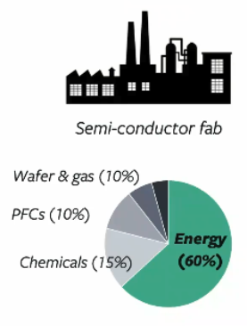

# Issues

## Environmental Issues

Sources of carbon footprint

- train models
- data collection
- inference
- creating new chips

### Types

- Embodied carbon
- Operational carbon

Not just the energy cost of running computers, but also energy required to build them

### Solutions

- Efficiency of models
- Software infra to promote development of efficiency
  - AutoML instead of grid search
  - Easy-to-use APIs for efficient models
- Efficient computer chips
- Efficient datacenters
  - Microsoft: underwater servers
    - 8 x more reliable, using Nitrogen, etc
    - No need for fresh water for cooling
- Use renewable energy
  - Transitioning to 100% renewables will not eliminate the carbon footprint of chips
  - 
- Stop planned obscelence

### 4 M’s of AI Efficiency

1. Model
2. Machine
3. Mechanism
4. Map: Location

### Jevon’s Paradox/Effect

Improved efficiency in resource utilization increases the total consumption of resources, due to increased rate of consumption from increased demand

Hence, definition of “efficiency” is important

### PUE

Power Usage Effectiveness

Lower is better

Typically $\in [1.1, 1.6]$

How the power input is being used for compute & for other supporting consumption such as cooling, lighting, etc.
$$
\begin{aligned}
\text{PUE}
&= \dfrac{\text{Total Energy}}{\text{Productive Energy}} \\
&=
1 + \dfrac{\text{Overhead}}{\text{Productive Energy}}
\end{aligned}
$$

## Ethical Issues

New technologies are disruptive, not neutral

AI can
- change current practices
- influence human decisions
- regulate human behavior

### Responsible AI

- Researchers and engineers should
	- be proactive - not reactive - about ethics
	- anticipate how their work will impact society
	- incorporate human values throughout all stages of product's lifecycle
- Increased public trust means
	- Improved marketability
	- Higher product adoption

### Abstraction

Researchers/Engineers often abstracted away from application they’re working on, hence not aware of bad things that can be used for

### Data Ownership

Data governance

Trade-off: Privacy vs Progress

Model monetization trained on consumer data, eg: GitHub Copilot

### Data Bias

Dataset curation

Federated learning

## Research Inequality

- Inequitable access to computing resources
- Inequitable access to datasets

## Bias

Solution

| Solution           | Meaning                                                                                              | Pro                        | Con                                                                                                                            |
| ------------------ | ---------------------------------------------------------------------------------------------------- | -------------------------- | ------------------------------------------------------------------------------------------------------------------------------ |
| Group unawareness  | Sensitive attributes not included as features                                                        | Avoids disparate treatment | Possibility of highly correlated features that are proxies of the sensitive attribute  Incompatible with group threshold |
| Group threshold    | Counteract historical biases in data by adjusting confidence thresholds independently for each group |                            | Incompatible with group unawareness                                                                                            |
| Demographic Parity | TP + FP equal for all groups                                                                         |                            | Introduces false negatives                                                                                                     |
| Equal opportunity  | TP + FN equal for all groups                                                                         |                            | Introduces false positives  Incompatible with equal accuracy                                                             |
| Equal accuracy     | TP + TN equal for all groups                                                                         |                            | Higher FN for one group Higher FP for one group  Incompatible with equal opportunity                                  |
