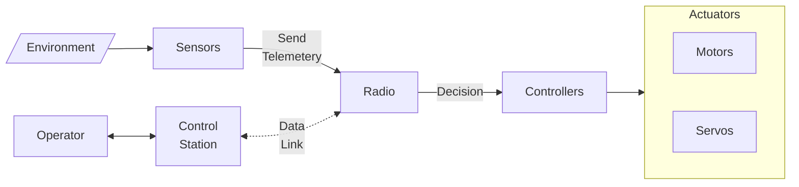

# Introduction

## Agent

Anything that can be viewed as

- perceiving its environment through **sensors**
- acting upon that environment through **effectors**

|        | Sensors                                                   | Effectors       |
| ------ | --------------------------------------------------------- | --------------- |
| Humans | Eyes Nose Skin Tongue                      | Hands Legs |
| Robots | Cameras Infrared Range Finders Thermal Scanners | Motors          |

## Robot

Software-controllable device using sensors to guide effectors through programmed motion in a workspace to manipulate physical objects

## Types of Robots

- Mobile
- Stationary
- Autonomous
- Remote-Controlled
- Virtual

## Robot Control System

