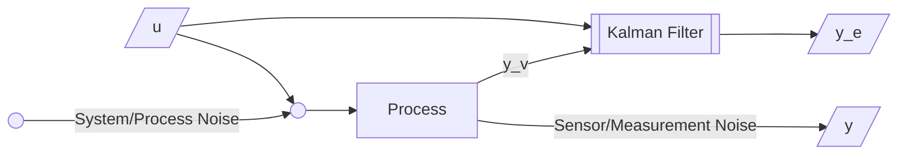

# Filters

Algorithms that use uncertain measurements from sensors to predict unknown variable with acceptable accuracy, to estimate the state of robot and its environment.

This concept can be used in any field where estimation and prediction are required.

## Types

Alpha, Beta, Gamma, Kalman, Extended Kalma, Particle Filters

## Measurement Uncertainty

Most modern systems are equipped with multiple sensors that provide estimation of hidden/unknown variables based on series of measurements

One of the biggest challenges of tracking and control systems is to provide accurate and precise estimation of the hidden variables in the presence of uncertainty.

## Measurement Bias & Variance

Very similar to Machine Learning [Prediction Bias & Variance](../Machine_Learning/07_Evaluation.md#Prediction-Bias-&-Variance) 

## Kalman Filter

Assumes measurement error is normally-distributed

### State Update Equation

$$
\begin{aligned}
&{\small \text{Estimated current state}} \\
&= {\small \text{Mean of all measurements}} \\
&= {\small 
\text{Predicted current state} + \text{Factor} \times (\text{Measurement - Predicted current state})
} \\
\implies &\hat x_{n, n} = \hat x_{n, n-1} + \alpha_n (x_n - \hat x_{n, n-1})
\end{aligned}
$$

The $\alpha$ factor is called as Kalman Gain, and is taken as $\alpha_n = \dfrac{1}{n}$. As number of measurements increase, each successive measurement has less weight in estimation, as $n \uparrow \implies \alpha \downarrow$

Kalman filter requires an initial guess as a preset; it may be approximate. 

$(x_{n, n} - \hat x_{n, n-1})$ is called the measurement residual
