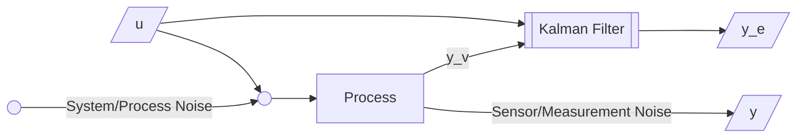

# Filters

Algorithms that use uncertain measurements from sensors to predict unknown variable with acceptable accuracy, to estimate the state of robot and its environment.

## Filters vs Rolling Statistics

The Kalman filter is better suited for estimating things that change over time. The Kalman Filter lets you add more information about how the system you're filtering works. In other words, you can use a signal model to improve the output of the filter.

Sure, a moving average filter can give very good results when you're expecting a close-to-constant output. But as soon as the signal you're modelling is dynamic (think speech or position measurements), then the simple moving average filter will not change quickly enough (or at all) compared with what the Kalman Filter will do.

The Kalman filter uses the signal model, which captures your knowledge of how the signal changes, to improve its output in terms of the variance from "truth".

## Concepts

|             |               | Denotation        |
| ----------- | ------------- | ----------------- |
| Measurement |               | $x_{t, t}$        |
| Estimation  | Current state | $\hat x_{t, t}$   |
| Prediction  | Future state  | $\hat x_{t, t-1}$ |

## Applications

These can be used in any field, but a few examples

- Guidance
- Navigation
- Control of vehicles

## Filter Design

1. Define problem which consists of the state
2. Define the motion model
3. Define how the state will be measured
4. Define uncertainty in system’s dynamic model
5. Implement & test the filter with know inputs & outputs
6. Tune the filter

## Batch vs Recursive

|            | Batch  | Recursive |
| ---------- | ------ | --------- |
| Complexity | $O(n)$ | $O(1)$    |
|            |        | Preferred |

