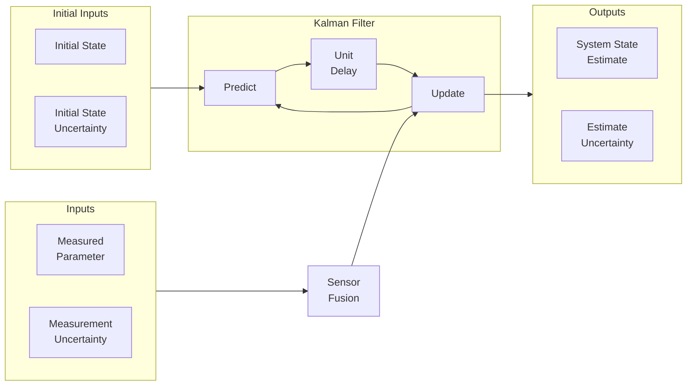
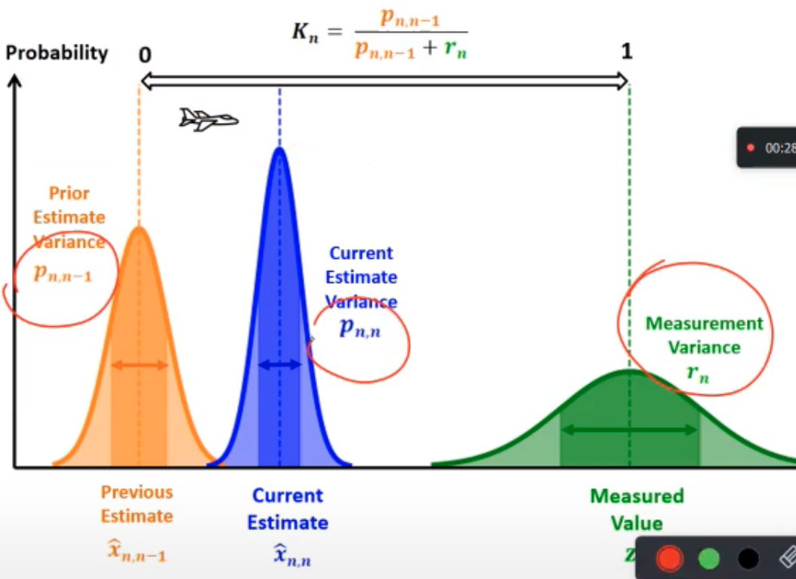

# Measurement

### Uncertainty

Variance of measurement errors provided by scale vendor/derived through calibration; Even though we can’t accurately know the estimate error, we can estimate the uncertainty in the estimates

Most modern systems are equipped with multiple sensors that provide estimation of hidden/unknown variables based on series of measurements

One of the biggest challenges of tracking and control systems is to provide accurate and precise estimation of the hidden variables in the presence of uncertainty.

### Bias & Variance

Very similar to Machine Learning [Prediction Bias & Variance](../Machine_Learning/07_Evaluation.md#Prediction-Bias-&-Variance) 

## Measurement Filters

|        |         |
| ------ | ------- |
| Alpha  | Static  |
| Beta   | Dynamic |
| Kalman | Dynamic |

## Average Filter

$$
\begin{aligned}
&\text{Estimated current state} \\
&= \text{Mean of all measurements} \\
&=\text{Predicted current state} \\
&\quad + \text{Factor} \times (\text{Measurement - Predicted current state})
\end{aligned}
$$

$$
\begin{aligned}
\hat x_{t, t}
&= \hat x_{t, t-1} + \alpha_t (x_t - \hat x_{t, t-1}) \\
&= (1-\alpha_t) \hat x_{t, t-1} + \alpha_t x_t \\
\hat x_{1, 0} &= 0 \\
\alpha_t &= \dfrac{1}{t}
\end{aligned}
$$

The $\alpha$ factor is called as Gain, and is taken as $\alpha_t = \dfrac{1}{t}$. As number of measurements increase, each successive measurement has less weight in estimation, as $t \uparrow \implies \alpha \downarrow$

Gives the less weight to recent data compared to past data

Kalman filter requires an initial guess as a preset; it may be approximate. 

$(x_{t, t} - \hat x_{t, t-1})$ is called the measurement residual

## Moving Average Filter

$$
\begin{aligned}
\hat x_{t, t}
&= \dfrac{1}{w} \sum_{i=0}^{w-1} x_{t-i} \\
&= \hat x_{t, t-1} + \dfrac{1}{w} (x_t - x_{t-w}) \\
\hat x_{1, 0} &= 0 \\
w &= \text{Rolling Window Size}
\end{aligned}
$$

Gives the same weight to recent data and past data

## Low Pass Filter

$$
\begin{aligned}
\hat x_{t, t}
&= \hat x_{t, t-1} + \alpha_t (x_t - \hat x_{t, t-1}) \\
&= (1-\alpha_t) \hat x_{t, t-1} + \alpha_t x_t \\
\hat x_{1, 0} &= 0 \\
\alpha_t & \in (0, 1)
\end{aligned}
$$

| $\alpha$       | Curve  | Delay |
| -------------- | ------ | ----- |
| High $(\to 1)$ | Noisy  | Low   |
| Low $(\to 0)$  | Smooth | High  |

## Beta Filter: Dynamic System

State(s) change over time

Let’s take the case of 2 states: position & velocity
$$
\begin{align}
\hat x_{t, t} &= \hat x_{t, t-1} + \Delta t \ \hat {\dot x}_{t, t-1} \tag{1} \\
\implies \hat {\dot x}_{t, t} &= \hat {\dot x}_{t, t-1} + \beta \left( \dfrac{x_t - \hat x_{t, t-1}}{\Delta t} \right) \tag{2} \\
\hat x_{1, 0} &= 0; \hat {\dot x}_{1, 0} = 0
\end{align}
$$
However, if we assume constant velocity, but measurement residual in $x \ne 0,$ then it could be due to 2 reasons

|                          | More likely when          |
| ------------------------ | ------------------------- |
| Measurement error        | Sensor has low precision  |
| Velocity is not constant | Sensor has high precision |

- Value of $\beta = \text{const}$, unlike $\alpha_t$
- $\beta \propto \text{Precision} \propto \dfrac{1}{\sigma_\text{measurement}}$

## Kalman Filter

A low-filter with dynamically-changing $\alpha$

Assumes that the following are normally-distributed

- measurements
- current state estimates
- next state estimates

Also quantifies the uncertainties associated with the estimates

Optimal filter that combines the prior state estimate with the measurement, such that uncertainty of current state estimate is minimized



where

- $r$ is the measurement uncertainty in variance
- $p$ is the estimate uncertainty in variance


### Equations

| Purpose          | Equation name                                                | Static System                                                | Dynamic System                                               | Comments                                                     |
| ---------------- | ------------------------------------------------------------ | ------------------------------------------------------------ | ------------------------------------------------------------ | ------------------------------------------------------------ |
| State Update     | State Update<br />Filtering Equation                         | $\hat x_{t, t} = \hat x_{t, t-1} + K_t (x_t - \hat x_{t, t-1}) $ | 👈                                                            |                                                              |
|                  | Covariance gain<br />Corrector Equation                      | $p_{t, t} = (1-K_t) p_{t, t-1}$                              | 👈                                                            |                                                              |
|                  | Kalman Gain<br />Weight Equation                             | $K_t = \dfrac{p_{t, t-1}}{p_{t, t-1} + r_t}; \in [0, 1]$     | 👈                                                            | When measurement uncertainty is large and estimate uncertainty estimate is small, $K_n \approx 0$, the new measurement is given low weightage |
| State Prediction | State Extrapolation<br />Prediction Equation<br />Transition Equation<br />Dynamic Model<br />State Space Model | $\hat x_{t+1, t} = \hat x_{t, t}$                            | $\hat x_{t+1, t} = \hat x_{t, t} + \Delta t \ \hat {\dot x}_{t, t}$<br />$\hat {\dot x}_{t+1, t} = \hat {\dot x}_{t, t}$ |                                                              |
|                  | Covariance Extrapolation<br />Predictor Covariance Equation  | $p_{t+1, t} = p_{t, t}$                                      | $p^x_{t+1, t} = p^x_{t, t} + \Delta t^2 p^v_{t, t}$<br />$p^v_{t+1, t} = p^v_{t, t}$ |                                                              |

| Kalman Gain |                                                              |
| ----------- | ------------------------------------------------------------ |
| $\approx 0$ |      |
| $\approx 1$ |  |

### Advantages

- Handles noise in initial estimate, state transitions, and observations 
- Removes need to store historical data
- Can handle asynchronous measurements, ie measurements recorded by multiple sensors at different time points
- Computationally-efficient
- Suitable for real-time applications

### Disadvantages

- Only for **linear** gaussian state space models.
  - In practice, state transitions may be non-linear/noise and may be non-gaussian.
  - Use other types of Kalman filters for this

### Code

```python
import numpy as np
import matplotlib.pyplot as plt

class KalmanFilter(object):
  def __init__(self, F = None, B = None, H = None, Q = None, R = None, P = None, x0 = None):

      if(F is None or H is None):
          raise ValueError("Set proper system dynamics.")

      self.n = F.shape[1]
      self.m = H.shape[1]

      self.F = F
      self.H = H
      self.B = 0 if B is None else B
      self.Q = np.eye(self.n) if Q is None else Q
      self.R = np.eye(self.n) if R is None else R
      self.P = np.eye(self.n) if P is None else P
      self.x = np.zeros((self.n, 1)) if x0 is None else x0

  def predict(self, u = 0):
      self.x = np.dot(self.F, self.x) + np.dot(self.B, u)
      self.P = np.dot(np.dot(self.F, self.P), self.F.T) + self.Q
      return self.x

  def update(self, z):
      y = z - np.dot(self.H, self.x)
      S = self.R + np.dot(self.H, np.dot(self.P, self.H.T))
      K = np.dot(np.dot(self.P, self.H.T), np.linalg.inv(S))
      self.x = self.x + np.dot(K, y)
      I = np.eye(self.n)
      self.P = np.dot(np.dot(I - np.dot(K, self.H), self.P), 
        (I - np.dot(K, self.H)).T) + np.dot(np.dot(K, self.R), K.T)

def main():
  dt = 1.0/60
  F = np.array([[1, dt, 0], [0, 1, dt], [0, 0, 1]])
  H = np.array([1, 0, 0]).reshape(1, 3)
  Q = np.array([[0.05, 0.05, 0.0], [0.05, 0.05, 0.0], [0.0, 0.0, 0.0]])
  R = np.array([0.5]).reshape(1, 1)

  x = np.linspace(-10, 10, 100)
  measurements = - (x**2 + 2*x - 2)  + np.random.normal(0, 2, 100)

  kf = KalmanFilter(F = F, H = H, Q = Q, R = R)
  predictions = []

  for z in measurements:
    prediction = np.dot(H,  kf.predict())[0]
    predictions.append(prediction)
    kf.update(z)

  plt.plot(range(len(measurements)), measurements, label = 'Measurements')
  plt.plot(range(len(predictions)), np.array(predictions), label = 'Kalman Filter Prediction')
  plt.legend()
  plt.show()

if __name__ == '__main__':
  main()
```

## Kalman Smoother


## Extended Kalman Filter

Developed for non-linear dynamics

Performs analytic linearization of the model at each point

## Unscented Kalman Filter


## Without Model-Based Approach

|                                                    | $\mu'$                                                       | ${\sigma^2}'$                                     | Estimation uncertainty |                                                              |
| -------------------------------------------------- | ------------------------------------------------------------ | ------------------------------------------------- | ---------------------- | ------------------------------------------------------------ |
| Update Parameter/Measurement<br />Uses Bayes’ rule | $\left( \dfrac{\mu}{\sigma^2} + \dfrac{\nu}{r^2} \right) {\sigma^2}'$ | $\dfrac{1}{\dfrac{1}{r^2} + \dfrac{1}{\sigma^2}}$ | decreases              |  |
| Predict Motion                                     | $\mu + u$                                                    | ${\sigma^2} + r^2$                                | increases              |  |

