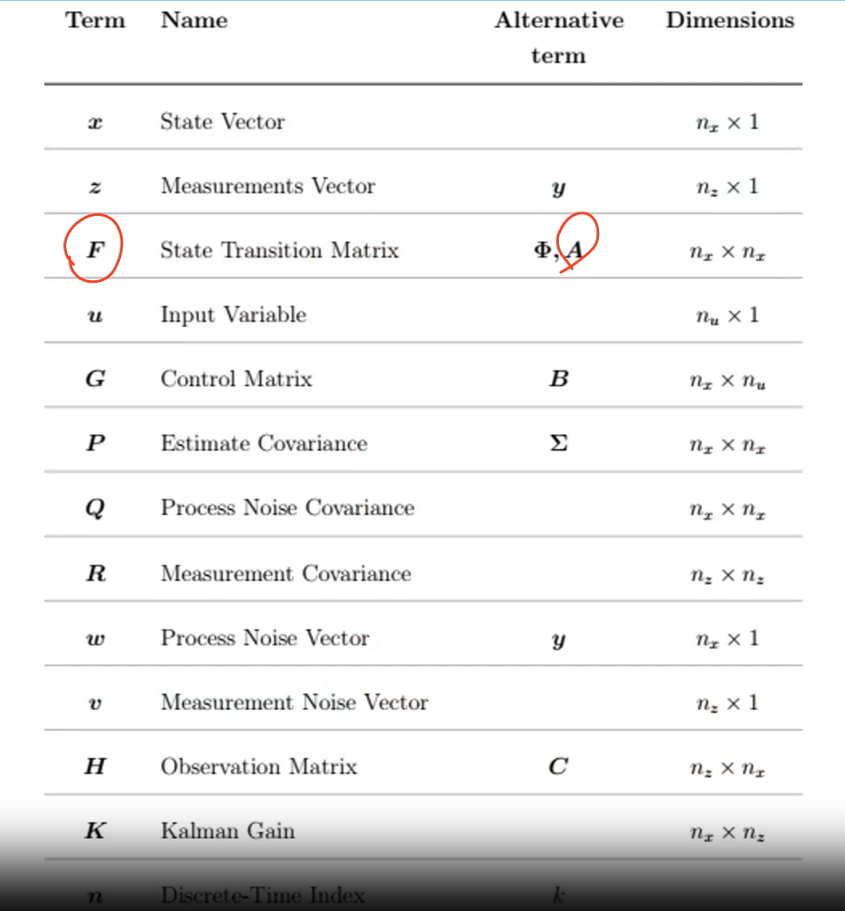

# State Space Modelling

Representation of a system that replaces an $n$th order differential equation with a single first order matrix differential equation.

The state space representation is given through 2 equations

|        |                             |
| ------ | --------------------------- |
| State  | $\dot q(t) = Aq(t) + Bx(t)$ |
| Output | $y(t) = Cq(t) + Dx(t)$      |

where

|      |                          | Dimension    |                  |
| ---- | ------------------------ | ------------ | ---------------- |
| $q$  | State Vector             | $n \times 1$ | Constant         |
| $A$  | State Matrix             | $n \times n$ | Constant         |
| $B$  | Input Matrix             | $n \times r$ | Constant         |
| $x$  | Input                    | $r \times 1$ | Function of time |
| $C$  | Output matrix            | $m \times n$ | Constant         |
| $D$  | Direct transition matrix | $m \times r$ | Constant         |
| $y$  | Output                   | $m \times 1$ | Function of time |

## Advantages

- Concise notation: Even large systems can be represented using 2 simple equations
- Easy to develop general techniques to solve systems, as all systems are represented by the same notation
- Computers easily simulate first-order equations

## Example

$$
2 \dfrac{d^3 y}{dt^3} + 4 \dfrac{d^2 y}{dt^2} + 6 \dfrac{dy}{dt} + 8y = 10 u(t) \\
\implies 2 y''' + 4 y'' + 6 y' + 8y = 10 u(t)
$$

Since DE is of 3rd order, there are 3 state variables
$$
x_1 = y, x_2 = \dot y, x_3 = \ddot y
\\
\implies 2 \dot x_3 + 2 x_3 + 6 x_2 + 8x_1 = 10u(t)
$$

### Equation Representation

$$
\begin{aligned}
\dot x_1 &= x_2 \\
\dot x_2 &= x_3 \\
\dot x_3 &= -4x_1 - 3x_2 - 2x_3 + 5u(t)
\end{aligned}
$$

### Matrix Representation

$$
\begin{aligned}
\begin{bmatrix}
\dot x_1 \\
\dot x_2 \\
\dot x_3
\end{bmatrix}
&=
\begin{bmatrix}
0 & 1 & 0 \\
0 & 0 & 1 \\
-4 & -3 & -2
\end{bmatrix}
\begin{bmatrix}
x_1 \\
x_2 \\
x_3
\end{bmatrix}
+
\begin{bmatrix}
0 \\
0 \\
5
\end{bmatrix} u(t) \\
y &=
\begin{bmatrix}
1 & 0 & 0
\end{bmatrix}
\begin{bmatrix}
x_1 \\
x_2 \\
x_3
\end{bmatrix}
\end{aligned}
$$

## Representation of Kalman Filter

$$
x_k = A x_{k-1} + B u_{k-1} + w_{k-1}
$$

$$
z_k = H x_k + v_k
$$

