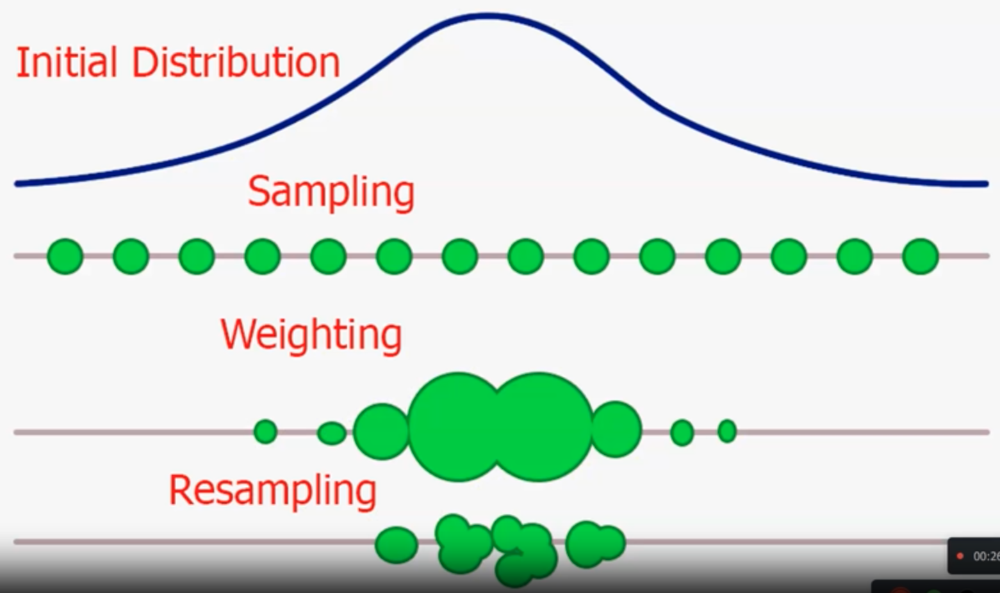
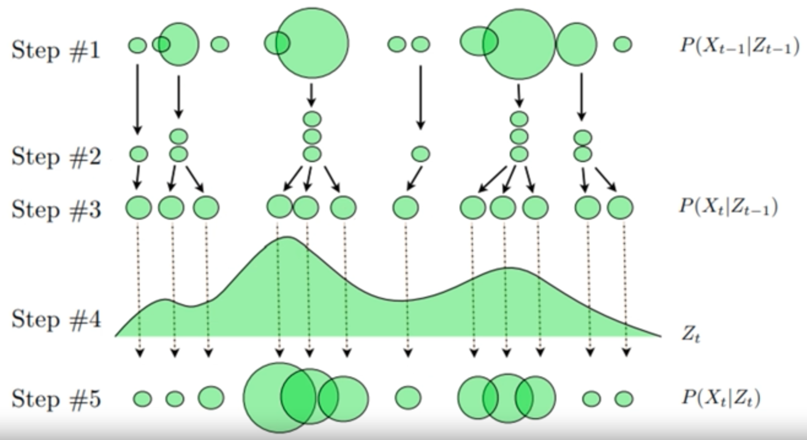

# Localization

 Navigation is one of the most challenging competencies required of a mobile robot.

## Building blocks of navigation

1. Perception: Robot must interpret its sensors to extract meaningful data
2. Localization: Robot must determine its position in its environment
3. Cognition: Robot must decide how to act to achieve its goals
4. Motion Control: Robot must modulate its motor outputs to achieve the desired trajectory

Devices relying on localization include IMU, encoders, LiDARs, Ultrasonic sensors, onboard cameras

Methodologies include Markov, Monte Carlo, Kalman Filters

## Particle Filter

For localization in a known map

Estimate posterior density of state variables given the observation variables

Generic particle filter estimates the posterior distribution of hidden states using observation measurement process

Working principle: Bayes’ Rule

### Requirements

- Uniformly-distributed particles
- Landmarks
- Object

### Concept

- Object senses landmarks and generates measurements vector for each landmark
- These measurements are bearing angles, ie angle between object and landmark location
- Since sensors are noisy, bearing noise of gaussian mean 0 is added to the measurements

### Steps

1. Randomly generate set of particles $p_i = (x_i, y_i, \theta_i)$

2. Predict next state of particles: Move particles based prediction of how the real system is behaving

3. Update weighting of particles proportional to closeness to object

   - Particles that closely match the measurements are weighted higher
   - Represented with larger area

4. Resample, by replacing highly improbable particles with copies of more probable particles

5. Compute estimate

   Optionally, compute weighted means and covariance of set of particles to get a state estimate

### Convolution

Shifting & flattening of probability distribution of the beliefs

$$
P(\hat x_i \vert x_i) = \dfrac{P(x_i \vert \hat x_i) \cdot P(x_i)}{P(\hat x_i)} \\
P(\hat x_i) = \sum_j P(x_j \vert \hat x_j) \cdot P(\hat x_j)
$$

## Inexact Motion

Incorporate probability of undershooting/overshooting

## Multiple Measurements
