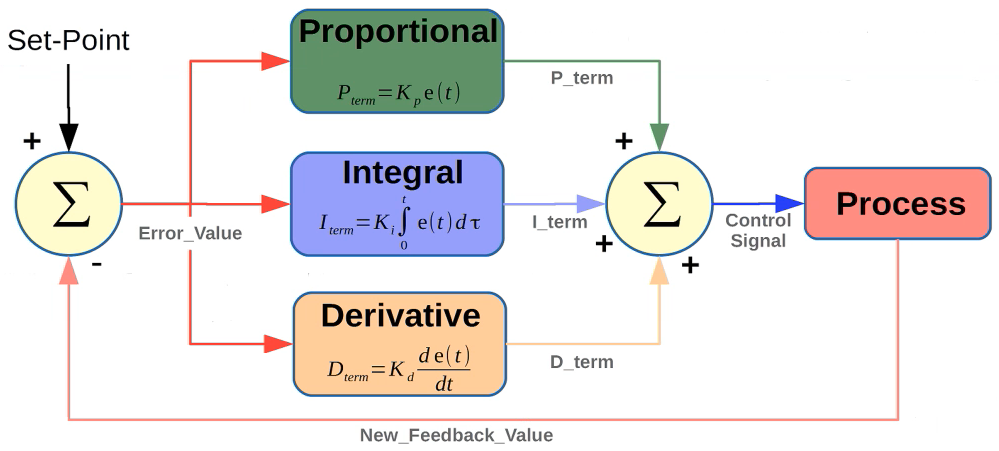

# Path Planning

Goal is to plan a collision-free route from a starting point to a target point

Find a path between 2 locations in an environment, regardless of the level of knowledge about it.

Computational problem to find a sequence of valid configurations that move object from source to destination

## Algorithms

- A*
- Dijkstra
- GVD (Generalized Moroni Diagrams)
- RRT (Rapidly Exploring Random Tree)

## Local <-> Global Frame

If robot position in a plane is defined by its state vector (location and orientation) is defined by
$$
q(t) = \begin{bmatrix}
x(t) \\
y(t) \\
\theta(t)
\end{bmatrix}
$$
Transformation between local frame $m$ and global frame $g$
$$
R(\theta) = \begin{bmatrix}
\cos \theta & \sin \theta & 0 \\
- \sin \theta & \cos \theta & 0 \\
0 & 0 & 1
\end{bmatrix}
$$

## Direct/Forward Kinematics

Determination of robot position for given control variables

### Odometry/Dead Reckoning

Obtaining through integration of kinematic model
$$
\begin{aligned}
x(t) &= \int_0^t v(t) \cdot \cos \theta(t) \cdot dt \\
y(t) &= \int_0^t v(t) \cdot \sin \theta(t) \cdot dt \\
\theta(t) &= \int_0^t w(t) \cdot dt
\end{aligned}
$$

 ### Euler Method

$$
\begin{aligned}
x(t+1) &= x(t) + v(t) T_s \cos \theta(t) \\
y(t+1) &= y(t) + v(t) T_s \sin \theta(t) \\
\theta(t+1) &= \theta(t) + w(t) T_s
\end{aligned}
$$

## Control

$$
u(t) = k_p e(t) + k_i \int_0^t e(\tau) d \tau + k_d \dfrac{d}{dt} e(t)
$$
where $e=$ error

## Path Planning Algorithms

### Single-Course Shortest Path problem

Finding shortest path from a source to all other vertices in the graph

Dijkstra’s algorithm

### A* algorithm
