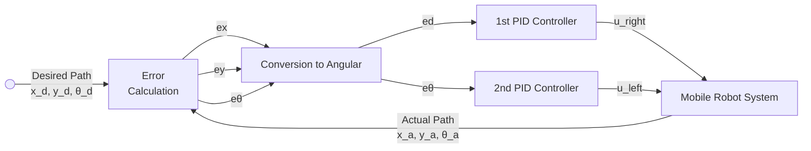

# Motion Control

PID (Proportional Integral Derivative) controllers are used to control movement of mobile robot.

Linear velocity loop controls the robot wheels speeds using motor speed feedback signal from the encoder

Angular velocity control loop keeps robot always in the accepted angle boundary using a 6 degree-of-freedom gyroscope and accelerometer as a feedback signal

