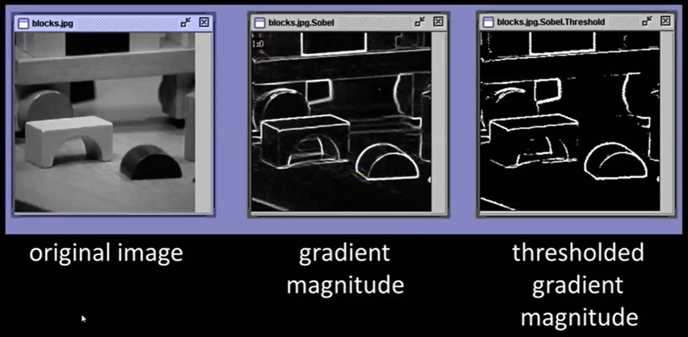
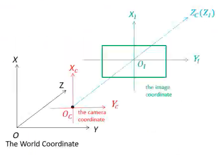
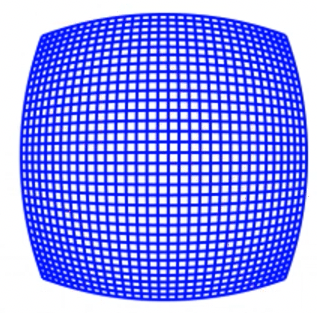
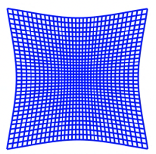

# Computer Vision

Extraction, analysis and comprehension of useful information from image(s)

Used for Navigation & Mapping

An image may be defined as a 2D function $f(x, y)$ where

- $x, y$ are spatial coordinates
- value of $f$ gives the intensity at a point

### Channels

- For a gray-range image, intensity is given by just one ‘channel’
- For color images, intensity is given by 3d vector (3 channels): RGB

Conversion from analog to a “digital image” requires both coordinates and intensity to be digitized

- Sampling: Digitizing the coordinates
- Quantization: Digitizing the intensity

## Types of images

|    | Binary Image | Intensity Image                                                    | Color Image |
|---     | ---    | ---                                                                | ---|
|        | Black and white | Data matrix whose values have been scaled to represent intensities | Intensity image with 3 channels (RGB) |
| Values | 0/1 | Usually scaled to [0, 255] or [0, 1] |  |

## Image Quantization

Transforming a real valued sampled image into one with a finite number of distinct values

Eg: rounding the digits, setting a max/min range

## Convolution Filters

- Low-pass: noise removal, blur
- High-pass: edge detection, sharpening

### Averaging

### Gaussian

Nearest neighboring pixels have the most influence

Center of the filter matrix will be larger than the edges and the corners

Variance of the filter determines the smoothing

### Median

Salt and pepper noise reduction

### Bilateral

Blur while maintaining sharp edges

Slower

## Edge Detection

Look for a neighborhood with strong signs of change

- Surface normal discontinuity
- Surface color discontinuity
- Illumination discontinuity
- Depth discontinuity

Kernel

- Kernel should be symmetric
- Normalization required to make the sum of elements in the filter as 1

Derivative will be non-zero at edges

$$
\begin{aligned}
\nabla f &= ( f_x, f_y ) \\
\theta &= \tan^{-1}
\left(
\dfrac{ f_y }{ f_x}
\right) \\
\vert \vert \nabla f \vert \vert &= \sqrt{
	{f_x}^2 + {f_y}^2
}
\end{aligned}
$$

### Discrete gradient

$$
\begin{aligned}
\dfrac{\partial f}{\partial x}
&\approx \dfrac{f(x+1, y) - f(x, y)}{1} \\
&\approx f(x+1, y) - f(x, y)
\end{aligned}
$$
### Sobel Operator

- Sobel
- Prewitt
- Roberts

### Difficulties

- Neighborhood size
- Change detection

### Canny Edge Detection

Robust and flexible

1. Noise reduction
2. Calculating intensity gradient
3. Suppression of false edges
4. Hysteresis thresholding

Thresholding: $\vert \vert \nabla f \vert \vert$ are compared with 2 threshold values

- If $\vert \vert \nabla f \vert \vert > T_h$, those pixels are associated with solid edges and included in the final edge map
- If $\vert \vert \nabla f \vert \vert < T_l$, those pixels are suppressed and excluded from final edge map
- All other pixels are marked as “weak” edges, and become candidates for final edge map
  - If weak pixels are connected to solid pixels, they are also included in final edge map

## Camera Calibration

Estimates parameters of lens and image sensor, to be used for

- Correction of lens distortion
- Object measurement
- Determine location of camera in scene
- Estimate depth using stereo camera
- Estimate 3D structure from camera motion

### Camera

Converts 3D world into 2D image
$$
\begin{aligned}
x
&= PX \\
\begin{bmatrix}
X \\
Y \\
Z
\end{bmatrix}
&= 
\begin{bmatrix}
p_1 & p_2 & p_3 & p_4 \\
p_5 & p_6 & p_7 & p_8 \\
p_9 & p_{10} & p_{11} & p_{12}
\end{bmatrix}
\begin{bmatrix}
X \\
Y \\
Z \\
1
\end{bmatrix}
\end{aligned}
$$
where

- $x =$  homogeneous image
- $P =$  camera matrix
- $X =$  homogeneous world point

### Parameters

|         | Intrinsic/Internal                                           | Extrinsic/External                                           |
| ------- | ------------------------------------------------------------ | ------------------------------------------------------------ |
|         | Allows mapping between pixel coordinates and camera coordinates in the image frame | Describe orientation and location of camera                  |
| Example | Optical center Focal length Radial distortion of coefficients of lens | Rotation of camera Translation of camera  wrt world coordinate system |

### Pinhole Camera Model

Basic camera model without a lens. Light passes through aperture and projects an inverted image on the opposite side of the camera.

Visualize the virtual image plane in front of the camera and assume that it is containing the upright image of the scene
$$
\begin{aligned}
w \begin{bmatrix} x & y & 1 \end{bmatrix}
&= \begin{bmatrix} X & Y & Z & 1 \end{bmatrix} P \\
P &= \begin{bmatrix} R \\ T \end{bmatrix} k \\
k &= \begin{bmatrix}
f_x & s & c_x \\
0 & f_y & c_y \\
0 & 0 & 1
\end{bmatrix}
\end{aligned}
$$
where

- $w=$ scale factor
- $P=$ camera matrix represents the camera specifications
- $R=$ Rotation
- $T=$ Translation
- $k=$ Intrinsic matrix
- $F =$ focal length in world units, usually in mm
- $(p_x, p_y) =$ size of pixel in world units
- $f_x, f_y = \dfrac{F}{p_x}, \dfrac{F}{p_y} =$ focal length in pixels
- $\begin{bmatrix}c_x & c_y \end{bmatrix}=$ optical center (principal point) in pixels
- $s = f_x \tan \alpha$ skew coefficient
  - non-zero if image axes are not perpendicular
- 1 pixel $\approx 1/96 \text{inch}$

### Distortion

|         | Barrel (Radial)                                         | Pincushion (Radial)                                     | Tangential/Decentering                                       |
| ------- | ------------------------------------------------------------ | ------------------------------------------------------------ | ------------------------------------------------------------ |
| Meaning | Straight lines of actual world appear curved outward         | Straight lines of actual world appear curved inward          | Image appears to slanted & stretched                         |
|         | -ve radial displacement                                      | +ve radial displacement                                      |                                                              |
| Cause   | Unequal light bending (rays bent more at lens’ border than at center) Before hitting the image sensor, the light ray is shifted radial inward/outward from its optimal point | Unequal light bending (rays bent more at lens’ border than at center) Before hitting the image sensor, the light ray is shifted radial inward/outward from its optimal point | Picture screen/sensor is at an angle wrt lens  |
| Example |          |  |  |

#### Radial distortion coefficients model

$$
\begin{aligned}
x_\text{distorted} &= x (1 + k_1 r^2 + k_2 r^4 + k_3 * r^6) \\
y_\text{distorted} &= y (1 + k_1 r^2 + k_2 r^4 + k_3 * r^6)
\end{aligned}
$$

where

- $x_\text{distorted}, y_\text{distorted}$ are distorted points
- $x, y$ are undistorted and dimensionless pixel location in normalized image coordinates format, calculated from pixel coordinates by translating to optical center and dividing by focal length in pixels
- $k_1, k_2, k_3$ are radial distortion coefficients of the lens
- $r^2 = x^2 + y^2$

#### Tangential distortion coefficients model

$$
\begin{aligned}
x_\text{distorted} &= x + [2 p_1 x y + p_2(r^2 + 2x^2)] \\
y_\text{distorted} &= y + [2 p_1 (r^2 + 2y^2) + 2 p_2 x y]
\end{aligned}
$$

#### Distortion Removal

1. Calibrate camera and obtain intrinsic camera parameters
2. Control percentage of undersized pixels in undistorted image by fine-tuning camera matrix
3. Use revised camera matrix to remove distortion from image
