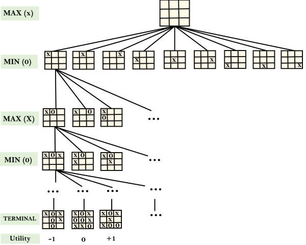

## Game Playing

A game can be defined as a type of search in AI which can be formalized of the following elements:  

1. Initial state  
2. Terminal state  
2. Player(s)  
3. Action(s)  
4. Result(s, a) - It is the transition model, which specifies the result of moves in the state space.  
5. Terminal-Test(s) - Terminal test is true if the game is over, else it is false at any case.   
6. Utility(s, p) - A utility function gives the final numeric value for a game that ends in terminal states s for player p.  

A game tree is a tree where nodes of the tree are the game states and Edges of the tree are the moves by players. Game tree involves initial state, actions function, and result Function.

|       | Deterministic | Nondeterministic (Chance) |
| ----- | -------- | -------- |
| Fully Observable |        Chess  |       Monopoly   |
| Partially Observable |      Battleship    |       Card games   |

### Zero Sum game
- In Zero-sum game each agent's gain or loss of utility is exactly balanced by the losses or gains of utility of another agent.  
- One player of the game tries to maximize one single value, while other player tries to minimize it.
- Examples are tic tac toe and chess.

### Mini-Max Algorithm
- It is a method to determine optimal move.  
- Utility of each node is computed bottom up from leaves toward root.  
- At each MAX node, pick the move with maximum utility.  
- At each MIN node, pick the move with minimum utility.  

*NOTE - We assume that the opponent we face behaves optimally, and will always perform the move that is worst for us.*

Minimax is only for deterministic, fully observable games  

Mini-max algorithm is complete and optimal

### Alpha Beta Pruning
- modified version of mini-max
- Used to reduce branching factor hence handles complex games as well 
- Maintain two parameters in depth-first search, α, the value of the best (highest) value found so far for MAX along any path and β, the best (lowest) value found along any path for MIN.
- Prune a subtree once it is known to be worse than the current α or β.

