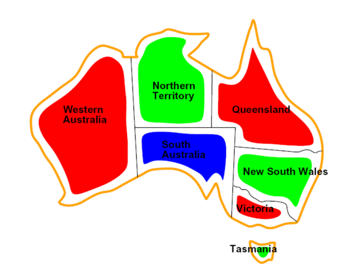
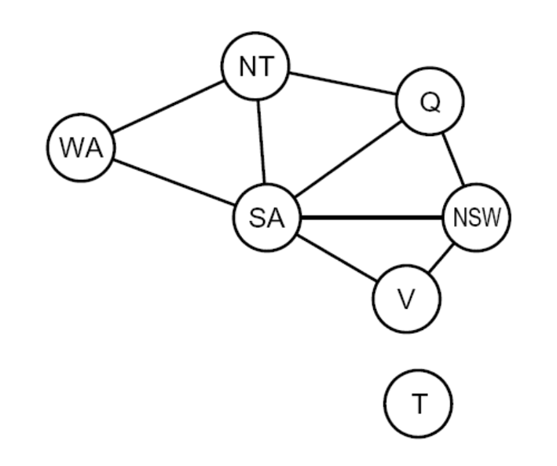

## Constraint Satisfaction Problem

These are problems in which we must simply identify whether a state is a goal state or not.  
Consists of : 
1. Variables
2. Domain
3. Constraints  

Examples are Map coloring problem, N queens problem

CSPs are represented as constraint graphs,where nodes represent variables and edges represent constraints between them.

Graph coloring problem :  

  
  
Corresponding constraint graph :  
 

## Solving CSPs

1. Fix an ordering for variables, and select values for variables in this order. 
2. When selecting values for a variable, only select values that don’t conflict with any previously assigned values.If no such values exist, backtrack and return to the previous variable,changing its value.

### Filtering

To improve performance, we consider filtering which checks if we can prune the domain of unassigned variables ahead of time. 

### 1. Forward Checking 

- Whenever a new variable is assigned, we can run forward checking and prune the domains of unassigned variables adjacent to the newly assigned variable in the constraint graph.
- Basically we eliminate all the values from the domain of the adjacent variables which could cause violation of any constraint.

### 2. Arc Consistency

- Interpret each undirected edge of the constraint graph for a CSP as two directed edges pointing in opposite directions.
- Each of these directed edges is called an arc.
- Begin by storing all arcs in the constraint graph for the CSP in a queue Q.
- Iteratively remove arcs where an arc is of the form $X_i \rightarrow X_j$ and $\forall$ $ v \in Domain(X_i)$ there should be at least one value $w \in Domain(X_j)$ such that $v$ and $w$ do not violate any constraint. 
- If some value $v$ for $X_i$ would not work with any of the remaining values for $X_j$, we remove $v$ from the set of possible values for $X_i$.
- If at least one value is removed for $X_i$ add arcs of the form $X_k \rightarrow X_i$ to Q,for all unassigned variables $X_k$. 
- If an arc $X_k \rightarrow X_i$ is already in Q, don't add it again