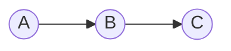
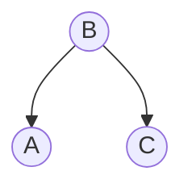
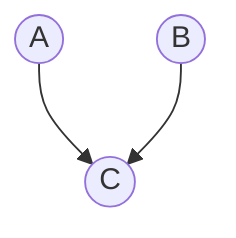
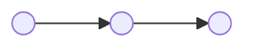
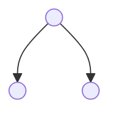
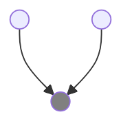
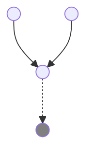
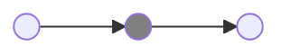
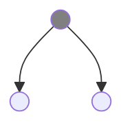
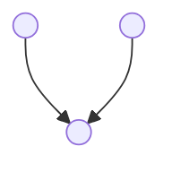

## Probability And Naïve Bayes

- Probability of disjunction - $P(A \vee B) = P(A) + P(B) - P(A \wedge B)$

- Conditional Probability - $P(A|B) = \frac{P(A \wedge B)}{P(B)}$

- Independence - Two events $A$ and $B$ are independent if $P(A \wedge B) = P(A)P(B)$

### Bayes' theorem 
It determines the probability of an event with uncertain knowledge.  
 
$P(A|B) = \frac{P(B|A)P(A)}{P(B)}$  
 
where $P(A|B)$ is known as posterior,  
$P(B|A)$ is called the likelihood,  
$P(A)$ is called the prior probability and  
$P(B)$ is called marginal probability 

The equation can be generalized as  
$P(A_i|B) = \frac{P(B|A_i)P(A_i)}{\sum_{i=1}^k P(B|A_i)P(A_i)}$  
where $A_1, A_2, A_3,........, A_n$ are all mutually exclusive events

## Bayesian Network

Represents the dependence between variables

- Nodes - represents variables
- Links - X points to Y, implies X has direct influence over Y or X is a parent of Y
- CPT - each node has a conditional probability distribution which determines the effect of the parent on that node

### Joint Probability Distribution

$P(X_i|X_{i-1},........., X_1) = P(X_i |Parents(X_i ))$

### Independence in BN

$X {\perp \!\!\! \perp} Y | Z$ is read as $X$ is conditionally independent of $Y$ given $Z$

1. Casual chains

In such a configuration, A is guaranteed to be independent of C given B

2. Common Cause

In such a configuration, A is guaranteed to be independent of C given B

3. Common effect

In such a configuration, A is guaranteed to be independent of B.  
But A and B are not independent given C.

### Active Triples

### Inactive Triples

_NOTE : All possible configurations for active and inactive triples are listed above_

> Notes on d-seperation and variable elimination need to be added