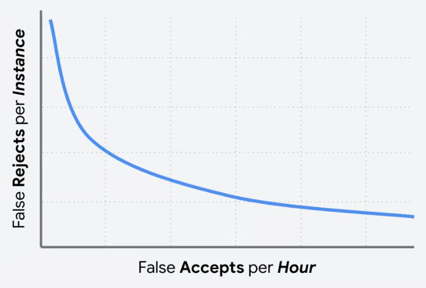
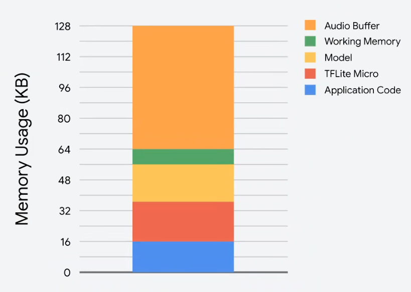
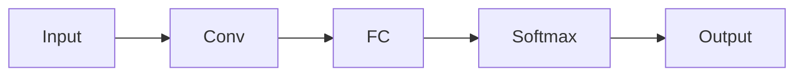
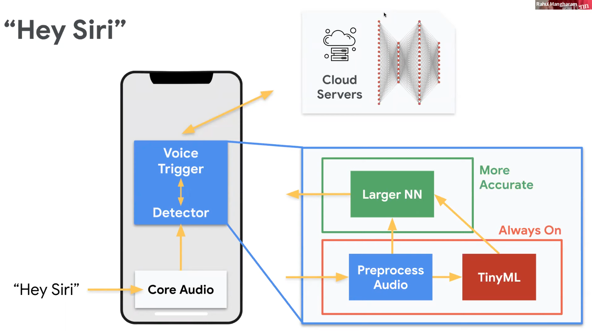

# Keyword Spotting

## Keyword Spotting vs Speed Recognition

|             | Keyword Spotting | Speed Recognition    |
| ----------- | ---------------- | -------------------- |
| Power-Usage | Low              | High                 |
| Type        | Continuous       |                      |
| Location    | On-Device        | On-Device/ Online |

## Types

|     | Single Shot         | Streaming                 |
| --- | ------------------- | ------------------------- |
|     | Only keyword spoken | Keyword within a sentence |

## Challenges

| Aspect               | Constraint      | Comment                                                                                         | Metrics                                         |
| -------------------- | --------------- | ----------------------------------------------------------------------------------------------- | ----------------------------------------------- |
| System performance   | Latency         | Listening animation                                                                          |                                                 |
|                      | Bandwidth       |                                                                                                 |                                                 |
| Preserving           | Security        | Safeguarding data being sent to cloud                                                           |                                                 |
|                      | Privacy         |                                                                                                 |                                                 |
| Model                | Accuracy        | Listen continuously, but only trigger at the right time  Pick operating point accordingly |  |
|                      | Personalization | Trigger only for user, not for other users or for background noise                              |                                                 |
| Resource constraints | Battery         |                                                                                                 |                                                 |
|                      | Memory          |                                                                                                 |   |

## Model

Spectrogram is just an image

### TinyConv

Since we only we are only focused on recognizing a few keywords, we can just use One Conv2D followed by single dense layer

#### Limitations
- Limited vocabulary
- Lower accuracy
- Limited UX

## Cascading

## Multiple Inferences

- Average inferences across multiple time slices

This is to avoid False Positives for group of words. For eg:
- No
	- No good
	- Notion
	- Notice
	- Notable