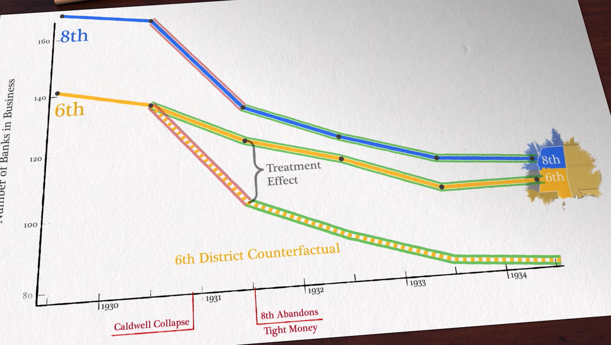
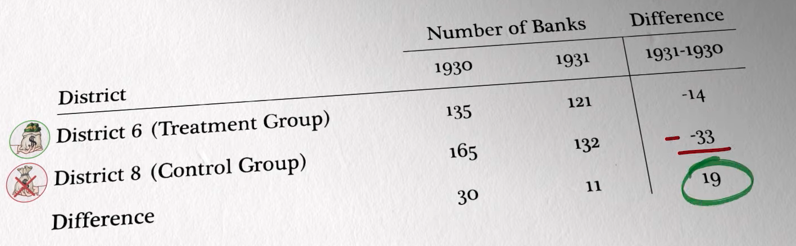

# Treatment Effect

$$
\begin{aligned}
E(y \vert \text{do}(x), s)
&= E(y \vert x, s) \\
\implies \widehat{\text{ATE}}(x, s)
&=\dfrac{d}{dx} \hat E[y \vert \text{do}(x)] \\
&=\dfrac{d}{dx} \hat E[y \vert \text{do}(x), s] \\
&= \dfrac{d}{dx} E_s \Big[ \hat E[y \vert \text{do}(x), s] \Big] \\
&= \dfrac{d}{dx} E_s \Big[ \hat E[y \vert x, s] \Big] \\
&= E_s \left[ \dfrac{\partial}{\partial x} \hat E[y \vert x, s] \right]
\end{aligned}
$$

HTE = Heterogeneous Treatment Effect = ATE with high dimensional $s$ 

If $x$ is binary
$$
\begin{aligned}
x &\in \{ 0, 1 \} \\
\implies \text{ATE}(x, s)
&= E[ y \vert \text{do}(x=1) ] \ - \ E[ y \vert \text{do}(x=0) ] \\
&= E_s \Bigg[ E[y \vert x=1, s ] \  - \ E[ y \vert x=0, s] \Bigg] \\
\end{aligned}
$$

| Treatment                    | Model                                                   | $\widehat{\text{ATE}}(x)$ |
| ---------------------------- | ------------------------------------------------------- | ------------------------- |
| Binary                       | Linear $\hat \beta_0 + \hat \beta_1 x + \hat \beta_2 s$ | Constant $\hat \beta_1$   |
| Multi-Level/ Continuous | Non-linear                                              | Functional                |

## Heterogeneous Treatment Effects

If we consider effect modifier $s$
$$
\begin{aligned}
\text{ATE}
&= \dfrac{\partial}{\partial x} E[ y \vert \text{do}(x), s] \\
&= \int \limits_s E[y^1 - y^0 \ | \ s] \cdot P(s) \cdot ds \\
\end{aligned}
$$

where $P(s)$ is the distribution of effect modifier.

Then, the result of the randomized test actually gives us $E[\tilde \tau]$, which may **not** be equal to $E[\tau]$

#### Example

For example, the yield depends on the season and the crop for which was grown previous year. Let’s take the example of a a randomized test of a fertilizer used  in the summer.

If no crop was grown the previous year, then we 

| Crop Grown in Field Last Year | Result of Randomized Test $E[\tilde \tau]$                   |
| ----------------------------- | ------------------------------------------------------------ |
| No crop                       | $E[\tau | \text{Summer, No crop}]$                           |
| Rice only                     | $E[\tau | \text{Summer, Rice}]$                              |
| 50% Barley, 50% Rice          | $0.5 \cdot E[\tau |\text{Summer, Barley}] + 0.5 \cdot E[\tau |\text{Summer, Rice}]$ |

## Regression Discontinuity Design

Causal effect cannot be obtained directly due to lack of overlap for different $s$, hence we take the neighborhood

When a quasi-experiment partially determines the
treatment status, the “as if” randomness can be used as an instrument for identifying the causal effect of interest

$$
\begin{aligned}
\widehat {\text{LATE}}
&= \lim_{z \to {z_0}^+} E[ y \vert x=1, z ] \ - \lim_{z \to {z_0}^-} E[ y \vert x=0, z ] \\
&= \lim_{z \to {z_0}^+} E[ y \vert z ] \ - \lim_{z \to {z_0}^-} E[ y \vert z ]
\end{aligned}
$$

Eg: Evaluating the treatment effect of college on students in the neighborhood of college acceptance cutoff, where the selection of students is random

Limitations

- Poor generalizability: The validity of the results is usually restricted to this region
- Throws away the lot of information in the non-random parts
- Doesn’t allow building structural causal model

## Differences-in-Differences

Let

- Control: $y_0$ be the time series with $x=0$
- Treated: $y_1$ be the time series with $x=1$
- $D_t$ be the difference of the 2 series

$$
\begin{aligned}
y_{0t}
&= f(w, t) + \beta_1 (x=0) \\
&= f(w, t) \\
y_{1t} &= f(w, t) + \beta_1 (x=1) \\
D_t &= (y_1 - y_0)_t
\end{aligned}
$$

Assumptions

- parallel trends: confirmed by evaluating regions without the treatment
- absence treatment: no other variables
- Hence, the difference between the
  treatment & the control group is time-invariant, any difference in their difference
  must be due to the treatment effect.

$$
\begin{aligned}
E[\Delta D] &= 
\Big( E[y_{1 \ t}] - E[y_{0 \ t}] \Big) - \Big( E[y_{1 \ t_0}] - E[y_{0 \ t_0}] \Big) \\
&= \hat \beta_1(x=1) \\
&= E(y \vert x=1) - E(y \vert x=1) \\
\implies \text{ATE}(x)
&\approx \text{ATT}(x) \\
&= E[\Delta D]
\end{aligned}
$$
Technically, $\hat \beta_1$ is an ATT because the parallel trend assumption assumes what the
treated series would be like in the absence of the treatment, not what the control series
would be like given the treatment

Didn’t understand

> Technically, α is an ATT because the parallel trend assumption assumes what the
> treated cities would be like in the absence of the program, not what the control cities
> would be like given the program

