# Causal Model

A causal/scientific model $M$ for a set of RVs $\{ x_1, \dots, x_n \}$ is a model of the joint distribution $p(x_1, \dots, x_n)$ as well as the causal structure governing $\{ x_1, \dots, x_n \}$ which describes the causal relationships among the vars
$$
M: y \leftarrow x
$$

## Causal Graph Model

Causal diagram/graph is a graph that can be used to represent a causal structure and hence, describe our quantitative knowledge about a causal mechanism

Causal model that uses a causal graph to represent the causal structure is called as Causal Graph Model/Causal Bayesian/Belief network.

RCM was developed in statistics, causal graphical model is derived from CS/AI.

## Parts of Causal Model

1. Causal Structure $G$: Direction of causality (What causes what)
1. Statistical Model $H$: Joint distribution function

$$
M = (H, G)
$$

### Example

Consider a model $y = 2x$. This is a statistical model.

If $y \leftarrow 2x$, then it means that $x$ causes $y$. This is a causal model.

Let’s analyze the $x,y$ pairs for the following sequential changes.

| Model       | 1. do$(x=2)$ | 2. do$(x=3)$ | 3. do$(y=2)$ |
| ----------- | ------------ | ------------ | ------------ |
| Statistical | 2, 4         | 3, 6         | ==1, 2==     |
| Causal      | 2, 4         | 3, 6         | ==3, 2==     |

This is because, $x$ causes $y$; not the other way around.

## Causal Diagram/Graph

Directed graph that represents the causal structure of a model. It is represented using a bayesian network: DAG (Directed Acyclic Graph) in which each node has associated conditional probability of the node given in its parents. 

The joint distribution is obtained by taking the product of the conditional probabilities.
$$
\begin{aligned}
p(x_1, \dots, x_n)
&= \Pi_{i=1}^n \ p( \ x_i \vert \text{pa}(x_i) \ ) \\
x_i \ & {\tiny \coprod} \ \text{nd}(x_i) \vert \text{pa}(x_i)
\end{aligned}
$$
where

- pa = parent
- nd = not descendant

Useful when you are only interested in the causal structure, and not so much in the statistical model

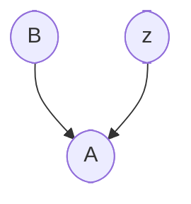

$$
P(A, B, C) =
P(A | B, C) \cdot P(B) \cdot P(C)
$$

### Why DAG?

- Directed, because we want causal effects directions
- Acyclic, because a variable cannot cause itself.

my question is: What about recursive loops, such as our body’s feedback loops

### Parts

|                                    |                                                              |
| ---------------------------------- | ------------------------------------------------------------ |
| Nodes - vars                       | - Rounded - Unconditioned - Square - Conditioned         |
| Directed Edges - Causal directions | 1. The presence of an arrow from $x_i$ to $x_j$ indicates either that $x_i$ has a direct causal effect on $x_j$ – an effect not mediated through any other vars on the graph, or that we are unwilling to assume such a effect does not exist 2. The absence of an arrow from $x_i$ to $x_j$ indicates the absence of a direct effect; the absence of an arrow hence represents a more substantive assumption |

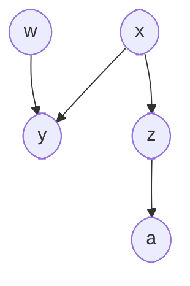

| Term                                    | Condition                                                    | Above Example                              |
| --------------------------------------- | ------------------------------------------------------------ | ------------------------------------------ |
| Parent                                  | Node from which arrow(s) originate                           | $x$ is parent of $y$ and $z$               |
| Child                                   | Node to which arrow(s) end                                   | $y$ and $z$ are children of $x$            |
| Descendants                             |                                                              |                                            |
| Ancestors                               |                                                              |                                            |
| Exogenous                               | vars w/o any parent                                          | $w, x$                                     |
| Endogenous                              | vars w/ $\ge 1$ parent                                       | $y, z, a$                                  |
| Causal Path                             | Uni-directional path                                         | $x z a$ $z a$  $x y $ $w y$ |
| Non-Causal Path                         | Bi-directed path                                             | $x y w$                                    |
| Collider                                | Node having multiple parents, where path ‘collides’          | $y$ in the path $x y w$                    |
| Blocked Path                            | Path with a - conditioned non-collider or - unconditioned collider, w/o conditioned descendants |                                            |
| Back-Door Paths                         | Non-causal paths b/w $x$ and $y$, which if left open, induce correlation b/w $x$ and $y$ without causation |                                            |
| d-separated vars                        | all paths b/w vars are blocked                               |                                            |
| d-connected vars                        | $\exists$ path between the vars which isn’t blocked          |                                            |
| conditionally-independent vars          | If 2 vars are d-separated after conditioning on a set of vars |                                            |
| conditionally-dependent/associated vars | If 2 vars are d-connected after conditioning on a set of vars  w/o faithfulness condition, this may not be true |                                            |

### Properties

Causal diagrams compatible with a joint distribution $p(x_1, \dots, x_n)$ must satisfy

| Property                | Meaning                                                      |
| ----------------------- | ------------------------------------------------------------ |
| Causal Markov Condition | Every var is independent of any other vars (except its own effects) conditional on its direct causes |
| Completeness            | All common causes (even if measured) of any pair of vars on the graph are on the graph This property is as important as the requirement that all relevant factors are accounted for. Our ability to extract causal information from data is predicated on this untestable assumption |
| Faithfulness            | The joint distribution $p(x_1, \dots, x_n)$ has all the conditional independence relations implied by the causal diagram, and only those conditional independence relations |

- $\text{nd}:$ non-descendent
- $\text{pa}:$ parents

## Causal Relations

### General Framework

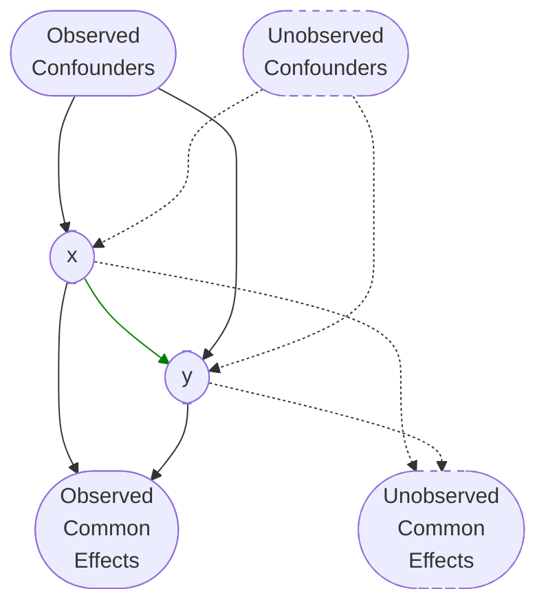

### Types

| Type                                                   | $x, y$ are statistically-independent  Correlation $=$ Causation $E[y \vert x] = E[y \vert \text{do}(x)]$ | $E[y \vert \text{do}(x)]$                                    | Comment                                                      | Path ‘__’ by collider $c$ | Example $z$      | Example $x$                                      | Example $y$                                             |
| ------------------------------------------------------ | ------------------------------------------------------------ | ------------------------------------------------------------ | ------------------------------------------------------------ | ------------------------- | --------------------- | ----------------------------------------------------- | ------------------------------------------------------------ |
| Mutual Dependence/ Confounding/ Common Cause | ❌                                                            |                                                              | Info on $x$ helps predict $y$, even if $x$ has no causal effect on $y$ |                           | Smoker                | Carrying a lighter                                    | Cancer                                                       |
| Conditioned Mutual Dependence                          | ✅                                                            | $\sum_i E[y \vert \text{do}(x), c_i] \cdot P(c_i)$ $=\sum_i E[y \vert x, c_i] \cdot P(c_i)$ |                                                              | blocked                   | Smoker=FALSE          | Carrying a lighter                                    | Cancer                                                       |
| Mutual Causation/ Common Effect                   | ✅                                                            |                                                              |                                                              | blocked                   | Revenue of company    | Size of company                                       | Survival of company                                          |
| Conditioned Mutual Causation                           | ❌                                                            |                                                              |                                                              | opened                    | Revenue of company    | Size of company                                       | Survival of company=TRUE (we usually only have data for companies that survive)  (Survivorship bias) |
| Mediation                                              | ❌                                                            |                                                              |                                                              |                           |                       |                                                       |                                                              |
| Conditioned Mediation                                  | ✅                                                            |                                                              |                                                              | blocked                   | 1. Cancer 2. Tax | 1. Tar deposits in lung 2. Economic consequences | 1. Smoking 2. Economic conditions                       |

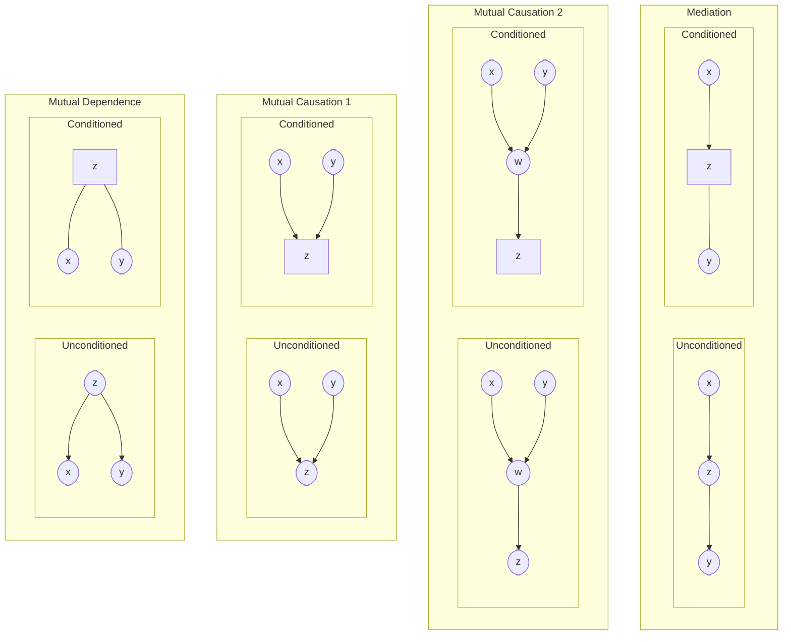

### Confounding

#### Self Selection Bias

Special case of confounding, when $z$ affects the selection of $x$ and also has a causal effect on $y$, then $z$ is confounder.

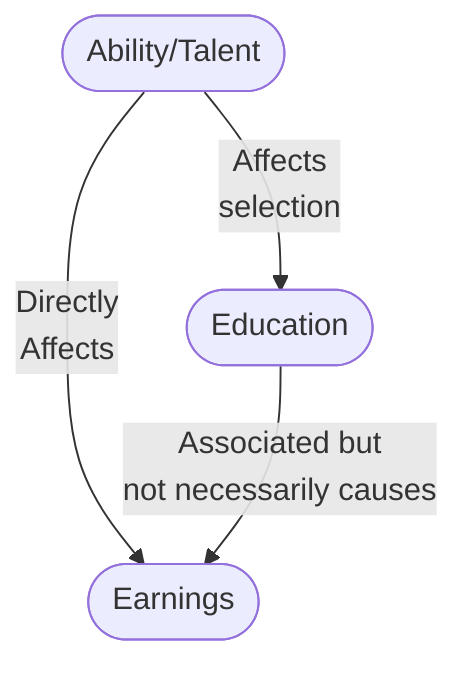

Here, education may **not necessarily** causally affect earnings.

#### Unmeasured Confounding

We need to find new ways to identify causal effect

| $z$ fully observed | $\not \exists$ unmeasured confounding | Selection on  |
| ------------------ | ------------------------------------- | ------------- |
| ✅                  | ✅                                     | observables   |
| ❌                  | ❌                                     | unobservables |

However, in some cases, there can exist a set of observed vars conditioned such that it satisfies the back-door
criterion, by blocking all non-causal paths
b/w $x$ and $y$

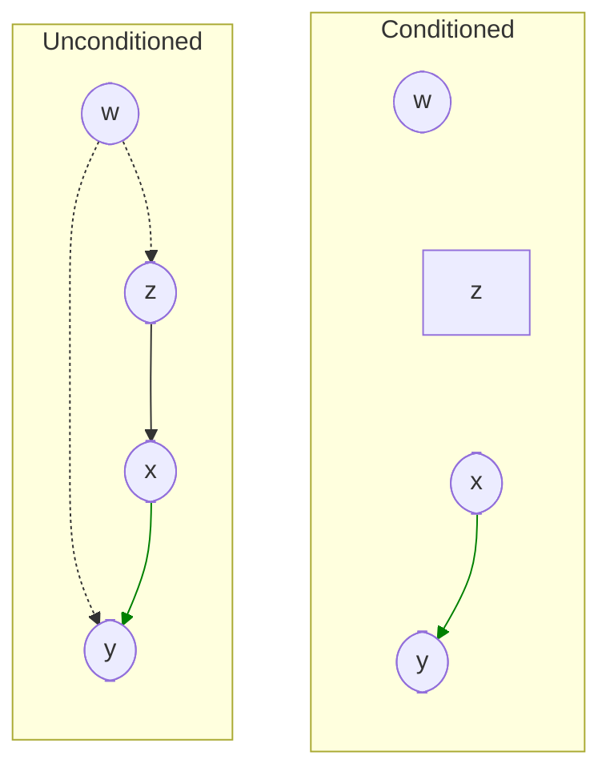

$w$ is a confounder to $x$ and $y$, but we do not need to observe it, as causal effect of $x$ on $y$ is identifiable by conditioning on $z$

## Conditioning

- Condition common causes
- Do **not** condition common effects

If we condition on a set of vars $z$ that block
all open non-causal paths between treatment $x$ and outcome $y$, then

- the causal effect of $x$ on $y$ is identified (estimated from observed data)
- $z$ is said to satisfy the ‘back-door criterion’
- Conditioning on z makes $x$ exogenous to $y$

### Covariate Balance

In a sample where is $z$ is a conditioned confounder
$$
P(z \vert x = x_i) = P(z \vert x = x_j) \quad \forall i, j
$$

If $x$ is binary
$$
\begin{aligned}
& x \in \{ 0, 1 \} \\
\implies & P(z \vert x=1) = P(z \vert x=0)
\end{aligned}
$$

### Matching

Converting non-RCT observed sample into a sample that satisfies Covariate Balance, ie behaves similar to a RCT sample through control of observed confounding.

## Effect Modifiers

Confounders $s$ that change the causal effect of a treatment $x$, since their causal effect on the outcome $y$ interacts with treatment’s causal effect on $y$

Controlling them help control conditionally randomized experiments.

Consider the following causal diagram.

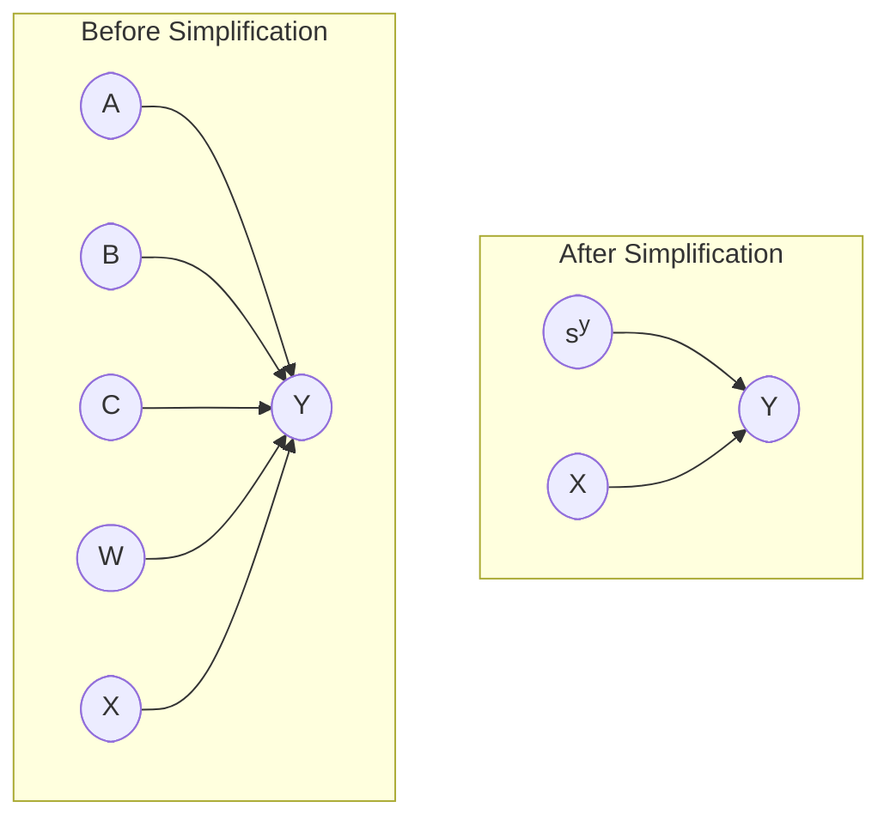

where $s^y$ is anything other than $x$ that can causally affect $y$; ie, the set of potential effect modifiers

An example could be gender, temperature, etc.

Mathematically, $s$ is an effect modifier if
$$
\begin{aligned}
P(y) &\ne P(y \vert s) \\
E[y \vert \text{do}(x)] &\ne E(y \vert \text{do}(x), s)
\end{aligned}
$$

## Instrumental Variable

Variable $iv$ that satisfies

1. $iv$ correlated with $x$
2. Every open path connecting $iv$ w/ $y$ has an arrow to $x$
   - $iv$ exogenous to $y$ (desired but not strictly necessary)
   2. $iv$ affects $y$ only though correlation with $x$

If we use a model
$$
\begin{aligned}
\hat y &= \beta_0 + \beta_1 x + u\\
\implies \beta_1 &= \dfrac{\text{Cov}(y, iv)}{\text{Cov}(x, iv)}
\end{aligned}
$$

## Fixed Effects

Variable that captures effect of unobserved confounders
$$
\hat y = \tau + \beta_0 + \beta_1 x + u \\
\implies \widehat{\text{ATE}} = \beta_1
$$

## Example

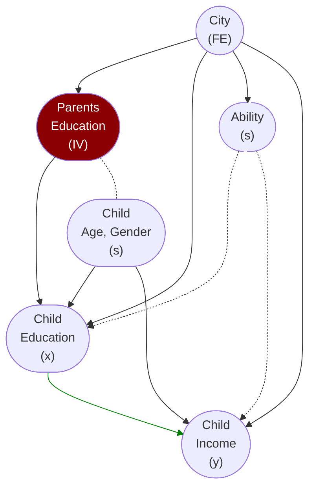

### Parent’s education is an instrument variable for child’s wage through child education.

College-educated parents have +ve impact on children’s
college attainment, either through better home education or because
they are more capable of affording college education.

If we assume that more educated parents

- don’t produce children with higher unobserved abilities/preferences that affect education and wages
- don’t directly help children obtain higher wage jobs

The statement holds true as the only way parent’s education affects individual’s earnings is through effect on child’s education.

### City is a Fixed Effect

City captures ability, school quality, productivity and other unobserved factors

## Types of Intermediary vars

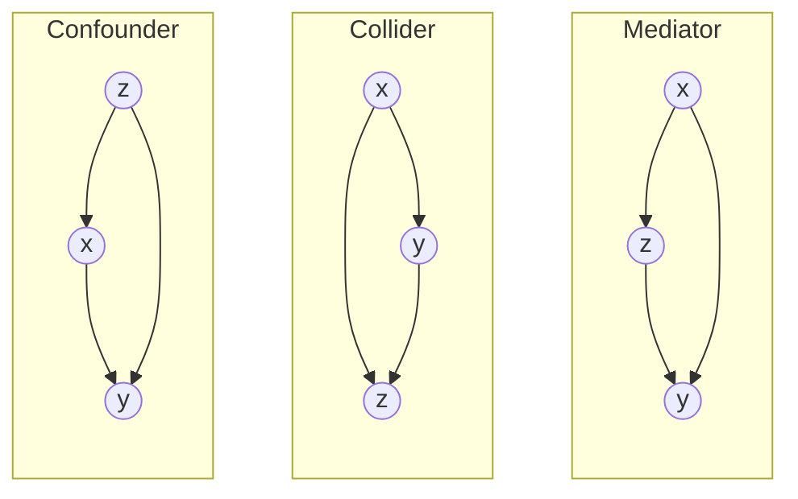

| Type       | Should Condition to remove block |
| ---------- | -------------------------------- |
| Confounder | ✅                                |
| Collider   | ❌                                |
| Mediator   | ❌                                |

## Intervention

$\text{do}(x_i = a)$ implies removing all arrows entering $x_i$ while setting $x_i = a$, hence removing the effect of all parents of $x_i$

Hence $x_i$ becomes endogenous after intervention

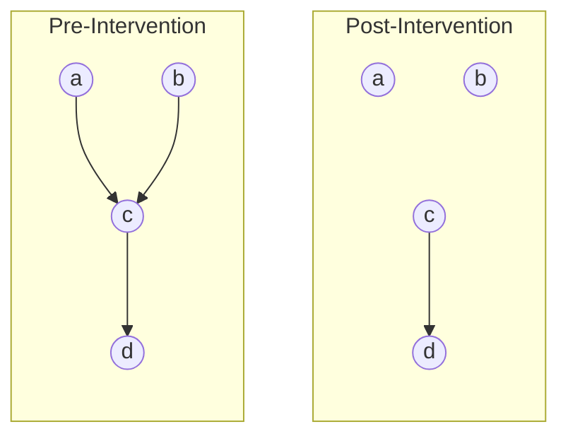

|                   |                                                              |
| ----------------- | ------------------------------------------------------------ |
| Pre-Intervention  | $p(A, B, C, D) = p(D \vert C) \cdot p(C \vert A, B) \cdot P(A) \cdot p(B)$ |
| Post-Intervention | $p( \ A, B, C, D \vert \text{do}(C=c) \ ) = p(D \vert C=c) \cdot P(A) \cdot p(B)$ |

$$
p(A \vert \text{do}(C)) = p(A) \\
p(A \vert C) \ne p(A)
$$

## IDK

$$
\begin{aligned}
p(x_a, \dots, x_b)
&= \Pi_i \  P(x_i \vert \text{pa}(x_i))
&& i = [a, b]
\\
p(x_a, \dots, x_b \vert \text{do}(x_c=1)) 
&= \Pi_i \  P(x_i \vert \text{pa}(x_i))
&& i = [a, b], i \ne c
\end{aligned}
$$

## Limitation of Causal Graph

There is no way for causal graph to represent the causal effect of input $x$ on output $y$ due to some effect modifier. For example

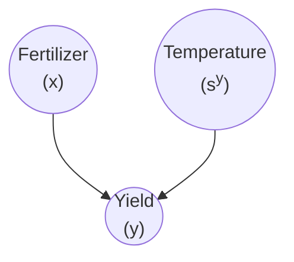

Temperature does not affect how much usage of fertilizer, but we know that the temperature affects the **effectiveness** of the fertilizer, but we have no way of representing that here. However, the [Causal Effect Formula](09_Causal_Effect_Learning.md#Causal Effect Formula) will take care of that.

