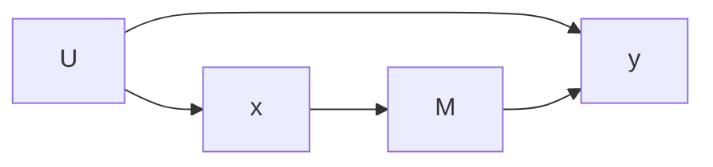
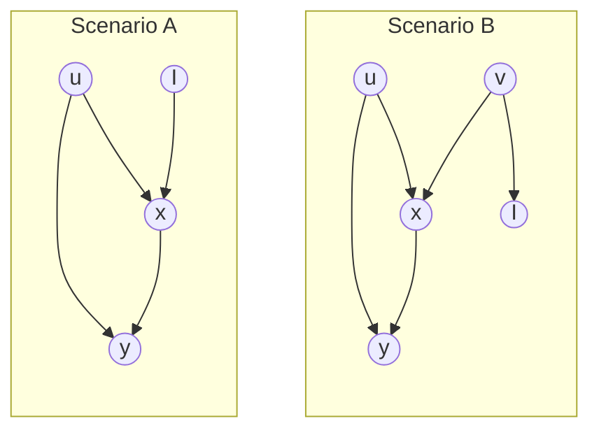
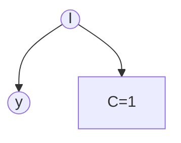
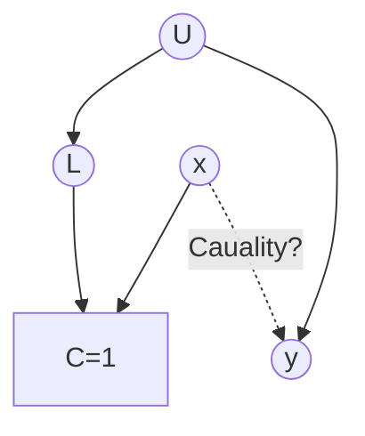
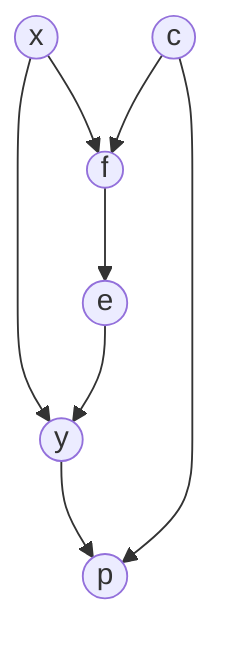

# Causal Effect Learning

Causal effect learning = statistical learning with

- Target function: $E[y \vert \text{do}(x)]$, instead of $E[y \vert x]$

  or
- Target distribution: $p(y|\text{do}(x))$, instead of $p(y \vert x)$

## Probabilistic

Causal effect of a treatment is a probability distribution: it is not the same for every individual.

- Learning the individual-level is nearly impossible
- Learning the pdf of the effect is hard

Hence, we use the Average Treatment Effect

## Stages of Causal Effect Learning

1. Identification of causes: Causal Reasoning
   Just reasoning and understanding; no math, statistics
2. Reformulate into statistical form
3. Estimation

## Identifiability of Causal Effects

Causal effect $\theta(M)$ is identifiable if it can be uniquely determined from $D$

- $M=$ Model with vars $x=(x_1, \dots, x_n)$
- $v = (v_1, \dots, v_m) =$ set of observed RVs
- $D \sim p(v) =$ Observed data
- $\theta(M) = g_M(x)$ be a function of $x$ according to $M$, which is the causal effect of $x_i$ on $x_j$

## Identification

Express $P(y \vert \text{do}(x) \ )$ in terms of $P(v)$, where $v$ is the set of observed variables $\{ x, y, \dots \}$

Questions

1. Is it possible to learn the causal effect of our interest from the available observable variables.
2. What causal assumptions do we need to make to do so?

### Types

| Type           | Identification                                               | Example               |
| -------------- | ------------------------------------------------------------ | --------------------- |
| Non-Parametric | w/o any parametric assumptions on the relationships among the variables | RCT                   |
| Parametric     | Statistical and functional form assumptions are involved     | Observational studies |

## Estimation

Learn the identified causal effect from a **finite** sample

Once we have established identification using causal reasoning based on causal models, we are left with a pure statistical learning problem

### Types

| Type           | Estimation                                                   |
| -------------- | ------------------------------------------------------------ |
| Non-Parametric | w/o any parametric assumptions on the relationships among the variables |
| Parametric     | Statistical and functional form assumptions are involved     |

## IDK

Hence we have a matrix

| Identification \| Estimation | Parametric | Non-Parametric |
| ---------------------------- | ---------- | -------------- |
| Parametric                   |            |                |
| Non-Parametric               |            |                |

## Limitations of Causal Effect learning

- Causal effects do not exist in a vacuum. They are usually the effects of complex and scientific/economic processes
- Causal effects are limited to the [scope](#Scope) of the study, ie, population-specific. When we talk about “the causal effect of $x$ on $y$”, it is always wrt to a specific population within a specific social, cultural, and economic environment.

## Intervention

The effect of an intervention $\text{do}(x_i=a)$ is to transform the pre-intervention distribution into the post-intervention distribution
$$
\begin{aligned}
P( \ x_{-i} \vert \text{do}(x_i=a) \ )
&= \Pi_{j \ne i} \  p( \ x_j \vert \text{pa}(x_j) \ ) \\
&= \dfrac{p(x_{-i}, x_i = a)}{p( \ x_i = a \vert \text{pa}(x_i) \ )} \\
&= p( \ x_{-i} \vert x_i = a, \text{pa}(x_i) \ ) \times p( \ \text{pa}(x_i) \ )
\end{aligned}
$$

## Causal Effect Formula

### General Formula

$$
\begin{aligned}
&P(y| \ \text{do}(x) \ ) \\
&= \int P(y| \ \text{do}(x), s^y \ )
\cdot P(s^y)
\cdot ds^y
\end{aligned}
$$

### RCT

$$
\begin{aligned}
&P(y| \ \text{do}(x) \ ) \\
&= P(y \vert x)
\end{aligned}
$$

### Observational Studies

Let $z=\text{pa}(x)$, ie all the causes of $X$ 
$$
\begin{aligned}
p( \ y \vert \text{do}(x) \ ) &= \int p(y \vert x, z) \cdot p(z) \cdot dz \\
& \quad \text{(Causation)}
\\
p( \ y \vert x \ ) &= \int p(y \vert x, z) \cdot p(z \vert x) \cdot dz \\
& \quad \text{(Correlation)}
\end{aligned}
$$

Assuming we observe a random sample of $\{ x, y \}$
$$
\begin{aligned}
\\
x {\small \coprod} z \implies p(z \vert x) &= p(z)
\\
\implies
p(y \vert \text{do}(x), z) &= p(y \vert x, z) \\
E[y \vert \text{do}(x), z] &= E[y \vert x, z]
\end{aligned}
$$

$$
\begin{aligned}
& p( \ y \vert \text{do}(x=a) \ ) \\
&= \int p( y \vert \text{do}(x=a), z ) \cdot p( \ z \ ) \cdot dz \\
&= \int p(y \vert x=a, z) \cdot p( \ z \ ) \cdot dz \\
&E( \ y \vert \text{do}(x=a) \ ) \\
&= \int E[y \vert \text{do}(x=a), z] \cdot p( \ z \ ) \cdot dz
\\
&= \int E[y \vert x=a, z] \cdot p( \ z \ ) \cdot dz
\end{aligned}
$$
where

- $E[y \vert x=a, z]$ can be estimated from data using any appropriate statistical model
- $p(z)$ can be estimated using empirical distribution

What if we don't observe $z$?

| $z$ Fully Observed | Identifiability of $p( \ y \vert \text{do}(x) \ )$           |
| ----------------------------- | ------------------------------------------------------------ |
| ✅                             | ✅ Non-parametrically                                         |
| ❌                             | ❌ ✅ Non-parametrically only if identification criteria satisfied |

## Non-Parametric Identification

Provide sufficient conditions

### Back-Door Criterion

Set of variables $s$ satisfy this criterion $\iff$

1. conditioning on $s$ blocks every back-door path from $x$ to $y$
2. no var in $s$ is a descendant of $x$: $s$ only includes pre-treatment vars

IDK

- $x$ is exogenous to $y \iff \not \exists$ open back-door path from $x$ to $y$: $p(y \vert \text{do}(x)) = p(y \vert x)$
- $x$ is conditionally exogenous to $y \iff \not \exists$ open back-door path from $x$ to $y$ after conditioning on $s$: $p(y \vert \text{do}(x), s) = p(y \vert x, s)$

When $x$ is (conditionally) exogenous to y, individual units with different values of $x$ are (conditionally) exchangeable with respect to $y$, in which case an observational study resembles a (conditionally) randomized experiment: treatment assignment mechanism is ignorable
$$
s^y \coprod x \vert s^B
$$
where $s^B =$ set of variables that meet back-door condition

idk

- $\exists$ an open back-door path from $x$ to a variable $s \in s^y$ such that $s \centernot {\small \coprod} x \iff \exists$ open back-door path from $x \to y$
- There, if conditioning on $s^B$ blocks all back-door paths from $x \to y \implies s {\small \coprod} x \vert s^B, \quad \forall s \in s^y$
- Therefore, back-door criterion can be equivalently states as requiring that no direct causes of $y$ are correlated with $x$ conditional on $s^B$
- $x$ is exogenous to $y$ conditioning on $s^B$ if $s^y {\small \coprod} x \vert s^B$, else it is endogenous

$$
\begin{aligned}
p( \ y \vert \text{do}(x), s^B \ )
&= p( \ y \vert x, s^B \ )
\\
p( \ y \vert \text{do}(x) \ )
&= \int p( \ y \vert x, s^B \ ) \cdot p(s^B) \cdot d s^B
\end{aligned}
$$

### Front-Door Criterion

If we can establish an isolated and exhaustive mechanism that relates $x \to y$, then the causal effect of $x$ on $y$ can be calculated as it propagates through the mechanism

A set of variables $s^F$ satisfies the front-door criterion when

1. conditioning on $s^F$ blocks all causal paths from x to $y$

   and

2. $x$ is exogenous to $s^F$, ie no open back-door paths exist from x to $s^F$

   and

3. $s^F$ is exogenous to $y$ conditional on $x$, ie conditioning on $x$ blocks all back-door paths from $s^F$ to $y$

$x \to M \to y$ represents an mechanism that is

- isolated: not affected by U
- exhaustive: only causal path from $x \to y$
  - all of the effects of $x$ on $y$ is mediated through $x$’s effect on $M$
  - $M$’s effect on $y$ is confounded by the back-door path $M \leftarrow x \leftarrow U \to y$ but $x$ blocks this path
  - We can find $p(y \vert \text{do}(x))$
    - directly find $p(M \vert \text{do}(x)) = p(M \vert x)$
    - use perform back-door adjustment to find $p(y \vert \text{do(M)})$

$$
\begin{aligned}
&p( \ y \vert \text{do}(x) \ ) \\
&= \int p \left( \ y \vert \text{do}(s^F) \ \right) \cdot p \left( \ s^F \vert \text{do}(x) \ \right) \cdot ds^F \\
&= \int
\left[{\small \int} p \left( \ y \vert (s^F, x) \cdot p(x) \cdot dx \ \right)
\right]
\cdot p \left( \ s^F \vert \text{do}(x) \ \right) \cdot ds^F
\end{aligned}
$$

## Parametric Identification

If we use observational data, but neither the back-door nor the front-door criterion is satisfied by the variables that we observe, then we may need additional parametric assumptions in order to identify the causal effect of interest

### Instrumental Vars Strategy

The causal effect of $x$ on $y$ is not identified if $U$ is not observed and we assume only the causal relationships encoded in this diagram. If in addition we assume $Y = βX + αU$, then $β$ can be identified using $I$ as an instrument

A variable $s^I$ can serve as an instrumental variable (IV) for identifying the causal effect of $x$ on $y$ if

1. $I$ is associated with x
2. $I$ is associated with $e$, where $y=\beta_1 x + e$

   Every open path connecting $I$ and $y$ has an arrow pointing into $x$: $I$ is d-separated and independent from any common causes of $x$ and $y$, since $x$ is a collider on their paths

Both conditions imply that any association between $I$ and $y$ could only be a result of the association between $I$ and $x$ and the causal effect of $x$ on $y$

One of the simplest parametric assumptions under which an IV strategy works is that of a linear model: $y = \beta x + \alpha u$, where $u$ are the causes of $y$ other than $x$, including those that are $x$ and $y$’s common causes
$$
\begin{aligned}
& \text{Causal Effect } \\
& \implies \beta = \dfrac{\text{Cov}(y, I)}{\text{Cov}(x, I)}
\end{aligned}
$$

## Sample Selection Bias

Let $c \in \{0, 1\}$ indicate whether an individual unit belongs to the subpopulation.

The subpopulation with $c = 0$ and the subpopulation with $c = 1$ are **not exchangeable**. Hence, analyses based on samples drawn from the subpopulation can be thought of as analyses using the whole population, but conditional on $c = 1$

Suppose we want to learn $p(y)$ in the whole population, then $c$ can be considered as a treatment itself: $p(y ) = p (y | \text{do} (c = 1))$, i.e. the distribution of $y$, where everyone is ‘assigned’ to the ‘observed group’

Hence nonparametric identification of $p (y)$ relies on whether we can make $c$ exogenous to $y$, which can be done by blocking all backdoor paths between $c$ and $y$

### Credit Card Default

Suppose credit card companies determine whether to accept $x$ credit card applications based solely on income $I$. Once a person is issued a credit card, income determines the probability of her default ($y$)

Assume we observe I for entire population, but only observe $y$ for $x = 1$

- Observed: $p(y \vert x=1)$
- Interested: $p(y \vert \text{do}(x=1))$
- Interested: $p(y)$

Since there is sample selection bias to estimate effect of $c$ on $y$:

$$
p (y |\text{do}(c = 1)) \ne p (y |c = 1)
$$

Since $I$ satisfies backdoor condition for $c \to y$
$$
\begin{aligned}
p (y |\text{do}(c = 1)) &= p (y) \\
&=\int p( y \vert c=1, I) \cdot p(I) \cdot dI
\end{aligned}
$$

There is no sample selection bias here in learning the causal effect of $I$ on $y$:
$$
\begin{aligned}
& p(y \vert \text{do}(I)) \\
&= p ( \ y \vert \text{do}(I, c=1) \ ) \\
&= p ( \ y \vert \text{do}(I), c=1 \ )
\end{aligned}
$$

### IDK

$C$ is a collider on the path $x \to C \leftarrow L \leftarrow U \to y$. Hence, the path is blocked without conditioning on $C$
$$
p( y \vert \text{do}(x) ) \ne  p( y \vert x)
$$
Conditioning $c=1$ opens the path, making $A$ and $y$ associated without causal, leading sample selection bias in learning $p(y \vert \text{do}(A))$
$$
p( y \vert \text{do}(x) ) \ne  p( y \vert 
x)
$$
Assume we observe

- $\{ x, L \}$ for both $C = 0$ and $C = 1$
- $y$ only for $C = 1$

Since conditioning on L blocks all back-door paths from $x \to Y$ and from $C \to Y$, we have
$$
\begin{aligned}
&p( y \vert \text{do}(x) ) \\
&= p( y \vert \text{do}(x, c=1) ) \\
&= \int p( y \vert x, L, c=1 ) \cdot p(L) \cdot dL
\end{aligned}
$$
Hence, $p(y \vert \text{do}(x))$ is non-parametrically identifiable and estimated

## Observational Studies vs RCT

RCT helps ensure that the links from $\text{pa}(x)$ to $x$ are broken, so that $x \coprod pa (x) \implies p (\text{pa} (x) |x = a) = p (\text{pa} (x) |x = b)$. The distribution of $\text{pa}(x)$ is balanced across the different values of treatment $x \implies x$ becomes exogenous, so there is no confounding to worry about

Compared with observational studies, RCTs have less knowledge requirement: we do not need to know the treatment assignment mechanisms that generate the observational data, since we now determine the mechanism ourselves. In graph terms, only knowledge of the post-intervention causal diagram is needed

A major limitation of RCTs, as already discussed, is that it is hard to generate data from a $p(y \vert \text{do}(x))$ that is the result of a desired distribution of effect modifiers

## IDK

### Fumigation and Yield

Suppose the mechanism that generates our observed data works as follows: fumigation ($X$) helps control eelworms (E), which affects crop yield (Y). Farmers’ use of fumigation is affected by weather (W) and the price of fumigants (C). Weather also affects yield independently. Finally, we observe the equilibrium crop price (P), which is affected by both the price of fumigants and the realized crop yield

Assuming $X$ is binary and other variables are discrete
$$
\begin{aligned}
& P( y \vert \text{do}(X=1) ) \\
&= \sum_{w, c} p(y \vert X=1, W=w, C=c) \times p(W=w) \times p(C=c)
\end{aligned}
$$

