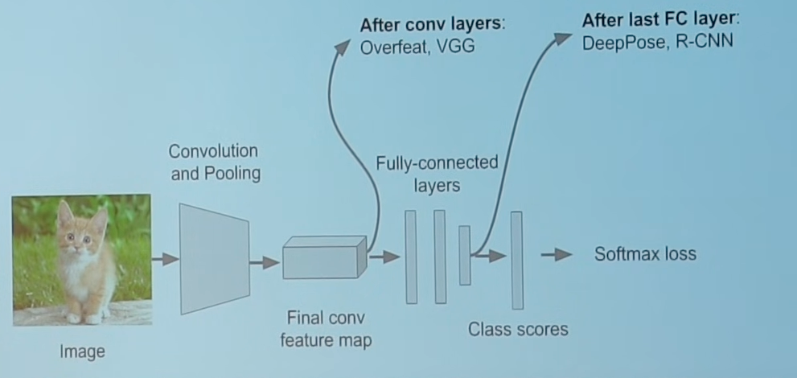
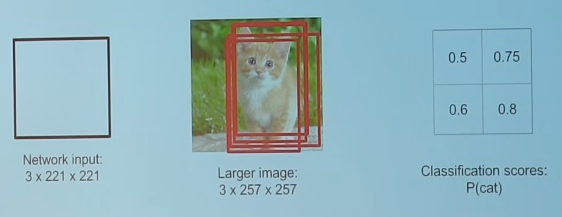
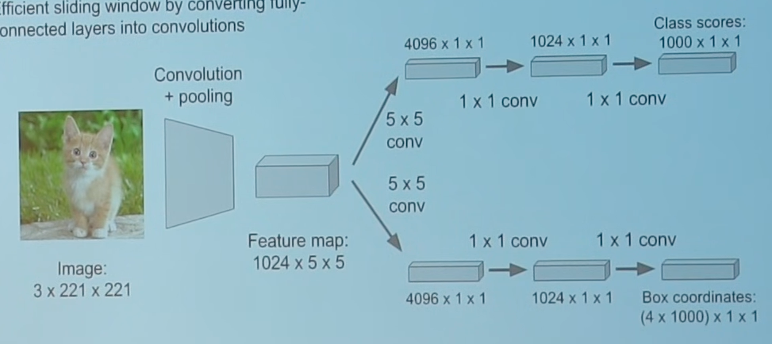

# Localization

Image --> Bounding box

1. Train classification model
2. Attach new fully-connected "regression head"
3. Train regression head with regression loss
4. At inference, use both heads

## Regression Head Approaches
- Class agnostic: one box in total
- Class specific: one box per class
	- more intuitive
	- works for multiple object localization; For eg: represent human pose with $k$ joints

## Regression Head Position

## Sliding Window

### Naive
- Run classification + regression head at multiple location on high resolution network
- Combine classifier and regressor predictions across all scales for final prediction

### Efficient

Convert FC layers into conv layers

|                             |                                                      |
| --------------------------- | ---------------------------------------------------- |
| Train                       |   |
| Inference (larger image) |  |

Advantage: Extra compute only for extra pixels