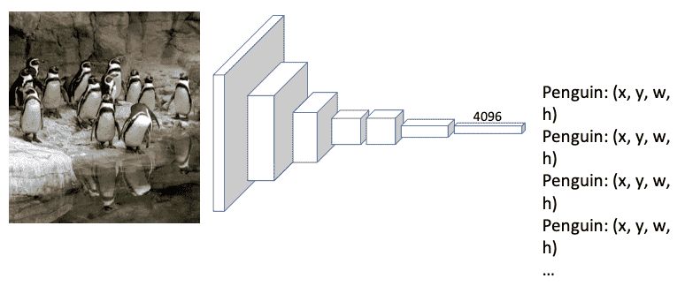
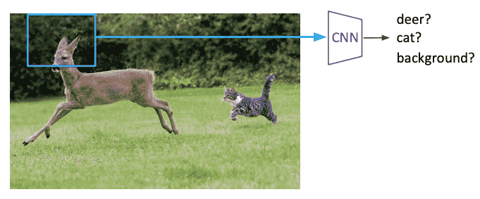

# Detection

Perform classification and localization for multiple (unspecified) instances

Hard to solve with techniques used for localization, as we need variable sized outputs

## Approaches

- Brute-force Classification: Keep running classification for sliding window at different positions; computationally-expensive
- Histogram of oriented gradients
- Deformable parts model
- Region proposals
	- Class -agnostic object detector
	- Look for "blob-like" regions that are likely to be foreground containing objects
	- Search techniques
		- Selective search
		- EdgeBoxes
## Datasets
- Pascal
- ImageNet Detection
- Microsoft Coco