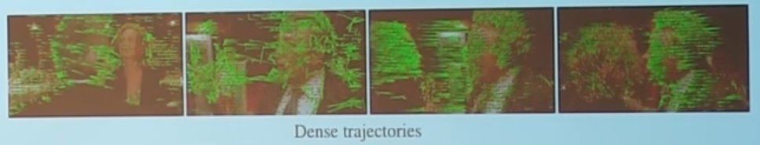

# Video
Continuous stream of images

## Before deep learning
they used 'tracklets'

## Generalizing CNNs

Intuitively a recurrent CNNs to share weights across time

Extend convolutional filters in time, performing spatio-temporal convolutions,

so filters will be $w \times h \times T; T \in [2, 15]$, where $T =$ temporal width

However, single frame is a very strong baseline and motion detection does not add much value
