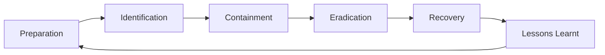
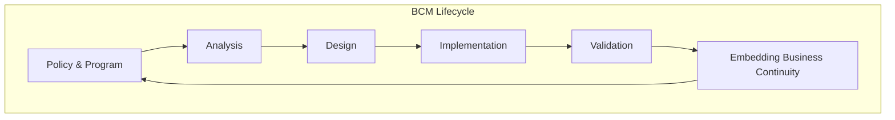
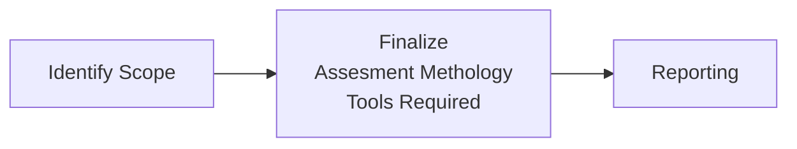
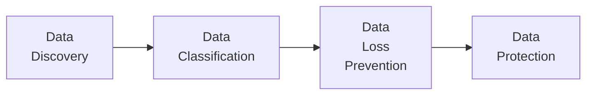
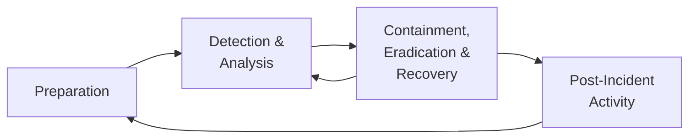

Take these points and plug them into other pages

## Why does Cyber Security Awareness Fails

- Complicated/Boring training content
- Poor Enforcement
- Lack of monitoring
- Unfocused awareness
- Point-in-Time Compliance
- Culture Misalignment
- Shared responsibility

## Solution

- Conventional vs UNconventional Thinking
- Policy vs Story telling
- Point-in-Time Assessment vs Continuous monitoring
- Compliance vs Culture
- Single-Unit vs Cross-Functional Team

Awareness has to fun and exciting, not like work.

## Using Virtual Machine

If you isolate your virtual machine from your OS, you **may** get away even in the case of an attack.

## Zero Day Vulnerability

Zero day vulnerability is something that was not known before.

## Phases of Cyber Kill Chain

The earlier you detect, the better

- Reconnaisance

  - Observation

  - Attacker identifies a target and explores vulnerabilities

  - > The one who knows their enemy more than themselves wins the war.
    >
    > If you don’t know how someone will attack you, then you can’t protect yourself.

  - Learn to attack so you can defend yourself

- Weaponization

  - Develop ‘ammunition’

  - Create a payload/malware

  - This is the only thing the defender has no control over, as it is in the attacker’s hands

- Delivery

  - Send the payload to the intended target

  - Social Engineering

  - Web Proxy helps protect users

- Exploitation

  - Malicious explotaition is executed within the victim’s system

  - Reverse shell is a response to a shell

- Installation

- C&C

  - Command and Control of system resources

- Action & Objectives

1 attacker and many victims leads to a bot(something)

## Cyber Threat Intelligence

The first phrase people say when something happens is ‘failure of intelligence’

- Strategy is long-term
- Tactics is short-term

### Fundamentals

1. Intel Planning/Strategy
2. Data Collection & Aggegration
3. Threat Analytics
4. Intel Uage & Dissemination

## Dark Web

- Gives illusion of anonymity
- Gives you access to information

### Onion Network

Be careful when using Tor

Most Tor networks are actually the host of the network, so they are infact monitored.

## Types of Malware

| Type                 | Meaning |
| -------------------- | ------- |
| Backdoor             |         |
| Botnet               |         |
| Downloader           |         |
| Information-Stealing |         |
|                      |         |
|                      |         |
| Scareware            |         |
|                      |         |

## Dark Web Economy

## Incident Response

## Compliance Management

### Compliance Montoring

You need to know what to comply to.

### Unified Compliance Framework

### Service Level Agreements

## Shell

Communication tunnel between 2 computers?

## Types of IP

The class of IP depends on the size of the organization

- Class A
- Class B
- Class C

## Skilled

Really skilled hackers won’t even be known.

## Miscelaneous

> Any field you are in, you should learn the terminologies.

> Never believe you know everything; keep learning

> Keep an open-mind always; don’t go with a bank mindset to another field.

> Always see if you get importance in your organizations. But then again, if you do get importance, never let it get to your head.

> You may not certificates/acknowledgment, but don’t let it get to your head.

> Success will won’t teach much; only failure will teach

> The only time you can stop learning is “when you’re 6ft under”

> You should be able to adapt to any situation.

## Book on Kingpin

## Impact

The extent to which a risk event might affect the enterprise.

|                   |                                                              |
| ----------------- | ------------------------------------------------------------ |
| Asset             |                                                              |
| Vulnerability     |                                                              |
| Threat            |                                                              |
| Security Controls |                                                              |
| Risk              | Possibilty that a threat will exploit a vulnerability, affecting asset |

## NIST Cybersecurity Framework

- Identify
- Protect
- Detect
- Respond
- Recover

## GDPR

General Data Protection Regulation

## Control

All risks should be evaluated, and a corresponding control measure should be used.

We need effectiveness

We cannot use 7 factor authentication :laughing:

### Control Design/Measure

### Control Operation

## Risk Management

- Risk Tolerance
  - 
- Risk Transfer
  - Getting insurance after doing whatever you can do yourself
- Risk Mitigation
  - Something

## Business Continuity

Ensures bare minimum services are provided in case of a business

## BIA

Business Impact Analysis

Analyze what are your critical processes

## IDK

- It is not safe to swipe your credit card, as the magnetic stripe is **not** encrypted
- It is safer to either
  - insert your card, and use the encrypted Electro-Magnetic chip
  - or, tap it and use NFC

Be careful about scams. A bank would never ask you for your credit card details.

 

----

Keep updated with the latest news related to cyber-security

There is high demand for cyber-security, but not enough supply to meet the demand.

## Supply-Chain Attack

Attack on backdoor (3rd Party Software dependency compromise)

Solar Winds

## log4j JNDI Attack

## Security Assessment

We need to test our tools before attackers do.

## DDOS

A Denial-of-Service (DoS) attack is **an attack meant to shut down a machine or network, making it inaccessible to its intended users**. DoS attacks accomplish this by flooding the target with traffic, or sending it information that triggers a crash.

### Half-Flood Attack

Uses TCP

Evolution and 

## Evolution App Infrastructrue

Mainframe

Shared Responsibility

### Monilithic vs Microservice Architecture

Microservice is basically modular distributed computing, for each service/page of the product

## Watch List

> History repeats itself.

Learn about history, and learn about what thought processes they used

- [ ] Pirates of the Silicon Valley
- [ ] Steve Jobs Autobiography

## Types of Assessment

- Vulernaribility Assessment
- Penetration Testing
- Red Teaming

## Tools

- SATAN (Security Admin Tool for Analyzing Networks)
- NMAP
- Nessus Project
- Appscan
- Burp Suite
  - Used for bug bounties

## CVE

Maintained in the National Vulnerability Database

## Vulnerabilities Scanner - Operation Models

|                |      |      |
| -------------- | ---- | ---- |
| Scan Direction |      |      |

## Types of Vulnerability Scanner

- Signtature-Based
- Behavioural

Something

- Static
- Dynamic

## Security Assessment Lifecycle

## Risk Rating and Prioritization

NVD rates vulnerabilities

## Where to Start

NICE (National Initiative for Cybersecurity Education) Framework

- Employers
- Learners
- Something

There are lists of required skills and knowledge

## Something

Data protection is needed to protect only for outgoing **confidential** data.

- It is not feasible to protect all data

Importance/Confidentiality of data varies over time

- Exam questions are important for uni **before** exam
- **After** exam, it is not important

## Biggest Risks

- Human Errors
- Insider threats
- BYOD (Bring Your Own Device)
- Public Networks
  - Especially in airports, where they harvest user data
  - Even your user-id and password will go through the public access point
  - Even https is not free from this risk
- Charging Ports
  - Using a ‘dumb intermediary’ (such as power bank) prevents this

Data Residency Law

## Data Protection Model

## DLP Architecture

## Training Techniques

- Provide data
- Exact data Matching
- Exact match data identifier
- Indexed document matching
- OCR

## Cloud Data Protection

- Intune
- O365 DLP
- Cloud Access Security Broker

## AIP (Azure Information Protection)

Encryption travels with the file

Used in Netflix Offline Saved

## Digital Rights Management

## Credit Card Pattern

- 1: Credit Service Provider
  - 4 = Visa
  - 5 = Mastercard
- 2-5: Bin Number

IBAN number?

## IDK

> Never share your secrets with anyone; it will destroy you.

> Trust anyone; never trust the devil inside.

> “**If you can't measure it, you can't manage it**.” If you don't measure, then how do you know how you are doing?

## SIEM

Used for log monitoring

Cannot simulate attacks

## Log

Historical record of an event

## Log Management

Approach to deal with large volumnes of computer-generated log messages.

Open-source something Wazoo

### Why?

### Challenges

- Variety of formats
- Large volume of data

### Load Balancing

Load Balancer manages the load that each collector receives

## Steps

1. Log 
2. Incident

## Incident Response

## Database Activity Monitoring

Monitor the activities of database admins.

For eg, if someone suddenly performs a `select` query of all tables

## IAM

Identity Access & Management

### Credential Security

- Something you have (password)
- Something you are 
- Something you know (childhood bestfriend)

## AAA Principles

- Authentication
- Authorization
- Accountability/Auditing
  - Authorized person has access to authorized resources only at authorized times

## Access Control Models

- Discretionary Access Control
- Mandatory Access Control
- Rule-Based Access Control
- Attribute-Based Access Control
- Role-Based Control
  - Most common in companies

## Identity Life Cycle Management

## Segregation of Duties

If both maker and checker are the same person,

- Possibility of frauds
- Possibility of human error

## UI Path RPA

> You’ll get job tomorrow at First Abu Dhabi bank if you are RPA-certified
>
> CASSP, CSSP, CEH
>
> ~ Senthilkumar

Most important thing is surveillance and find out weaknesses.

## Bridge Mode

You can run a 

VM is paired to machine

## NAT Mode

VM is subset of machine

# IDK

Go watch Chinese movies

Snake in the Monkey’s Shadow

> The world throws questions for which there are no answers. No point in memorizing stuffe

# VUCA

Volatile Uncertain Complex Ambiguous

US Military Strategy

1. nsetn
2. Preachers preach change, but they never do
3. Most people do not realize their prejudices when taking decisions

When making a decision, first try to see if any problem is similar to past experience, or is it a new problem

> God, give me the courage to do what i can change, the something to , and the wisdom know the difference between both

> Insult is the better way to force someone to learn. Getting stones helps you build a castle.

> Fear is the greatest thing in life.

> Fear and Confidence, Pain and Pleasure are the 4 driving forces of life.

> You may treat people nicely, but doesn’t mean they will treat you the same. Life isn’t fair. You don’t eat the lion doesn’t mean that it won’t eat you.

Nowadays, students coming out of university are **Unskilled Unemployable Something Resource**. Industry wants **Deployable Something Resource**.

# Supply Chain Risk

`node.js`, `faker.js`

# MacOS is not safe

It is based on Linux **FreeBSD/BSD**