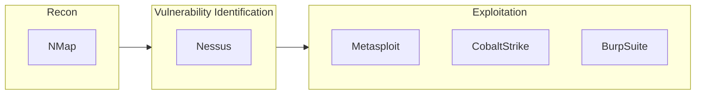

## Kali

```bash
ifconfig
```

```bash
cat /etc/hosts
```

```bash
ping kali
```

```bash
ping google
ping www.google.ae
```

```
64 bytes from any.in
```

```bash
netstat -ano
```

```bash
nmap 172.16.22.5
```

We can see what ports are open

## Telnet vs SSH(Secure SHell)

Telnet(Port 23) is unencrypted and insecure, as all traffic occurs in cleartext.

Block any service on Port 23 of the server.

If you see that port 23 is being used

```bash
telnet 172.16.22.5
```

All traffic will be in plain text.

```bash
ssh 2020A7PS0198U@172.16.22.5
```

All traffic will be encrypted.

## Wire Shark

You can analyze network. Click ethernet

Understand what all nmap is doing

```
ip.addr==172.16.22.5
```

## IP Address

Address for 2 computers to communicate with each other

Public can 

Private can access another Private without 

|          |          |
| -------- | -------- |
| 10.      | Internal |
| 172.16.  | Internal |
| 172.168. | Internal |

## DNS

Domain Naming Server

Lookup of domain with the corresponding IP address
$$
X. X. X \\
X \in [0, 255]
$$

## ICMP

Internet Control Message Protocol

## Automation Softwares



### Advantages

- Scalability
- Standardization
- Accuracy
- Reduced manual effort

## Nessus

```bash
curl --request G
```

```bash
sudo apt install ./Nessus.deb
```

## ngrok

This is like alias for wordpress localhosting

## IDK

```bash
showmount -e 192.168.100.25

mkdir /tmp/infosec ## not necessary
mount -t nfs 192.168.100.25:/home /tmp/infosec
```

