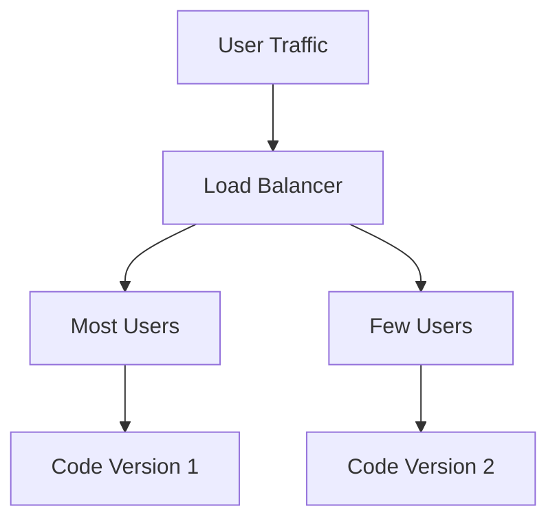

# Data Intensive Applications

Any of the following

 Any of the following generation/usage increases quickly:
- Volume of data
- Complexity of data
- Speed of change in data

## Pillars

| Pillar       | Properties                                                                                                                                                                                                                                                                                                                                                      |
| ------------ | --------------------------------------------------------------------------------------------------------------------------------------------------------------------------------------------------------------------------------------------------------------------------------------------------------------------------------------------------------------- |
| Reliable     | Fault-tolerance No authorized access Chaos Testing Robust to Full Machine Failures Bug-free, Automated bug tests Environments: Dev, Staging/Testing, Prod Quick roll-backs                                                                                                                                                                    |
| Scalable     | Handle high traffic volume Traffic load with peak # of reads, writes, simultaneous users Capacity planning Response time vs throughput End user response time 90th, 95th percentile SLO/A service level objectives/agreements Vertically-Scaling up (more powerful machine) Horizontally-Scaling out (distributed across smaller machines) |
| Maintainable | Add new people to work Productivity Operable: Configurable and testable Simple: easy to understand and ramp up, well-documented Evolveable: easy to change                                                                                                                                                                                          |

## Components

|                   |                                           | Tools                         |
| ----------------- | ----------------------------------------- | ----------------------------- |
| Databases         | Source of truth                           | SQL                           |
| Cache             | Temporary storage of expensive operation  | Memcache                      |
| Full-text index   | Quickly searching data by keyword/filter  | ESIndex Apache Lucener     |
| Message queues    | MEssaging passing passing between process | Apache Kafka                  |
| Stream Processing |                                           | Apache Spark Apache Samza  |
| Batch Processing  | Crunching last amount of data             | Apache Spark Apache Hadoop |
| Application code  | Connective tissue other components        |                               |

# Databases

Data Model
- Relational model
- Document-based model
	- Not great for analytics
- Graph model

Aspects to keep in mind
- Data storage
- Data retrieval

ID

u
K

|               | OLTP                                   | OLAP                                  |
| ------------- | -------------------------------------- | ------------------------------------- |
|               | Online Transaction Processing Database | Online Analytical Processing Database |
|               | Row-oriented                           | Column-oriented                       |
| Optimized for | Writes                                 | Reads                                 |
| Flexibility   | High                                   | Low                                   |
|               |                  |                 |

## Structure

- Shallow dimension tables
- Dense fact tables

## Pipeline

- ETL
- ELT

## Code Compatibility

- Backward compatibility: Newer code can read data written by older code for old and new clients
- Forward Compatibility: Older code can read data written by newer code for old and new clients

## Rolling Upgrades

### Canary

## Replication

- Machine failures
- Latency for global audience
- Scale to large userbase
- Offline/network failures

Types
- Leader-Replica
	- Writes go to leader
	- Reads may/may not go to leader
	- Reads go to replica
- Multileader-Replica
- Leaderless
	- Write to all replicas
	- Read from all replicas
	- Eg: Amazon Dynamo, Voldemort, Cassandra

Aspects to consider
- Synchronous vs Asynchronous replication
- Replication lag
- Topology
- Durability vs availability vs latency
- Leader Failover
- Conflict resolution between leaders

## Database Partitioning

Sharding/Splitting/Horizontal Scaling
