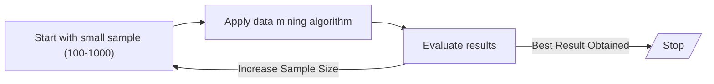
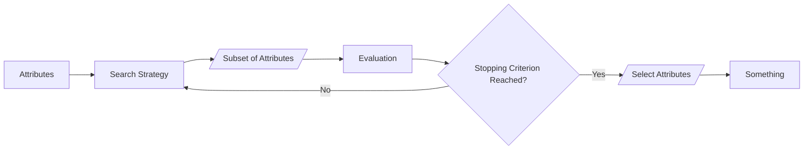
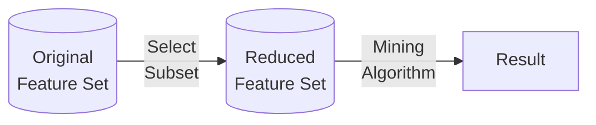
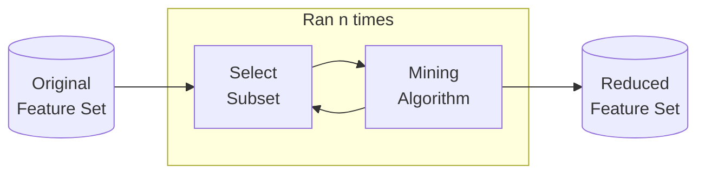

## Preprocessing Techniques

You don’t have to apply all these; it depends. You have to first understand the dataset.

| Technique                    | Meaning                                                      | Advantage                                                    | Disadvantage                                                 |
| ---------------------------- | ------------------------------------------------------------ | ------------------------------------------------------------ | ------------------------------------------------------------ |
| Aggregation                  | Combining/Merge data objects/attributes **Continuous**: Sum, mean, max, max, min, etc **Discrete**: Mode, Summarization, Ignoring | - Low processing cost, space, time - Higher view - More stable | Losing details                                               |
| Sampling                     | Creating **representative** subset of a dataset, whose characteristics are similar to the original dataset |                                                              |                                                              |
| Dimensionality Reduction     | Mathematical algorithm resulting in a set of new combination of old attributes | Eliminate noise and unnecessary features Better understandability Reduce time, memory and other processing cost Easier visualization | Getting the original data is not possible after transformation |
| Feature Subset Selection     | Removing irrelevant and redundant attributes                 | Same as ^^                                                   | Extra resources required                                     |
| Feature Creation             | Create new attributes that can capture multiple important features more efficiently |                                                              |                                                              |
| Discretization               | Convert continuous attribute into categorial/discrete (for classification) |                                                              |                                                              |
| Binarization (Encoding) | Convert continuous/categorical attribute into binary (association mining) |                                                              |                                                              |
| Attribute Transformation     | Mathematical transformations                                 |                                                              |                                                              |

Feature selection and Dimensionality reduction are used for **biomarkers analysis**

## Types of Sampling

### Random Sampling

| Random Sampling     | Data object put back into original population? | Duplicates? |
| ------------------- | :--------------------------------------------: | :---------: |
| With replacement    |                       ✅                        |      ✅      |
| Without replacement |                       ❌                        |      ❌      |

#### Problem

It may lead to misclassification, as not all classes are represented proportionally in the sample.

### Stratified Sampling

Different types of objects/classes with different frequency are used in the sample.

Useful especially in imbalanced dataset, where all the classes have large variation in their counts.

Ensures all classes of the population are well-represented in the sample.

#### Steps

- Draw samples from each class
    - equal samples, or
    - proportional samples, using % of the total of all classes
    - Gives us imbalanced dataset
- Combine these samples into a larger sample

### Progressive/Adaptive Sampling

Useful when not sure about good sample size

Computationally-expensive

#### Steps

{ loading=lazy }

### Data Augmentation

- Duplication
- Fit it a distribution

## Dimensionality Reduction Algorithms

| Technique               | Reduce dimensionality while              | Learning Type | No Hyperparameter Tuning Required | Fast | Deterministic | Linearity  |
| ----------------------- | ---------------------------------------- | ------------- | --------------------------------- | ---- | ------------- | ---------- |
| LDA                     | Separating pre-known classes in the data | Supervised    | ✅                                 | ✅    | ✅             | Linear     |
| PCA/ SVD using PCA | Generating clusters previously not known | Unsupervised  | ✅                                 | ✅    | ✅             | Linear     |
| MDS                     | ^^                                       | Unsupervised  | ❌                                 | ❌    | ❌             | Non-Linear |
| t-SNE                   | ^^                                       | Unsupervised  | ❌                                 | ❌    | ❌             | Non-Linear |
| UMAP                    | ^^                                       | Unsupervised  | ❌                                 | ✅    | ❌             | Non-Linear |

## Feature Selection

### Mutual Information

Mutual information (MI) between two random variables is a non-negative value, which measures the dependency between the variables. It is equal to zero if and only if two random variables are independent, and higher values mean higher dependency. The function relies on nonparametric methods based on entropy estimation from k-nearest neighbors distances.

### Brute Force Approach

Consider a set with $n$ attributes. Its power set contains $2^n$ sets. Ignoring $\phi$, we get $2^{n-1}$ sets.

**Steps**

- Evaluate the performance of all possible combinations of subsets
- Choose the subset of attributes which gives the best results

### Embedded Approach

The data mining algorithm itself performs the selection, without human intervention

Eg: A decision tree automatically chooses the best attributes at every level

Builds a model in the form of a tree

- Internal nodes = labelled with attributes
- Leaf nodes = class label

### Filter Approach

Independent of data mining algorithm

eg: Select attributes whose evaluation criteria(pairwise correlation/Chi^2^, entory) is as high/low as possible

### Wrapper Approach

Use the data mining algorithm (capable of ranking importance of attributes) as a black box to find best subset of attributes

## Feature Creation

- Feature extraction
- Mapping data to new space
    - Time series data $\to$ frequency domain
    - For eg, fourier transformation
- Feature construction
    - Construct features from pre-existing ones
    - Eg
    - Area = length * breadth
    - Density = mass/volume

## Discretization

1. Sort the data in ascending order

2. Generate

     - $n-1$ split points

     - $n$ bins $\to$ inclusive intervals (specified by the analyst)

Then convert using binarization. But, why?

### Types

|                   |            Equal-Width Binning             |                 Equal-Frequency Binning                 |
| ----------------- | :----------------------------------------: | :-----------------------------------------------------: |
| Analyst specifies |                 No of bins                 |          Frequency of data objects in each bin          |
| Width             | $\frac{\text{Max-Min}}{\text{No of bins}}$ |                                                         |
|                   |                                            | Make sure atleast $n-1$ bins have the correct frequency |

## Binarization 

|                                        |         Method 1         | One-Hot Encoding |
| -------------------------------------- | :----------------------: | :--------------: |
| For $m$ categories, we need ___ digits | $\lceil \log_2 m \rceil$ |       $m$        |
| No unusual relationship                |            ❌             |        ✅         |
| Fewer variables?                       |            ✅             |        ❌         |

## Attribute Tranformation

|                        |                             $x'$                             |        Property         |
| ---------------------- | :----------------------------------------------------------: | :---------------------: |
| Simple                 |                    $x^2, \log x, \vert  x  \vert$                    |                         |
| Min-Max Normalization  | $\frac{x - x_{\text{min}}}{x_{\text{max}} - x_{\text{min}}}$ |     $0 \le x \le 1$     |
| Standard Normalization |                    $\frac{x-\mu}{\sigma}$                    | $\mu' = 0, \sigma' = 1$ |

## Target Transformation

### Box-Cox/Bickel-Doksum Transformations

$$
w_t = \begin{cases}
\log \vert y_t \vert, & \lambda = 0 \\
\dfrac{\text{sign}(y_t) \vert y_t \vert ^\lambda - 1}{\lambda}, & \lambda \ne 0
\end{cases}
$$

| $\lambda$      | Transformation                         |
| -------------- | -------------------------------------- |
| 1              | None                                   |
| $\dfrac{1}{2}$ | Square root plus linear transformation |
| 0              | Natural log                            |
| -1             | Inverse plus 1                         |

### Back Transformation

$$
y_t = \begin{cases}
\exp(w_t), & \lambda = 0 \\
\text{sign}(\lambda w_t + 1) \cdot {\vert \lambda w_t + 1 \vert}^{1/\lambda}, & \lambda \ne 0
\end{cases}
$$

- Back-transformed point forecasts are medians
- Back-transformed Prediction Intervals have correct coverage

$$
E[y_t] = \begin{cases}
\exp(\mu) \left[1 + \dfrac{\sigma^2}{2} \right], & \lambda = 0 \\
(\lambda \mu + 1)^{1/\lambda} \left[1 + \dfrac{\sigma^2 (1-\lambda)}{2(\lambda \mu + 1)^2} \right], & \lambda \ne 0
\end{cases}
$$

