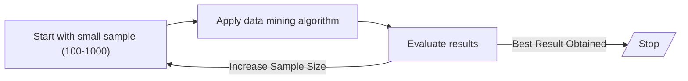
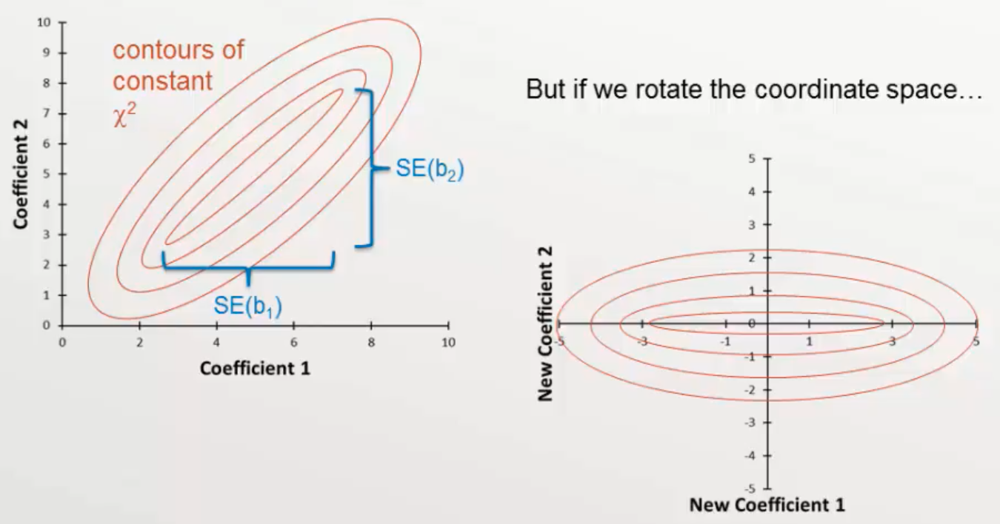
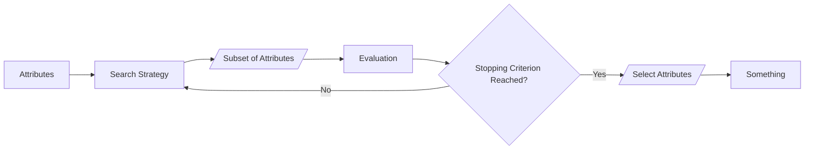
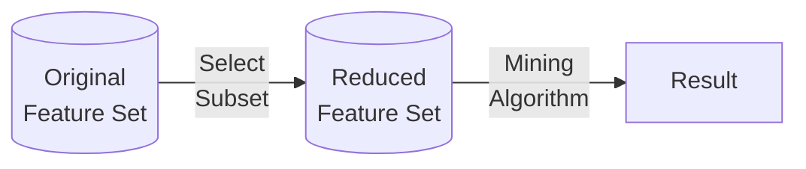
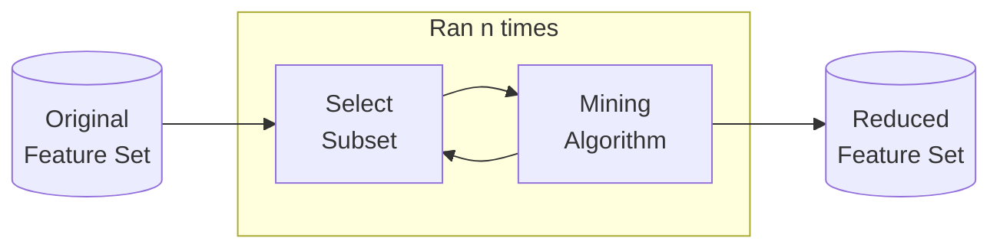

# Data Preprocessing

You don’t have to apply all these; it depends. You have to first understand the dataset.

| Technique                    | Meaning                                                                                                                                     | Advantage                                                                                                                                           | Disadvantage                                                   |
| ---------------------------- | ------------------------------------------------------------------------------------------------------------------------------------------- | --------------------------------------------------------------------------------------------------------------------------------------------------- | -------------------------------------------------------------- |
| Aggregation                  | Combining/Merge data objects/attributes<br />**Continuous**: Sum, mean, max, max, min, etc<br />**Discrete**: Mode, Summarization, Ignoring | - Low processing cost, space, time<br />- Higher view<br />- More stable                                                                            | Losing details                                                 |
| Sampling                     | Creating **representative** subset of a dataset, whose characteristics are similar to the original dataset                                  |                                                                                                                                                     |                                                                |
| Dimensionality Reduction     | Mathematical algorithm resulting in a set of new combination of old attributes                                                              | Eliminate noise and unnecessary features<br />Better understandability<br />Reduce time, memory and other processing cost<br />Easier visualization | Getting the original data is not possible after transformation |
| Feature Subset Selection     | Removing irrelevant and redundant attributes                                                                                                | Same as ^^                                                                                                                                          | Extra resources required                                       |
| Feature Creation             | Create new attributes that can capture multiple important features more efficiently                                                         |                                                                                                                                                     |                                                                |
| Discretization               | Convert continuous attribute into categorial/discrete (for classification)                                                                  |                                                                                                                                                     |                                                                |
| Binarization<br />(Encoding) | Convert continuous/categorical attribute into binary (association mining)                                                                   |                                                                                                                                                     |                                                                |
| Attribute Transformation     | Mathematical transformations                                                                                                                |                                                                                                                                                     |                                                                |

Feature selection and Dimensionality reduction are used for **biomarkers analysis**

## Types of Sampling

### Random Sampling

| Random Sampling     | Data object put back into original population? | Duplicates? |
| ------------------- | :--------------------------------------------: | :---------: |
| With replacement    |                       ✅                        |      ✅      |
| Without replacement |                       ❌                        |      ❌      |

#### Problem

It may lead to misclassification, as not all classes are represented proportionally in the sample.

### Stratified Sampling

Different types of objects/classes with different frequency are used in the sample.

Useful especially in imbalanced dataset, where all the classes have large variation in their counts.

Ensures all classes of the population are well-represented in the sample.

#### Steps

- Draw samples from each class
    - equal samples, or
    - proportional samples, using % of the total of all classes
    - Gives us imbalanced dataset
- Combine these samples into a larger sample

### Progressive/Adaptive Sampling

Useful when not sure about good sample size

Computationally-expensive

#### Steps



{ loading=lazy }

### Data Augmentation

Think of all invariances that is important for your model

- Images
  - Flip
  - Crop
  - Scale (Zoom)
  - Translation (Position)
  - Rotation
  - Adding noise
  - Warping
	  - Stretching
	  - Shearing
	  - Lens distortions
  - Filters
	  - Brightness
	  - Contrast
	  - Saturation
	  - ~~Hue~~ (don't do)
- Mixup
  - Convert labels
  - $x' = \lambda x_i + (1-\lambda) x_j; y' = \lambda y_i + (1-\lambda) y_j$
  - 

- Fit it to a distribution

## Dimensionality Reduction

Unsupervised learning problem where we find a low-dimensional representation $\mathcal Z$ of $\mathcal X$

$$
\begin{aligned}
\mathcal{Z}
&= f_\theta(\mathcal{X}) \\
f_\theta &: R^k \to R^d \\
d &< k
\end{aligned}
$$
Notes
- Ensure to standardize data prior
- Reducing dimensionality blindly is not always ideal
	- These are for visualization, but not good for learning due to non-causal nature
- Reduce dimensionality while preserving maximum information:
	1. Cluster correlated features
	   For eg Cluster 1: Volatility features, Cluster 2: Scale features
	2. Perform dimensionality reduction on each feature cluster separately
	3. Obtain the first principal component for each cluster

## Algorithms

| Technique                      | Working                                                                                                                                                                                                                                                                                                                                                                                                                                                                                                                                              | Reduce dimensionality while              | Learning Type | Comment                                                 | No Hyperparameter Tuning Required | Fast | Deterministic | Linearity  |
| ------------------------------ | ---------------------------------------------------------------------------------------------------------------------------------------------------------------------------------------------------------------------------------------------------------------------------------------------------------------------------------------------------------------------------------------------------------------------------------------------------------------------------------------------------------------------------------------------------- | ---------------------------------------- | ------------- | ------------------------------------------------------- | --------------------------------- | ---- | ------------- | ---------- |
| LDA                            | Maximize distance between classes                                                                                                                                                                                                                                                                                                                                                                                                                                                                                                                    | Separating pre-known classes in the data | Supervised    |                                                         | ✅                                 | ✅    | ✅             | Linear     |
| PCA/<br>SVD                    | Maximize variance in data<br /><br />Find linear combinations of predictor vars that are orthogonal to each other<br /><br />1. Calculate correlation matrix of predictors<br />2. Find eigenvalues and corresponding eigenvectors of correlation matrix<br />3. Orthogonalize design matrix by multiplying by a rotation matrix made up of eigenvectors<br /><br />$\mu(\text{PC}_i)=0 \quad \forall i$<br />$\sigma^2(\text{PC}_i)=\text{Eigenvalue} \quad \forall i$<br /><br />Learning more: Correlation matrix b/w PCs and original predictors | Generating clusters previously not known | Unsupervised  | $2k$ contaminated points can destroy top $k$ components | ✅                                 | ✅    | ✅             | Linear     |
| Kernel PCA                     |                                                                                                                                                                                                                                                                                                                                                                                                                                                                                                                                                      |                                          |               |                                                         |                                   |      |               |            |
| PLS<br>Partial Least Squares   | Similar to PCA but supervised<br>Create components correlated with the target                                                                                                                                                                                                                                                                                                                                                                                                                                                                        | ^^                                       | Supervised    |                                                         | ✅                                 | ✅    | ✅             | Linear     |
| Kernel PLS                     |                                                                                                                                                                                                                                                                                                                                                                                                                                                                                                                                                      |                                          |               |                                                         |                                   |      |               |            |
| Laplacian Eigenmaps            |                                                                                                                                                                                                                                                                                                                                                                                                                                                                                                                                                      |                                          |               |                                                         |                                   |      |               |            |
| LLE<br>Local Linear Embedding  |                                                                                                                                                                                                                                                                                                                                                                                                                                                                                                                                                      |                                          |               |                                                         |                                   |      |               |            |
| IsoMap                         |                                                                                                                                                                                                                                                                                                                                                                                                                                                                                                                                                      |                                          |               |                                                         |                                   |      |               |            |
| MDS                            |                                                                                                                                                                                                                                                                                                                                                                                                                                                                                                                                                      | ^^                                       | Unsupervised  |                                                         | ❌                                 | ❌    | ❌             | Non-Linear |
| t-SNE                          |                                                                                                                                                                                                                                                                                                                                                                                                                                                                                                                                                      | ^^                                       | Unsupervised  |                                                         | ❌                                 | ❌    | ❌             | Non-Linear |
| UMAP                           |                                                                                                                                                                                                                                                                                                                                                                                                                                                                                                                                                      | ^^                                       | Unsupervised  |                                                         | ❌                                 | ✅    | ❌             | Non-Linear |
| Variational auto-encoder       |                                                                                                                                                                                                                                                                                                                                                                                                                                                                                                                                                      |                                          |               |                                                         |                                   |      |               |            |
| Independent Component Analysis | Maximize signal independence                                                                                                                                                                                                                                                                                                                                                                                                                                                                                                                         |                                          |               |                                                         |                                   |      |               |            |

### PCA



- Eigen Vectors Matrix
	- Each element represents how much (the weight) each original variable contributes to the corresponding principal component
	- Row-wise sum of squared elements = 1, ie $\sum_{\text{feature } i} a_{ij}^2=1$
	- Col-wise sum of squared elements = 1, ie $\sum_{\text{loading } j} a_{ij}^2=1$
- Loadings matrix
	- Each element represents correlation between the original variable and the principal component
	- Col-wise sum of squared elements = var(PC_i), ie $\sum_{\text{loading } j} a_{ij}^2 = \sigma^2(\text{PC}_j)$
- Varimax rotation

```python
# apply PCA
pca = PCA(n_components=2)
pca.fit(X)

pca_eigenvectors_matrix = pd.DataFrame(
	pca.components_.T,
	columns=['PC1', 'PC2'],
	index=iris.feature_names
)

pca_corr_matrix = pd.DataFrame(
	pca.components_.T * np.sqrt(pca.explained_variance_),
	columns=['PC1', 'PC2'],
	index=iris.feature_names
)
```

## Feature Selection



### Mutual Information

Mutual information (MI) between two random variables is a non-negative value, which measures the dependency between the variables. It is equal to zero if and only if two random variables are independent, and higher values mean higher dependency. The function relies on nonparametric methods based on entropy estimation from k-nearest neighbors distances.

### Brute Force Approach

Consider a set with $n$ attributes. Its power set contains $2^n$ sets. Ignoring $\phi$, we get $2^{n-1}$ sets.

**Steps**

- Evaluate the performance of all possible combinations of subsets
- Choose the subset of attributes which gives the best results

### Embedded Approach

The data mining algorithm itself performs the selection, without human intervention

Eg: A decision tree automatically chooses the best attributes at every level

Builds a model in the form of a tree

- Internal nodes = labelled with attributes
- Leaf nodes = class label

### Filter Approach

Independent of data mining algorithm



eg: Select attributes whose evaluation criteria(pairwise correlation/Chi^2^, entory) is as high/low as possible

### Wrapper Approach

Use the data mining algorithm (capable of ranking importance of attributes) as a black box to find best subset of attributes



## Feature Engineering

### Feature extraction


### Mapping data to new space

- Time series data $\to$ frequency domain
- For eg, fourier transformation

### Feature Summary Statistics

- Mean
- Std
- Correlation

For time-series data, should only use past data
- Make sure to use rolling statistics until the current point to avoid data leakage

## Attribute Transform

|                        |          Non-Sequential<br>$x'$          | Time-Series<br>$x'_t$                                                       |        Property         |
| ---------------------- | :--------------------------------------: | --------------------------------------------------------------------------- | :---------------------: |
| Simple                 |      $x^2, \log x, \vert  x  \vert$      |                                                                             |                         |
| Min-Max Normalization  | $\dfrac{x - \min(x)}{\max(x) - \min(x)}$ | $\dfrac{x_t - \min(x_{t-p, t-1})}{\max(x_{t-p, t-1}) - \min(x_{t-p, t-1})}$ |     $0 \le x \le 1$     |
| Standard Normalization |         $\dfrac{x - \bar x}{s}$          | $\dfrac{x_t - {\bar x}_{t-p, t-1}}{s_{t-p, t-1}}$                           | $\mu' = 0, \sigma' = 1$ |

Standardization

- Reduces collinearity: even if $r(x, x^2) \ne 0$ standardizing will ensure $r(\tilde x, {\tilde x}^2)=0$
- However, it does NOT reduce multicollinearity

For time-series data, should only use past data
- Make sure to use rolling statistics until the current point to avoid data leakage
- This applies to normalization and any other inter-row operation

### Feature Construction

Construct new features from existing features

Eg
- Area = length * breadth
- Density = mass/volume

Operators

- Univariate
  - Normalize: Divide
  - Scale: Power, Power Root, Exponent, Log, Factorial
- Multivariate (interaction terms)
  - Combine: Add, Multiply
  - Contrast: Subtract, Divide, Absolute value

## Discretization

1. Sort the data in ascending order

2. Generate

     - $n-1$ split points

     - $n$ bins $\to$ inclusive intervals (specified by the analyst)

Then convert using binarization. But, why?

### Types

|                   |            Equal-Width Binning             |                 Equal-Frequency Binning                 |
| ----------------- | :----------------------------------------: | :-----------------------------------------------------: |
| Analyst specifies |                 No of bins                 |          Frequency of data objects in each bin          |
| Width             | $\frac{\text{Max-Min}}{\text{No of bins}}$ |                                                         |
|                   |                                            | Make sure atleast $n-1$ bins have the correct frequency |

## Discretization/Encoding

|                                        |         Method 1         | One-Hot | Ridge One-Hot                                                                                                              |
| -------------------------------------- | :----------------------: | :-----: | ---------------------------------------------------------------------------------------------------------- |
|                                        |      1. Perform one-hot<br>2. Perform Ridge Regression<br>3. Multiply one-hot encodings with Ridge Coefficients m  m  m  m  m  m  m  m  m  m  m  m  m  m  m  m  |
| For $m$ categories, we need ___ d                                                                                                                                                                        |
| No unusual rela                                                                                                                                                                                          |
|                                                                                                                                                                                                                                                                                                                                                                                                                       |


### Naming

|                   |                  |
| ----------------- | ---------------- |
| Feature Transform | Input variables  |
| Target Transform  | Output variables |

### Target Transform

Make sure the target range is standardized to ensure model can generalize, especially when using non-linear models such as Decision Trees/ANN

Non-linear transforms not recommended, as you will face all the disadvantages of [MSLE](../Machine_Learning/04_Performance_Measure_P.md#Regression) 

One idea could be to use $y_i$ as sample weight?

### Box-Cox/Bickel-Doksum Transform

$w_t = f(y_t)$

$$
w_t = \begin{cases}
\log \vert y_t \vert, & \lambda = 0 \\
\dfrac{\text{sign}(y_t) \cdot \vert y_t \vert ^\lambda - 1}{\lambda}, & \lambda \ne 0
\end{cases}
$$

|   $\lambda$    | Transformation                         |
| :------------: | -------------------------------------- |
|       1        | None                                   |
| $\dfrac{1}{2}$ | Square root plus linear transformation |
|       0        | Natural log                            |
|       -1       | Inverse plus 1                         |

The model will predict $\hat w_{t+h}$

### Back Transform

$\hat y_{t+h} = f^{-1}(\hat w_{t+h})$

| Point Estimate of response distribution | $\lambda=0$                                                                       | $\lambda \ne 0$                                                                                                                                          |
| --------------------------------------- | --------------------------------------------------------------------------------- | -------------------------------------------------------------------------------------------------------------------------------------------------------- |
| Median                                  | $\exp(\hat w_{t+h})$                                                              | ${\vert \lambda \hat w_{t+h} + 1 \vert}^{1/\lambda} \cdot \text{sign}(\lambda \hat w_{t+h} + 1)$                                                         |
| Mean                                    | $\exp(\hat w_{t+h}) \left[1 \textcolor{hotpink}{+ \dfrac{\sigma^2_{\tiny \hat w_h}}{2}} \right]$ | $(\lambda \hat w_{t+h} + 1)^{1/\lambda} \left[1  \textcolor{hotpink}{+ \dfrac{\sigma^2_{\tiny \hat w_h}}{2}} \dfrac{(1-\lambda)}{(\lambda \hat w_{t+h} + 1)^2} \right]$ |
| Mode                                    | $\exp(\hat w_{t+h}) \left[1 \textcolor{hotpink}{- \sigma^2_{\tiny \hat w_h}} \right]$            | $(\lambda \hat w_{t+h} + 1)^{1/\lambda} \left[1 \textcolor{hotpink}{- \sigma^2_{\tiny \hat w_h}} \dfrac{(1-\lambda)}{(\lambda \hat w_{t+h} + 1)^2} \right]$             |

where
- $\sigma^2_{\tiny \hat w_h}$ is the $h$-step forecast variance on the **transformed scale**

Bias Correction
- Back-transformed Prediction Intervals have correct coverage, but point forecasts are medians
- Maintained
	- Medians are maintained for monotonically increasing functions
	- Means are not due to Jensen's inequality
	- Mode: similarly to mean???
- Hence, if we need the mean/mode, we need to perform correction
- The larger the forecast variance, the larger the difference b/w median, mean, and mode

## Linear Basis Function

$$
\begin{aligned}
\phi_i
&= \text{exp}
\left\{
\frac{-(x- \mu_i)^2}{2 \sigma^2}
\right\} \\
&= \begin{cases}
0, & |x_i - x| \to \infty \\
1, & |x_i - x| \approx 0
\end{cases}
\end{aligned}
$$

- $\mu$ = pivot
- $\sigma^2$ = bandwidth
  - Higher, smoother
  - Lower, sharper


## LDA

Linear Discriminant Analysis, using Fisher Linear Discriminant

Maximizes separation using multiple classes, by seeking a projection that best **discriminates** the data

It is also used a pre-processing step for ML application

#### Goals

- Find directions along which the classes are best-separated (ie, increase discriminatory information)
  - Maximize inter-class distance
  - Minimize intra-class distance
- It takes into consideration the scatter(variance) **within-classes** and **between-classes**

#### Steps

1. Find within-class Scatter/Covariance matrix

   $S_w = S_1 + S_2$

   - $S_1 \to$ Covariance matrix for class 1
   - $S_2 \to$ Covariance matrix for class 2

$$
S_1 = \begin{bmatrix}
\text{cov}(x_1, x_1) & \text{cov}(x_1, x_2) \\
   \text{cov}(x_2, x_1) & \text{cov}(x_2, x_2)
\end{bmatrix}
$$

$$
\begin{aligned}
\text{Cov}(x_j, x_k) &= \frac{1}{n_j - 1} \sum_{i=1, x \in C_j}^{n_1} (x_i - \mu_1)(x_i - \mu_1) \\
\text{Cov}(x_1, x_1) &= \frac{1}{n_1 - 1} \sum_{i=1, x \in C_1}^{n_1} (x_i - \mu_1)^2
\end{aligned}
$$

2. Find between-class scatter matrix

$$
S_B =
(\mu_1 - \mu_2)
(\mu_1 - \mu_2)^T
$$

3. Find [Eigen Value](#Eigen-Value)

4. Find [Eigen Vector](#Eigen-Vector)

5. Generate LDA Projection [Normalized Eigen Vector](#Normalized-Eigen-Vector)

6. Generate LDA score (projected value) in reduced dimensions

$$
\text{LDA Score} = x_1 v_1 + x_2 v_2
$$

### Eigen Value

$$
| A - \lambda I | = 0 \\
|S_w^{-1} S_B - \lambda I| = 0
$$

- $\lambda =$ Eigen Value(s)
  - If we get multiple eigen values, we only take the highest eigen value
  - It helps preserve more information. How??
- $I =$ Identity Matrix

We are taking $A=S_w^{-1} S_B$ because taking $S_w^{-1}$ helps us maximize $\frac{1}{x}, x \in S_w$

- Hence $x$ is minimized
- Thereby, within-class distance is minimized

### Eigen Vector

$$
(S_w^{-1} S_B - \lambda I) 
\textcolor{hotpink}{V}
= 0
$$

- $\lambda =$ Highest eigen value
- $V =$ Eigen Vector

### Normalized Eigen Vector

$$
V_\text{norm} =
\begin{bmatrix}
\frac{v_1}{\sqrt{v_1^2 + v_2^2}} \\
\frac{v_2}{\sqrt{v_1^2 + v_2^2}}
\end{bmatrix}
$$

## Missing Value Imputation

This may be

- median
- mode
- min
- max: for eg, sensors won’t take reading if temperature is too high

- Just replacing value, without understanding the underlying process is not good
	- The fact that the value is missing is an important information itself
	- Better to just drop the row
	- Also, imputation is bad as it may break the relationship
		- especially univariate imputation will break the relationship, imagine linear regression with imputation
		- Last resort
			- Replace missing $x$ with $\arg \max \limits_x P(x_j \vert x_{\centernot j}, y)$
			- Replace missing $y$ with $\arg \max \limits_x P(y \vert x)$
