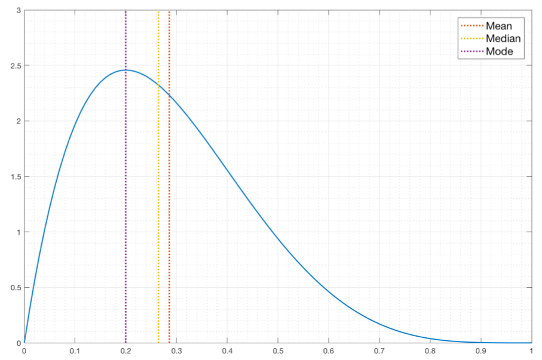

# Exploratory Data Analysis

Preliminary investigation of data, to understand its characteristics

Helps identify appropriate pre-processing technique and data mining algorithm

Involves

- Summary Statistics
- Visualization

## Summary Statistics

Note: Statistics about the data $\ne$ data itself

### Robustness

Ability of a statistical procedure to handle a variety of distributions (non-normal) and contamination (outliers, etc)

There is a trade-off between efficiency and robustness

### Breakdown Point

Fraction of contaminated data in a dataset that can be tolerated by the statistical procedure

Max logical BP is 0.5, because after that, you can’t tell what is correct data and what is contaminated

## Contamination

Fraction of data comes from a different distribution

There are 2 models for contamination

- Mean shift
- Variance shift

## Univariate Summary Statistics

Minimal set of value(s) that captures the characteristics of large amounts of data, and show the properties of a distribution

| Measure  | Statistic                             | Meaning                                                                                                                                                                                   | Formula                                                                                                                                                                                                                 | Moment           | Breakdown Point  (Higher is better) |                                          SE Standard Error $\sigma(\text{Estimate})$  (Lower is better) | SNR Signal Noise Ratio $\dfrac{E [\text{Estimate}]}{\sigma(\text{Estimate})}$  (Higher is better) | Comment                                                                                                            |
| -------- | ------------------------------------- | ----------------------------------------------------------------------------------------------------------------------------------------------------------------------------------------- | ----------------------------------------------------------------------------------------------------------------------------------------------------------------------------------------------------------------------- | ---------------- | :-------------------------------------------: | --------------------------------------------------------------------------------------------------------------------------: | --------------------------------------------------------------------------------------------------------------------- | ------------------------------------------------------------------------------------------------------------------ |
| Location | Mean/ Arithmetic Mean $\mu$ | Central tendency of distribution                                                                                                                                                          | $\dfrac{\sum x_i}{n}$                                                                                                                                                                                                   | 1st              |                $\dfrac{1}{n}$                 |                                                                   $1 \times \dfrac{s}{\sqrt{n}}$ (assumes Normal dist) |                                                                                                                       |                                                                                                                    |
|          | Trimmed Mean                          | $k \%$ obs from top of dist are removed $k \%$ obs from bottom of dist are removed $\implies 2k \%$ obs are removed in total                                                    |                                                                                                                                                                                                                         |                  |                $\dfrac{k}{n}$                 |                                                                         $\left( 1+\dfrac{2k}{n} \right)\dfrac{s}{\sqrt{n}}$ |                                                                                                                       | For $k>12.5$, better to use median                                                                                 |
|          | Winsorized Mean                       | $k \%$ obs from top of dist are replaced with $(1-k)$th percentile $k \%$ obs from bottom of dist are replaced with $k$th percentile $\implies 2k \%$ obs are replaced in total |                                                                                                                                                                                                                         |                  |                $\dfrac{k}{n}$                 |                                                                         $\left( 1+\dfrac{2k}{n} \right)\dfrac{s}{\sqrt{n}}$ |                                                                                                                       | For $k>12.5$, better to use median                                                                                 |
|          | Weighted Mean                         |                                                                                                                                                                                           | $\dfrac{\sum w_i x_i}{n}$                                                                                                                                                                                               |                  |                $\dfrac{1}{n}$                 |                                                                                                                             |                                                                                                                       |                                                                                                                    |
|          | Geometric Mean                        |                                                                                                                                                                                           | $\sqrt[{\Large n}]{\Pi x}$                                                                                                                                                                                              |                  |                $\dfrac{1}{n}$                 |                                                                                                                             |                                                                                                                       |                                                                                                                    |
|          | Root Mean Squared                     |                                                                                                                                                                                           | $\sqrt{\dfrac{\sum_{i=1}^n (x_i)^2}{n}}$                                                                                                                                                                                |                  |                                               |                                                                                                                             |                                                                                                                       | Gives more weightage to larger values                                                                              |
|          | Root Mean N                           |                                                                                                                                                                                           | $\sqrt[p]{\dfrac{\sum_{i=1}^n (x_i)^p}{n}}$                                                                                                                                                                             |                  |                                               |                                                                                                                             |                                                                                                                       | Gives more weightage based on power                                                                                |
|          | Harmonic Mean                         |                                                                                                                                                                                           | $\dfrac{n}{\sum \frac{1}{x}}$                                                                                                                                                                                           |                  |                $\dfrac{1}{n}$                 |                                                                                                                             |                                                                                                                       | Gives more weightage to smaller values                                                                             |
|          | Median                                | Middle most observation 50th quantile                                                                                                                                                | $\begin{cases} x_{{n+1}/2}, & n = \text{odd} \\ \dfrac{x_{n} + x_{n+1}}{2}, & n = \text{even}\end{cases}$                                                                                                               |                  |                $\dfrac{1}{2}$                 |                                                                                                 $1.253 \dfrac{s}{\sqrt{n}}$ |                                                                                                                       | Robust to outliers                                                                                                 |
|          | Mode                                  | Most frequent observation                                                                                                                                                                 |                                                                                                                                                                                                                         |                  |                                               |                                                                                                                             |                                                                                                                       | Unstable for small samples                                                                                         |
| Scale    | Variance $\sigma^2$ $\mu_2$ | Squared average deviation of observations from mean                                                                                                                                       | $\dfrac{\sum (x_i - \mu)^2}{n}$ $\dfrac{\sum (x_i - \bar x)^2}{n} \times \dfrac{n}{n-1}$                                                                                                                           | 2nd Centralised  |                $\dfrac{1}{n}$                 |                                                           $2 s \times \dfrac{s}{\sqrt{2 (n-1)}}$ (Assumes Normal dist) | $\dfrac{n-1}{2}$                                                                                                      |                                                                                                                    |
|          | Adjusted variance                     |                                                                                                                                                                                           | $\dfrac{1}{n-1} \left( 1 - \hat \gamma_3 \hat x + \dfrac{\hat \gamma_4 - 1}{4} \hat x^2 \right)$                                                                                                                        |                  |                                               |                                                                                                                             |                                                                                                                       |                                                                                                                    |
|          | Standard Deviation                    | Average deviation of observations from mean                                                                                                                                               | $\sqrt{\text{Variance}}$                                                                                                                                                                                                |                  |                $\dfrac{1}{n}$                 |                                                              $1 \times \dfrac{s}{\sqrt{2(n-1)}}$ (Assumes Normal dist) | $\sqrt{\text{SNR}(\sigma^2)}$                                                                                         |                                                                                                                    |
|          | Mean Absolute Deviation               | Mean deviation of observations from mean                                                                                                                                                  | $\dfrac{\sum \vert x_i - \mu \vert}{n}$ $\dfrac{\sum \vert x_i - \bar x \vert}{n} \times \dfrac{n}{n-1}$                                                                                                           |                  |                                               |                                                                                                                             |                                                                                                                       |                                                                                                                    |
|          | MAD Median Absolute Deviation    | Median deviation of observations from median                                                                                                                                              | $\text{med} (\vert x_i - \text{med}_x \vert)$ $\text{med} (\vert x_i - \hat {\text{med}_x} \vert ) \times \dfrac{n}{n-1}$  $1.4826 \times \text{MAD}$ corrects it to be comparable to standard deviation |                  |                $\dfrac{1}{2}$                 |                                                                                     $1.67 \times \dfrac{s}{\sqrt{2 (n-1)}}$ |                                                                                                                       |                                                                                                                    |
|          | Skewness $\gamma_3$              | Direction of tail                                                                                                                                                                         | $\dfrac{\sum (x_i - \mu)^3}{n \sigma^3}$ $\dfrac{3(\mu - \text{Md})}{\sigma}$ $\dfrac{\mu - \text{Mo}}{\sigma}$  $\dfrac{\sum (x_i - \bar x)^3}{n s^3} \times \dfrac{n}{(n-2)}$                     | 3rd Standardized |                                               |                                                                                                                             |                                                                                                                       | 0: Symmetric $[-0.5, 0.5]$: Approximately-Symmetric $[-1, 1]$: Moderately-skewed else: Higly-skewed |
|          | Kurtosis $\gamma_4$              | Peakedness of distribution                                                                                                                                                                | $\dfrac{\sum (x_i - \mu)^4}{n \sigma^4}$  $\dfrac{\sum (x_i - \bar x)^4}{n s^4} \times \dfrac{n}{(n-3)}$                                                                                                      | 4th standardized |                                               |                                                                                                                             |                                                                                                                       |                                                                                                                    |
|          | Excess Kurtosis $\gamma_4'$      | Kurtosis compared to Normal distribution                                                                                                                                                  | $\gamma_4-3$                                                                                                                                                                                                            |                  |                                               |                                                                                                                             |                                                                                                                       |                                                                                                                    |
|          | Max                                   |                                                                                                                                                                                           |                                                                                                                                                                                                                         |                  |                                               |                                                                                                                             |                                                                                                                       |                                                                                                                    |
|          | Min                                   |                                                                                                                                                                                           |                                                                                                                                                                                                                         |                  |                                               |                                                                                                                             |                                                                                                                       |                                                                                                                    |
|          | Percentile/ Quantile               | Divides distributions into 100 parts                                                                                                                                                      |                                                                                                                                                                                                                         |                  |                                               | $\dfrac{s}{\sqrt{n}} \dfrac{\sqrt{p (1-p)}}{f(q_p)}$, where $f=$ PDF $q_p=$ obtained quantile $x$ value for given $p$ |                                                                                                                       | Unstable for small datasets                                                                                        |
|          | Quartile                              | Divides distributions into 4 parts                                                                                                                                                        |                                                                                                                                                                                                                         |                  |                                               |                                                                                                                             |                                                                                                                       |                                                                                                                    |
|          | Decile                                | Divides distributions into 10 parts                                                                                                                                                       |                                                                                                                                                                                                                         |                  |                                               |                                                                                                                             |                                                                                                                       |                                                                                                                    |
|          | Range                                 | Range of values                                                                                                                                                                           | Max-Min                                                                                                                                                                                                                 |                  |                                               |                                                                                                                             |                                                                                                                       | Susceptible to outliers                                                                                            |
|          | IQR Interquartile Range          |                                                                                                                                                                                           | Q3 - Q1 $1.349 \sigma$ (Normal dist)  $0.7413 \times \text{IQR}$ corrects it to be comparable to standard deviation                                                                                      |                  |                $\dfrac{1}{4}$                 |                                                                                      $2.23 \times \dfrac{s}{\sqrt{2(n-1)}}$ |                                                                                                                       | Robust to outliers                                                                                                 |
|          | CV Coefficient of Variation      |                                                                                                                                                                                           | $\dfrac{\sigma}{\mu}$                                                                                                                                                                                                   |                  |                                               |                                                                                                                             |                                                                                                                       |                                                                                                                    |

### Standard Error of Statistic

- Standard deviation of statistic in sampling distribution
- Measure of uncertainty in the sample statistic wrt true population mean

### Relationship between Mean, Median, Mode

$$
\text{Mo} = 3 \text{Md} - 2 \mu
$$

### Skewness

| Skewness | Property             |                   |
| -------- | -------------------- | ----------------- |
| $> 0$    | Mode < Median < Mean | Positively Skewed |
| $0$      | Mode = Median = Mean |                   |
| $<0$     | Mean < Median < Mode | Negatively Skewed |

### Moment

$$
\begin{aligned}
M_k
&= E(x^k) \\
&= \dfrac{(x-M_{k-1})^k}{n} \\
&= \dfrac{(x-m_{k-1})^k}{n} \times \dfrac{n}{n-k+1}
\end{aligned}
$$

## Multivariate Summary Statistics

|                               |             |                         |
| ----------------------------- | ----------- | ----------------------- |
| How 2 variables vary together | Covariance  | $-\infty < C < +\infty$ |
|                               | Correlation | $-1 \le r \le +1$       |

### Covariance Matrix

It is always $n \times n$, where $n =$ no of attributes

|       |         $A_1$          |         $A_2$          |         $A_3$          |
| :---: | :--------------------: | :--------------------: | :--------------------: |
| $A_1$ |    $\sigma^2_{A_1}$    | $\text{Cov}(A_1, A_2)$ | $\text{Cov}(A_1, A_3)$ |
| $A_2$ | $\text{Cov}(A_2, A_1)$ |    $\sigma^2_{A_2}$    | $\text{Cov}(A_2, A_3)$ |
| $A_3$ | $\text{Cov}(A_3, A_1)$ | $\text{Cov}(A_3, A_2)$ |    $\sigma^2_{A_3}$    |

The diagonal elements will be variance of the corresponding attribute

$$
\begin{aligned}
\text{Cov}(x, y)
&= \frac{1}{n} \sum_{k=1}^n (x_k - \bar x) (y_k - \bar y) \\
\implies \text{Cov}(x, x)
&= \frac{1}{n} \sum_{k=1}^n (x_k - \bar x) (y_k - \bar y) \\
&= \frac{1}{n} \sum_{k=1}^n (x_k - \bar x) (x_k - \bar x) \\
&= \frac{1}{n} \sum_{k=1}^n (x_k - \bar x)^2 \\
&= \sigma^2_x
\end{aligned}
$$

### Correlation Matrix

|       |     $A_1$     |     $A_2$     |     $A_3$     |
| :---: | :-----------: | :-----------: | :-----------: |
| $A_1$ |      $1$      | $r(A_1, A_2)$ | $r(A_1, A_3)$ |
| $A_2$ | $r(A_2, A_1)$ |      $1$      | $r(A_2, A_3)$ |
| $A_3$ | $r(A_3, A_1)$ | $r(A_3, A_2)$ |      $1$      |

The diagonal elements will be 1

$$
\begin{aligned}
r(x, y)
&= \frac{
\text{Cov}(x, y)
}{
\sigma_x \sigma_y
} \\
\implies
r(x, x)
&= \frac{
\text{Cov}(x, x)
}{
\sigma_x \sigma_x
} \\
&= \frac{
\frac{1}{n} \sum_{k = 1}^n (x_k - \bar x) (x_k - \bar x)
}{
\left(
\sqrt{ \frac{1}{n} (x_k - \bar x)^2 }
\right)^2
} \\
&= 1
\end{aligned}
$$

## Why $(n-k)$ for sample statistics?

where $k=$ No of estimators

1. High probability that variance of sample is low, so we correct for that
1. Lost degree of freedom

