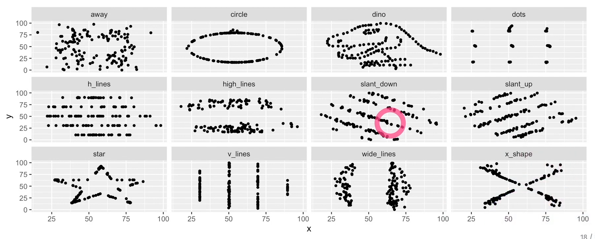
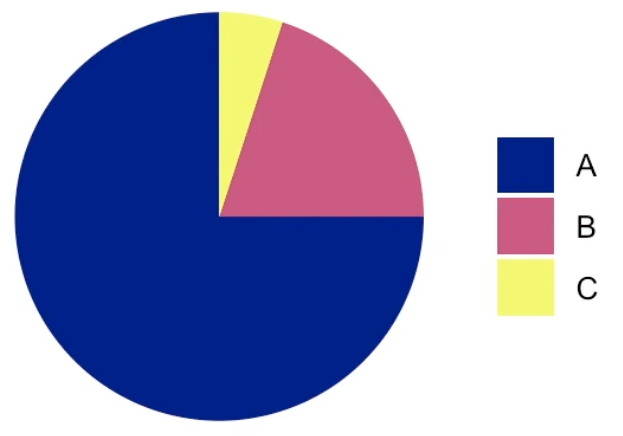
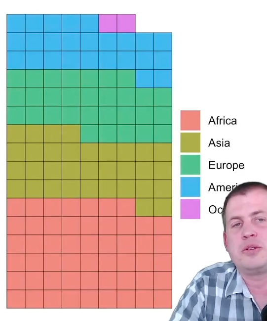
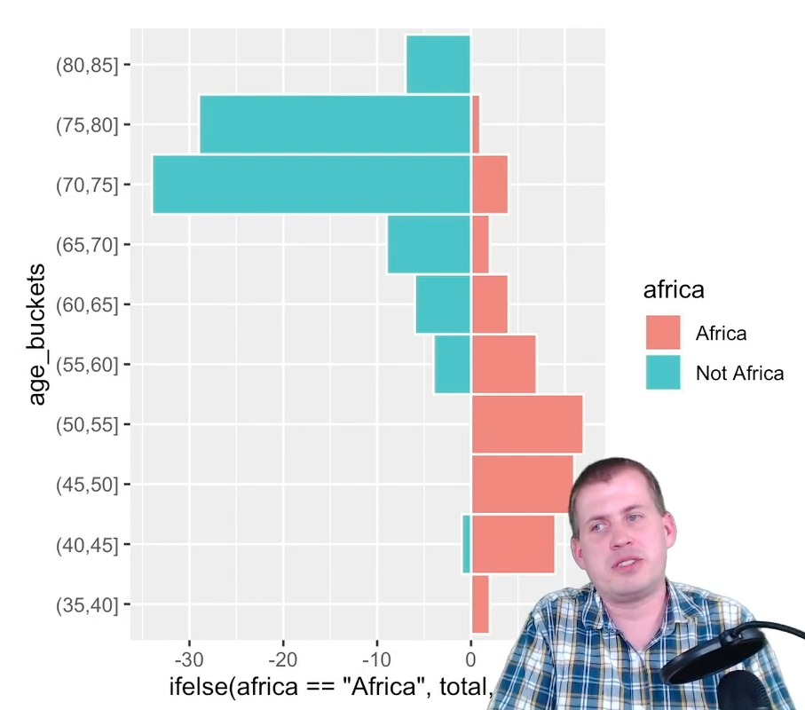
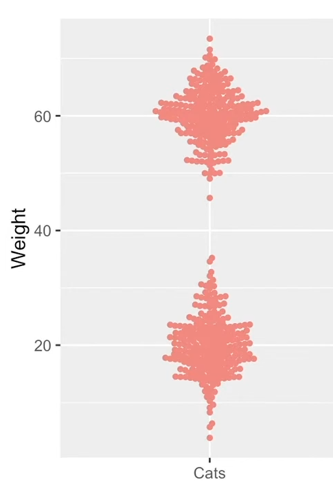
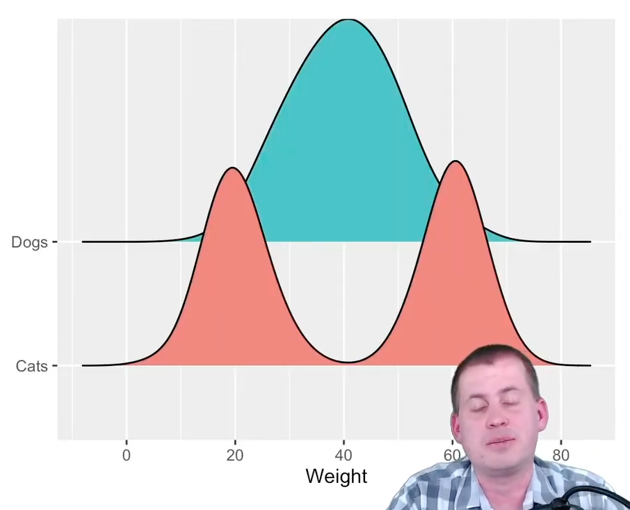
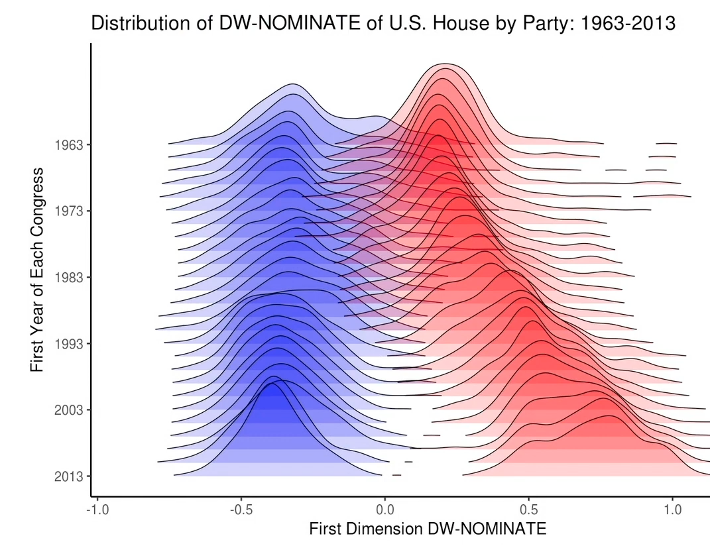
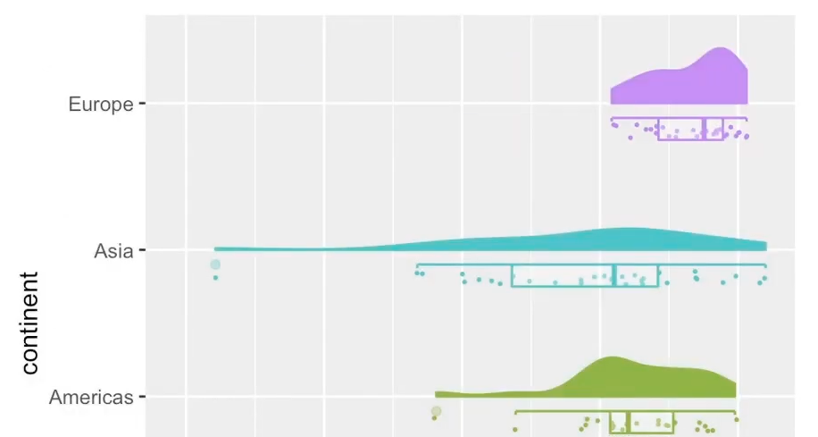
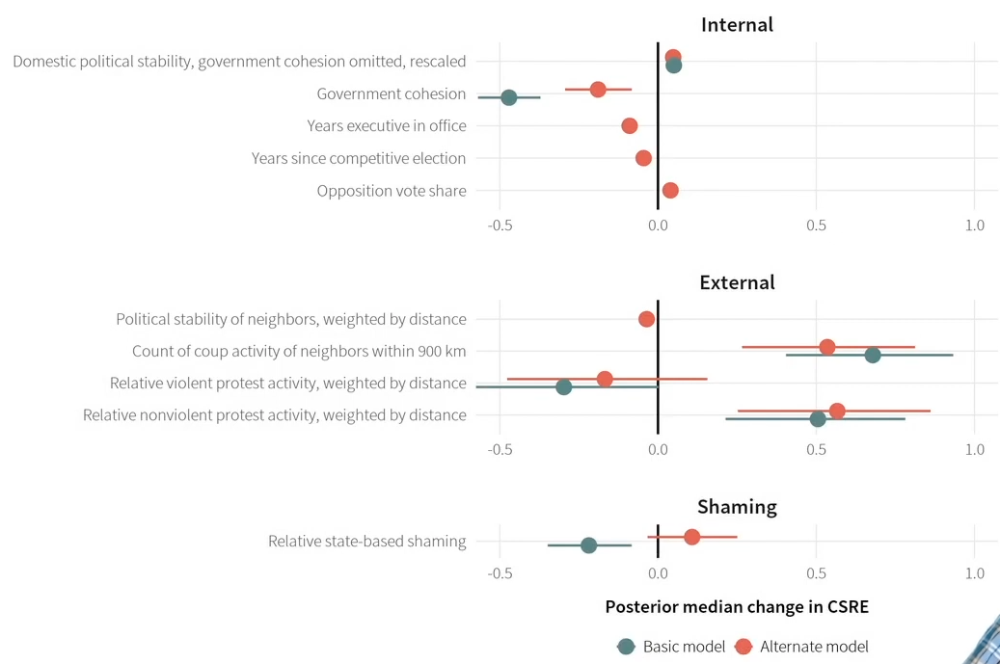
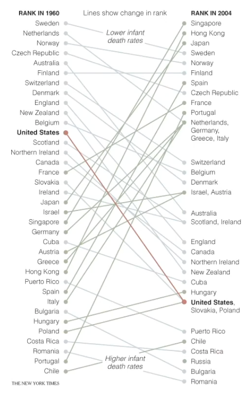

# Data Visualization

Display of data in a graphical/tabular format

Helps us understand the data; humans are better at recognizing visual patterns than numeric patterns

Limitation: Pareidolia; seeing patterns that do not exist

## Why is visualization important?

Widely different distributions can have the same statistical properties

| Example Case       | Visualization                                                    |                                              |
| ------------------ | ---------------------------------------------------------------- | -------------------------------------------- |
| Anscombe’s Quartet |  |                                              |
| Datasaurus Dozen   |                                  | All have the same mean, std, and correlation |

## Characteristics of Great Visualization

- [ ] Story
- [ ] Truthful: not aimed to mislead viewers, accurate representation
- [ ] Perception: Easy to understand
- [ ] Functional: useful and enlightening
- [ ] Insightful: reveals something that wouldn't have been possible otherwise
- [ ] Aesthetics: Grammar of Graphics
- [ ] Beautiful

## Grammar of Graphics

- [ ] Theme
	- [ ] Grid
	- [ ] Background
	- [ ] Typography
- [ ] Labels
	- [ ] Title
	- [ ] Subtitle
	- [ ] Caption: Extra text, source of data, etc
	- [ ] Axis Labels
	- [ ] Legend
		- [ ] Title
		- [ ] Items: try your best to align with the actual elements
- [ ] Coordinates
	- [ ] System
		- [ ] Cartesian
		- [ ] Polar
	- [ ] Range
		- [ ] Do not skew the axis: Use the correct minimum & max range
		- [ ] Exceptions
			- [ ] only possible values are included
				- [ ] For eg: for human body temperature, you should show 98-105 F; you shouldn’t start at 0
			- [ ] small movements matter
				- [ ] GDP across time
			- [ ] important time range
		- [ ] Tip: When presenting, show the full view, then zoom in clarifying the reason
- [ ] Facets: Subplots
- [ ] Scales: Axis
	- [ ] Discrete
	- [ ] Continuous
	- [ ] Continuous, breaks
	- [ ] Continuous, Log
	- [ ] Almost never use dual y-axes
		- [ ] Will lead to appearance of spurious correlations
		- [ ] Exception: When the 2 axes measure the same thing. For eg
			- [ ] Axis 1: Percentages; Axis 2: Absolute value
			- [ ] Axis 1: Celsius; Axis 2: Fahrenheit
- [ ] Geometries: Type of Plot (check below)
- [ ] Aesthetics
	- [ ] Position-X
	- [ ] Position-Y
	- [ ] Color
		- [ ] Discrete
		- [ ] Continuous
	- [ ] Size
	- [ ] Shape
	- [ ] Opacity
	- [ ] Animation (for Time)
- [ ] Data

## Plots

| Type               | Chart                             | Purpose                                                                                                                                                                                                                                                                                                                                                                                                                                                      | Visual                                                    | Limitations                                                                                                                                                                             |
| ------------------ | --------------------------------- | ------------------------------------------------------------------------------------------------------------------------------------------------------------------------------------------------------------------------------------------------------------------------------------------------------------------------------------------------------------------------------------------------------------------------------------------------------------ | --------------------------------------------------------- | --------------------------------------------------------------------------------------------------------------------------------------------------------------------------------------- |
| Uni-Variate        | Pie Chart                         | Part of a whole                                                                                                                                                                                                                                                                                                                                                                                                                                              |                                  | Not easy to compare between parts as it uses angles and areas                                                                                                                           |
|                    | Bar Chart                         | Comparing values of groups                                                                                                                                                                                                                                                                                                                                                                                                                                   |                                                           |                                                                                                                                                                                         |
|                    | Lollipop Chart                    | Comparing values of groups where only the end of the bar matters                                                                                                                                                                                                                                                                                                                                                                                             |                             |                                                                                                                                                                                         |
|                    | Column Chart                      | Comparing value across time                                                                                                                                                                                                                                                                                                                                                                                                                                  |                                                           |                                                                                                                                                                                         |
|                    | Waffle Chart                      | Show values as squares                                                                                                                                                                                                                                                                                                                                                                                                                                       |                               |                                                                                                                                                                                         |
|                    | Box/Box-Whiskers Plot             | Helps understand the distribution of a variable                                                                                                                                                                                                                                                                                                                                                                                                              | { loading=lazy }       |                                                                                                                                                                                         |
|                    | 1D Histogram                      | Visualizes the frequency distribution of attribute Relative uncertainty of each bin frequency $\propto \dfrac{1}{\sqrt{\text{count}}}$  The convention of analyzing these bins: Values are left-inclusive and right-exclusive; Last bin is right-inclusive  Continuous Data: binning                                                                                                                                                          |                                                           | - Shape may change dramatically depending on bin settings - Bins with few counts have high statistical uncertainty - Interpretation can be difficult without huge amounts of data |
|                    | Density Plot                      | Smooth version of histogram  - Bandwidth - Kernel                                                                                                                                                                                                                                                                                                                                                                                                   |                                                           |                                                                                                                                                                                         |
|                    | Pyramid Histogram                 |                                                                                                                                                                                                                                                                                                                                                                                                                                                              |                          |                                                                                                                                                                                         |
|                    | Violin Plot                       | Smooth version of pyramid histogram                                                                                                                                                                                                                                                                                                                                                                                                                          |                                |                                                                                                                                                                                         |
|                    | Strip                             | Jitter                                                                                                                                                                                                                                                                                                                                                                                                                                                       |                                 |                                                                                                                                                                                         |
|                    | Q-Q Plot                          | Quantile-Quantile plot comparing a distribution’s quantiles with quantiles of a known distribution (such as Normal distribution)                                                                                                                                                                                                                                                                                                                             |            |                                                                                                                                                                                         |
|                    | Beeswarm                          |                                                                                                                                                                                                                                                                                                                                                                                                                                                              |                                   |                                                                                                                                                                                         |
|                    | Ridge Plot                        | Multi-variate density plot offsetting the densities                                                                                                                                                                                                                                                                                                                                                                                                          |   |                                                                                                                                                                                         |
|                    | Raincloud Plot                    | Jitter plot + Box Plot + Violin Plot                                                                                                                                                                                                                                                                                                                                                                                                                         |                             |                                                                                                                                                                                         |
|                    | Treemap                           |                                                                                                                                                                                                                                                                                                                                                                                                                                                              |                                   | Hard to interpret                                                                                                                                                                       |
|                    | Conditional Quantitative          | - Bin quantitative data - Make different plots  This will be useful for error distribution inspection                                                                                                                                                                                                                                                                                                                                               |                                                           |                                                                                                                                                                                         |
| Bi-Variate         | Scatter Plot                      |                                                                                                                                                                                                                                                                                                                                                                                                                                                              |                                                           |                                                                                                                                                                                         |
|                    | Line Plot                         | Comparing trend of value across time                                                                                                                                                                                                                                                                                                                                                                                                                         |                                                           |                                                                                                                                                                                         |
|                    | 2D Histogram                      | Helps understand frequency of co-occurance of 2 attributes                                                                                                                                                                                                                                                                                                                                                                                                   | { loading=lazy }        |                                                                                                                                                                                         |
|                    | Heatmap                           | Looking at overall patterns                                                                                                                                                                                                                                                                                                                                                                                                                                  |                                    |                                                                                                                                                                                         |
|                    | Mosaic Plot                       |                                                                                                                                                                                                                                                                                                                                                                                                                                                              |                                | Hard to interpret                                                                                                                                                                       |
|                    | Stem & Leaf Plots                 | Understand the distribution of values of an attribute Useful when there aren’t many values  Steps - Split values into groups, where each group contains those values that are the same except for the last digit - Each group becomes a stem, while the last digit of a group are the leaves     - Stems will be the higher-order digits     - Leaves will be the lower-order digits - Plot stems vertically and leaves horizontally |                                                           |                                                                                                                                                                                         |
| Tri-Variate        | Contour Plots                     | Used for spacial data                                                                                                                                                                                                                                                                                                                                                                                                                                        |                                                           |                                                                                                                                                                                         |
| Multi-Variate      | Parallel Coordinates              |                                                                                                                                                                                                                                                                                                                                                                                                                                                              |                                                           |                                                                                                                                                                                         |
|                    | Pair Plot/ Scatter plot matrix | Basically a matrix of scatter plots                                                                                                                                                                                                                                                                                                                                                                                                                          |                                                           | May get overwhelming for large number of variables                                                                                                                                      |
|                    | Correlogram Heatmap               |                                                                                                                                                                                                                                                                                                                                                                                                                                                              |                                  |                                                                                                                                                                                         |
|                    | Correlogram Bar                   |                                                                                                                                                                                                                                                                                                                                                                                                                                                              |                                                           |                                                                                                                                                                                         |
| Regression         | Coefficients plot                 |                                                                                                                                                                                                                                                                                                                                                                                                                                                              |                          |                                                                                                                                                                                         |
|                    | Marginal effects plot             |                                                                                                                                                                                                                                                                                                                                                                                                                                                              |                                                           |                                                                                                                                                                                         |
| Comparison         | Sparklines                        |                                                                                                                                                                                                                                                                                                                                                                                                                                                              |                                                           |                                                                                                                                                                                         |
|                    | Slopegraphs                       |                                                                                                                                                                                                                                                                                                                                                                                                                                                              |                                |                                                                                                                                                                                         |
| Geospatial/ Map | Choropleth                        |                                                                                                                                                                                                                                                                                                                                                                                                                                                              |                                 | May hide details, such as population                                                                                                         |
|                    | IDK                               |                                                                                                                                                                                                                                                                                                                                                                                                                                                              |                                   |                                                                                                                                                                                         |
|                    | IDK                               |                                                                                                                                                                                                                                                                                                                                                                                                                                                              |                                 |                                                                                                                                                                                         |
|                    | 2D Map                            | Requires 'projection'  Best: Robinson Most-common: Mercator, but worst                                                                                                                                                                                                                                                                                                                                                                              |                                                           | Distortion of area                                                                                                                                                                      |
| Text               | Word cloud                        |                                                                                                                                                                                                                                                                                                                                                                                                                                                              |                                                           | Looks cool, but not very useful Kinda like Pie Charts Just use bar chart instead                                                                                                  |

## Cheat Sheet

## Uncertainty Visualization

Helps avoid misunderstanding of uncertainty

- Histogram
- Box plot

## Data Visualization Guidelines

| Company                                                       | Guideline                                                                                                         |
| ------------------------------------------------------------- | ----------------------------------------------------------------------------------------------------------------- |
| Adobe                                                         | https://spectrum.adobe.com/page/data-visualization-fundamentals/                                                  |
| Airbnb                                                        | https://airbnb.io/visx                                                                                            |
| Amazon Web Services                                           | https://cloudscape.design/patterns/general/data-vis/                                                              |
| Apple                                                         | https://developer.apple.com/design/human-interface-guidelines/charts                                              |
| Aviva                                                         | https://standards.aviva.com/framework/element-library/components/pie-chart/                                       |
| Baltimore City Data Fellows Project                           | https://storymaps.arcgis.com/stories/d19f7d4d2a9b49c7b8f68730e3cda1e6                                             |
| BBC                                                           | https://www.bbc.co.uk/gel/guidelines/how-to-design-infographics                                                   |
| BBC                                                           | https://bbc.github.io/rcookbook/                                                                                  |
| BBC Audiences                                                 | https://public.tableau.com/profile/bbc.audiences#!/vizhome/BBCAudiencesTableauStyleGuide/Hello                    |
| Cato Institute                                                | https://github.com/glosophy/CatoDataVizGuidelines/blob/master/PocketStyleBook.pdf                                 |
| Consumer Financial Protection Bureau                          | https://cfpb.github.io/design-system/guidelines/data-visualization-guidelines                                     |
| Data Design System Collection                                 | https://airtable.com/appmJoE6s8PAWWHaU/shrSvvfZySawZHvQa/tblLVYunaKUqILW3k/viwZ8ay3WHvzmCC6Z?blocks=hide          |
| Dallas Morning News                                           | https://drive.google.com/file/d/16qdtjdnMPQt_rJDfSCEwr8sUUO555W4I/view                                            |
| Datavizcatalogue                                              | https://datavizcatalogue.com                                                                                      |
| DHL                                                           | https://www.dpdhl-brands.com/en/dhl/tables-and-charts                                                             |
| Elastic                                                       | https://eui.elastic.co/#/elastic-charts/creating-charts                                                           |
| Finastra                                                      | https://design.fusionfabric.cloud/data-visualization                                                              |
| Gitlab                                                        | https://design.gitlab.com/data-visualization/overview                                                             |
| GitLab                                                        | https://handbook.gitlab.com/handbook/business-technology/data-team/platform/tableau-style-guide/                  |
| Goldman Sachs                                                 | https://design.gs.com/components/charts                                                                           |
| Google- Material Design                                       | https://material.io/design/communication/data-visualization.html                                                  |
| Government of Canada                                          | https://design.gccollab.ca/data/data-overview/                                                                    |
| Human Managed                                                 | https://www.figma.com/file/jixsiIT7pCeiPMk8oiM6Qb/Data-viz-system?node-id=547%3A12066                             |
| Humanitarian Data Exchange HDX                                | https://data.humdata.org/dataviz-guide/dataviz-elements/                                                          |
| International Business Communication Standards (IBCS®)        | https://www.ibcs.com/standards                                                                                    |
| IBM                                                           | https://www.ibm.com/design/v1/language/experience/data-visualization/                                             |
| IBM                                                           | https://www.ibm.com/design/language/data-visualization/overview                                                   |
| Liferay                                                       | https://liferay.design/lexicon/core-components/charts/                                                            |
| Mayo Clinic Genomic and Bioinformatic Services                | https://docs.google.com/document/d/1G1RluXmPC5xhiq8kddKYOOSl4Sqc3UtAHywva9FPh6g/edit                              |
| London City Intelligence                                      | https://data.london.gov.uk/blog/city-intelligence-data-design-guidelines/                                         |
| MailChimp                                                     | https://ux.mailchimp.com/patterns/data                                                                            |
| Microsoft                                                     | https://docs.microsoft.com/en-us/office/dev/add-ins/design/data-visualization-guidelines                          |
| MinnPost                                                      | http://code.minnpost.com/minnpost-styles/                                                                         |
| Monash Climate Change  Communication Research Hub  (MCCCRH)   | https://apo.org.au/node/314650                                                                                    |
| Morning Star                                                  | https://designsystem.morningstar.com/charts/chart-elements-status/                                                |
| NZZ                                                           | https://nzzdev.github.io/Storytelling-Styleguide/#/                                                               |
| Office for National Statistics                                | https://style.ons.gov.uk/category/data-visualisation/                                                             |
| Opower                                                        | https://ux.opower.com/opattern/how-to-charts.html                                                                 |
| Pearson                                                       | https://accessibility.pearson.com/resources/dataviz/                                                              |
| Pinterest                                                     | https://gestalt.pinterest.systems/foundations/data_visualization/overview                                         |
| Royal Statistical Society                                     | https://rss.org.uk/datavisguide                                                                                   |
| Salesforce                                                    | https://lightningdesignsystem.com/guidelines/charts/                                                              |
| semrush                                                       | https://developer.semrush.com/intergalactic/data-display/chart-showcase/chart-showcase                            |
| Shopify                                                       | [https://polaris.shopify.com/design/data-visualizationst](https://polaris.shopify.com/design/data-visualizations) |
| Sonos                                                         | https://www.agencysr.co.uk/works/data-visualisation-guidelines                                                    |
| Sunlight Foundation                                           | https://sunlightfoundation.com/2014/03/12/datavizguide                                                            |
| Trafford Data Lab                                             | https://www.trafforddatalab.io/graphics_companion/                                                                |
| The Economist                                                 | https://design-system.economist.com/documents/CHARTstyleguide_20170505.pdf                                        |
| The Urban Institute                                           | https://urbaninstitute.github.io/graphics-styleguide/                                                             |
| Trafford Data Lab                                             | https://www.trafforddatalab.io/interactive_graphics_companion/                                                    |
| U.S. Design System                                            | https://designsystem.digital.gov/components/data-visualizations/                                                  |
| US Agency for International Development \| Office of HIV/AIDS | https://issuu.com/achafetz/docs/oha_styleguide                                                                    |
| Visa                                                          | https://developer.visa.com/pages/chart-components                                                                 |
| VTEX                                                          | https://styleguide.vtex.com/#/Components/%F0%9F%91%BB%20Experimental/Charts                                       |
| World Health Organization                                     | https://apps.who.int/gho/data/design-language/                                                                    |

## IDK

- Human visual system
	- detects differences, not absolute values
	- attracted to edges
		- designer should maximize contrast with background if outlines of shapes are important
	- perceives surface color base on edge contrast informations
	- higher contrast sensitivity in luminance than in chrominance 
	- color recognition is not an automatic process
		- stoop effect

## Cleveland's Visual Operations of Pattern Perception

1. Detection
2. Assembly
3. Estimation

## Gestalt Laws of Perpetual Organization

1. Emergence: mind sees the whole and then the parts. It often sees more than what is specifically states by its individual parts
2. Invariance: mind recognizes simple objects independent of rotation, translation, scale deformations, and lighting
3. Proximity: Elements closer together are perceived to be more related than elements farther apart
4. Similarity: Similar elements that are perceived to be more related than dissimilar elements
5. Enclosure: Elements enclosed together are perceived as belonging together
6. Continuity: Mind tries to continue visual, auditory, and kinetic patterns
7. Closure: Mind perceives set of individual elements as a single, recognizable pattern
8. Symmetry: Mind perceives objects as symmetrical shapes that form around their center
9. Figure-ground: elements are perceived as either figures (objects of focus) or ground (rest of the perceptual field)
10. Connection: Elements connected together (for eg: by a line) are perceived as belonging together
11. Common-fate: Elements that share a common fate (eg: moving in the same direction) are perceived as belonging together

## Tufte’s design principles for graphical excellence

1. Maximize the data-ink ratio, within reason
2. Mobilize every graphical element, perhaps several times over, to show the data
3. Maximize data density and the size of the data matrix, within reason
4. Establish context
5. Show cause and effect, where possible
6. Compare and contrast, utilize layering & separation
7. Escape flatland, use small multiples, parallel sequencing (reality is multivariate)
8. Show multiple dimensions
9. Utilize narratives of space and time
10. Integrate image, number and text

## Encoding Methods

From most effective to least effective

| Variable Type | Encoding                    |
| ------------- | --------------------------- |
| Ordered       | Position on common scale    |
|               | Position on unaligned scale |
|               | Length (1D size)            |
|               | Tilt/Angle/Slope            |
|               | Area (2D size)              |
|               | Depth (3D position)         |
|               | Color Luminance             |
|               | Color Saturation            |
|               | Curvature                   |
|               | Volume (3D Size)            |
| Unordered     | Spatial region              |
|               | Color hue                   |
|               | Motion                      |
|               | Shape                       |
