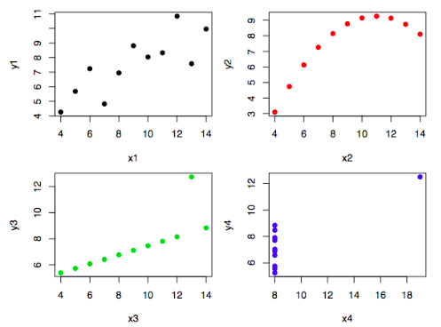
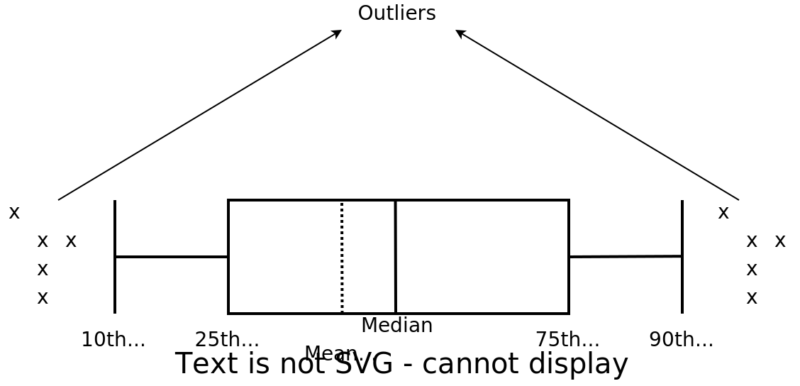
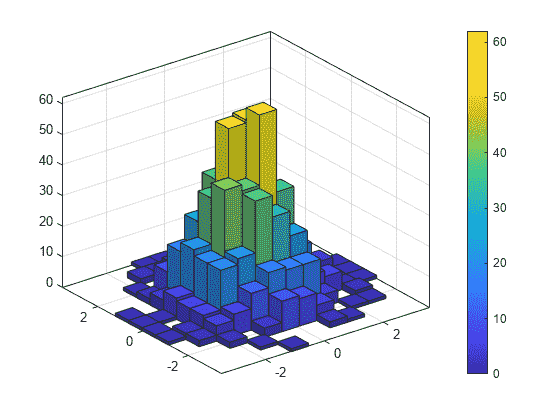

## Visualization

Display of data in a graphical/tabular format

Helps us understand the data

## Why is visualization important?

Widely different distributions can have the same statistical properties

Below is the Anscombe’s quartet

## Note

Use the correct minimum & max range, such that only possible values are included

- Do not skew the axis
- For eg: for human body temperature, you should show 98-105 F; you shouldn’t start at 0

## Uni-Variate

### Box/Box-Whiskers Plot

Helps understand the range and central tendancy of a variable

{ loading=lazy }

### 1D Histogram

Visualizes the frequency distribution of attribute

#### Categorical Data

Each category will have a line denoting the frequency associated with that category

#### Continuous Data

- Apply binning
    - Usually equal-width binning
- Each bin will be treated as a different category
- Now each bin will have a line denoting the frequency associated with that category

The convention of analyzing these bins

> - Values are left-inclusive and right-exclusive
> - Last bin is right-inclusive
>
> ~ Oracle Docs

### Q-Q Plot

Quantile-Quantile plot comparing a distribution’s quantiles with quantiles of a known distribution (such as Normal distribution)

## Bi-Variate

### Scatter Plot

### Line Plot

### 2D Histogram

Helps understand frequency of co-occurance of 2 attributes

{ loading=lazy }

### Pair Plot

Basically a matrix of scatter plots

### Stem & Leaf Plots

Understand the distribution of values of an attribute

Useful when there aren’t many values

### Steps

- Split values into groups, where each group contains those values that are the same except for the last digit
- Each group becomes a stem, while the last digit of a group are the leaves
    - Stems will be the higher-order digits
    - Leaves will be the lower-order digits
- Plot stems vertically and leaves horizontally

## Tri-Variate

### Contour Plots

Used for spacial data

## Multi-Variate

### Parallel Coordinates

## Conditional Quantitative Plots

- Bin quantitative data
- Make different plots

This will be useful for error distribution inspection