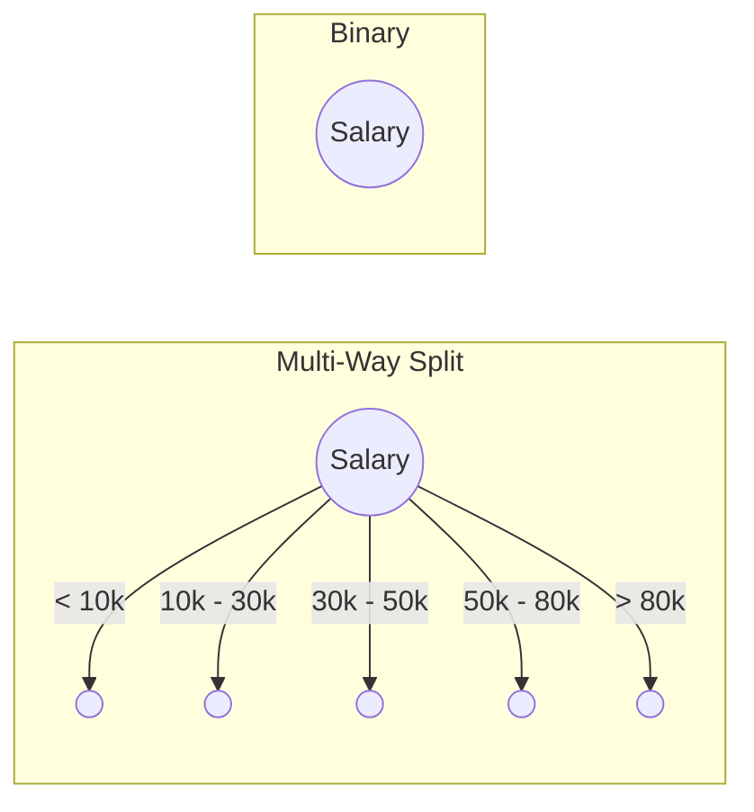
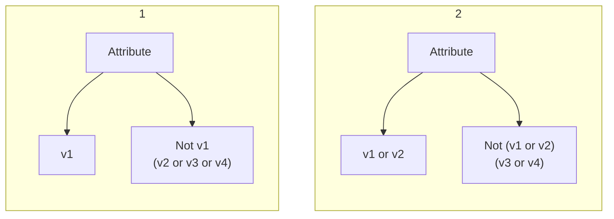

## Components

| Component      | Meaning                                                      |
| -------------- | ------------------------------------------------------------ |
| Internal Nodes | Labelled by attributes names, to be tested on an attribute Contain the splitting attributes |
| Leaf Nodes     | Labelled by class labels                                     |
| Edges          | determined by the nuo of outcomes on n attribute test conditions |

## Heuristics

Methods that help find optimal solution

## Decision Tree Approaches

| Approach      | Steps                                                        | Disadvantage                 |
| ------------- | ------------------------------------------------------------ | ---------------------------- |
| **Greedy**    | Divide the problem into different steps, take decisions at each step  Build tree in Top-Down manner Split train set into purer subsets (the best split) @ every node | Backtracking is not possible |
| **Recursive** |                                                              |                              |

## Hunt’s Algorithm

Let

- $t$ be a node
- $D_t$ be train dataset @ node $t$
- $y$ be set of class labels $\{ C_1, C_2, \dots, C_n \}$

### Steps

1. Make node $t$ into a leaf node. Label $t$ with class label $y_t$
2. Split using appropriate attribute
   1. Apply splitting criteria for each attribute and obtain impurity of split using that attribute
   2. Pick the attribute that gives the lowest impurity
   3. Label the node $t$ with this attribute
   4. Determine the outcomes
   5. Create nodes for each outcome
   6. Draw the edges
   7. Split the dataset
3. Repeat the steps for each subtree now

### Additional Cases

#### Empty Subset

Let’s say when splitting your data, you end up having an empty subset of the data

1. Make node $t$ into a leaf node
1. $t$ is labelled as the majority class of the parent dataset

#### All records have identical attribute values

1. Make $t$ into a leaf node
2. $t$ is labelled as the majority class represented in the current subset

#### Number of records fall below minimum threshold value

- Make $t$ into a leaf node
- $t$ is labelled as the majority class represented in the current subset

### Splitting Continuous Attributes

#### Binary Split

Choose a splitting value that results in a purer partition

#### Multi-Way Split

- Apply discretization
- Each bin will be a different node

### Challenges

- How to split training records?
    - Find best splitting attribute (Test on Attribute)
    - Measure for goodness of split
- Stopping conditions
  Stop at situations that result in fully-grown tree (the tree has learnt all the important characteristics, which may not be optimal; in that case we may require some other stopping conditions)
    - When all records at a node have the same attribute value
    - When all records at a node have the same class label value
    - When a node receives an empty subset

## Attribute Test Condition and Outcomes

### Nominal

Binary split will have $2^{k-1} - 1$ combinations of the binary split, where $k=$ no of values. For eg:

## Missed this class

[Lec20.pdf](assets/Lec20.pdf) 

## Terms

Variables

$$
\Delta = I(Parent) - \sum_{j=1}^k
\underbrace{
\frac{N(V_j)}{N} I (V_j)
}_\text{Weighted Average Impurity}
$$

- $I(\text{Parent}) =$ Impurity at parent
- $N =$ no of records before split (parent)
- $k =$ no of splits
- $V_j =$ denote a split
- $N(V_j) =$ no of records at split $V_j$
- $I(V_k) =$ impurity at child(split) $V_j$

## Steps to choose splitting attribute

- Compute degree of impurity of parent node (before splitting)
- Compute degree of impurity of child nodes (after splitting)
- Compute weighted average impurity of split
- Compute gain $(\Delta)$
  Larger the gain, better the test condition
- Choose attribute with largest gain
- Repeat for all attributes

### Note

==Information gain means the impurity measure is entropy==
