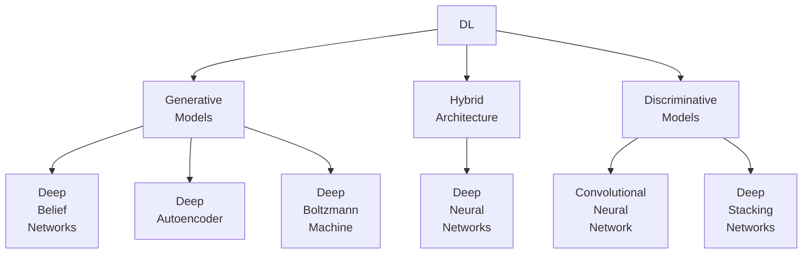

Deep Learning is subset of machine learning, which involves a deep neural network. Large availability of data in present-day has led to the rise in demand for deep learning applications.

Refer [Machine Learning](./../Machine_Learning/) concepts, to understand this course well.

## Types

## Applications of DL

- Object detection/counting
- Image/Video
  - classification
  - segmentation
  - captioning
  - sentence matching
  - face recognition
- Natural language processing
  - At the time of writing this sentence, ChatGPT’s successor GPT4 has come out, and it looks pretty insane

## Advantages

1. Automatic
2. Robust
3. Generalizable
4. Parallelizable $\implies$ Scalable

## Disadvantages

1. Low interpretability (Black box)
2. Computationally-expensive wrt to [Resource Constraints](#Resource-Constraints)

## Resource Constraints

1. Processor Speed
2. Memory Size
3. Power Consumption

## Challenges

- Lack of adequate data (addressed through [Transfer Learning](#Transfer Learning), Shallow learning, Incremental learning)
- Data inconsistencies
- Low battery life of edge devices (h/w controlling data flow at boundary b/w 2 networks)
- Resource-constrained algorithm development issues
- Diversity in computing units
- Privacy & security concerns (addressed through Encryption)

## Image Representation

Every images is a matrix of pixels, where each pixel is represented as a combination of **red, green, blue**; usually as a 8-bit value (0-255)

So if the width and height of image are $w, h$

## Key Metrics

- Accuracy
- Throughput
- Latency
- Energy efficiency
- Hardware costs
- Flexibility

## Major Neural Networks

|                          | Meaning                                               | Efficient at         | Major Application | Computation Complexity |
| ------------------------ | ----------------------------------------------------- | ------------------------- | ---------------------- | --------------------------- |
| CNN (Convolutional) |                                                       | Detecting spatial pattens | Images, Videos         | High                        |
| RNN (Recurrent)     | Forward-feed, backward-feed, and self-loop is allowed |                           | Time series            |                             |

## Popular Models & Datasets

| Dataset | Sample Size | Content                                                      | Classes |
| :-----: | ----------: | ------------------------------------------------------------ | :-----: |
|  MNIST  |      50,000 | Images of handwritten digits (0-9)                           |   10    |
|  CIFAR  |      60,000 | Airplanes, cars, birds, cats, deer, dogs, frogs, horses, ships, and trucks |   10    |

## Transfer Learning

