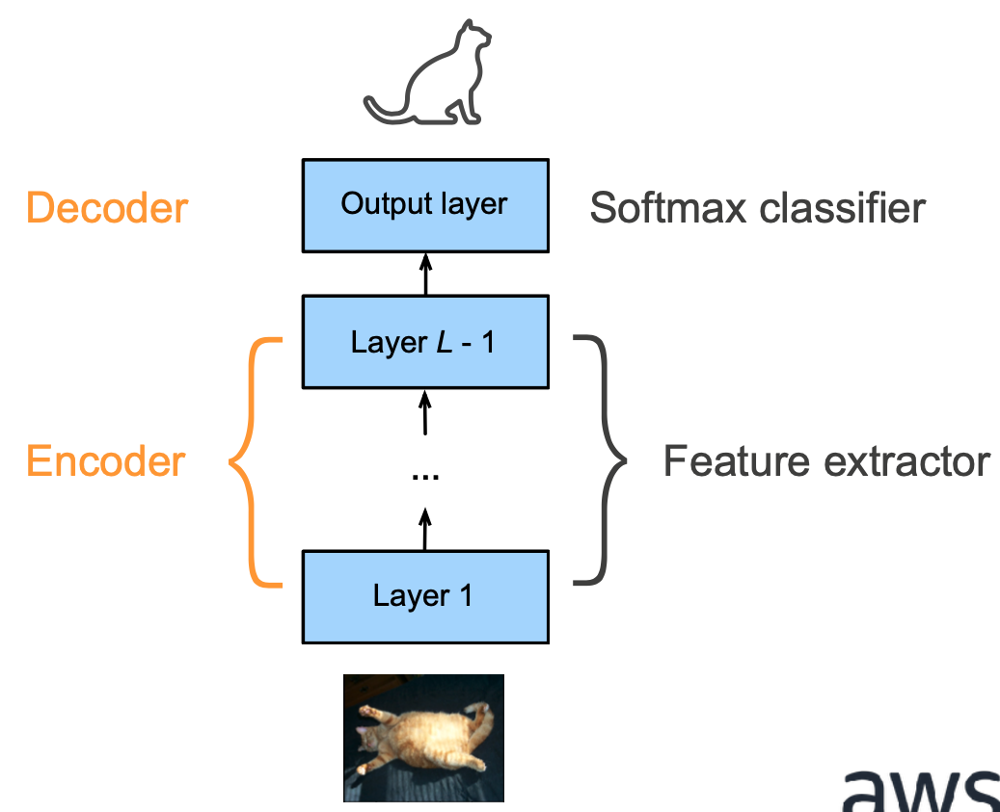
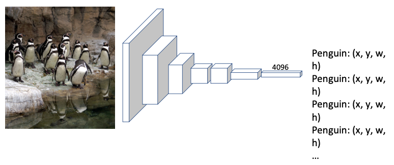
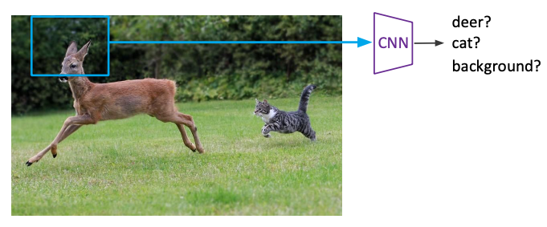
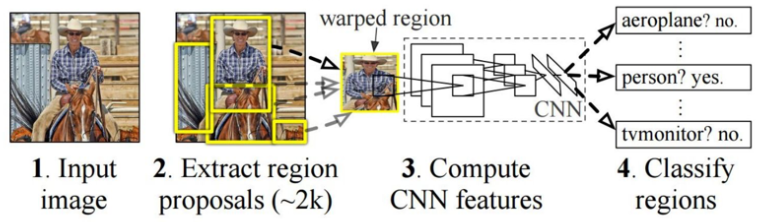
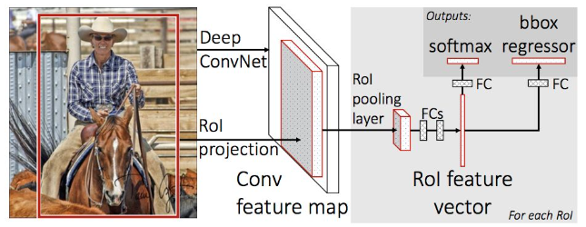
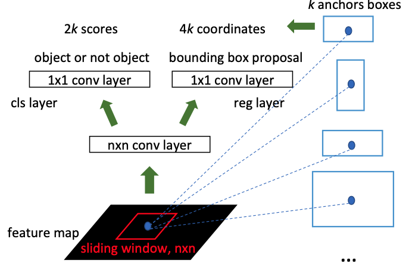

Convolutional Neural Networks



We control output shape via padding, strides and channels

Very nice [Youtube explanations](https://www.youtube.com/playlist?list=PLuhqtP7jdD8CD6rOWy20INGM44kULvrHu). Watch this!

## Variables in this page

| Variable | Meaning                                           |
| :------: | ------------------------------------------------- |
|   $I$    | Input matrix                                      |
|   $i$    | Size of input matrix                              |
|   $f$    | Size of filter matrix                             |
|   $p$    | Padding applied to input matrix (default=0)       |
|   $s$    | Stride length                                     |
|   $n$    | no of filters                                     |
|   $c$    | no of channels<br />- Grayscale: 1<br/>- Color: 3 |
|   $b$    | Bias                                              |

## Principles

- Translation invariance
- Locality

## Types of Layers

|                                             | Convolutional Layer                                          | Pooling Layer                                                |
| ------------------------------------------- | :----------------------------------------------------------- | ------------------------------------------------------------ |
| Purpose                                     | Control output shape via padding, strides and channels<br />Edge Detection<br />Image Sharpening | Gradually reduce spatial resolution of hidden representations<br />Some degree of invariance to translation<br />Image size reduction, without much data loss<br />Image Sharpening |
| Operation                                   | Cross Correlation                                            | Pooling                                                      |
| Representation<br />$O = $                  | $I \star F + b$<br />$\sum (I \star F + b)$ (multiple channels) |                                                              |
| $O_{i, j} =$                                | $\sum_{k=1}^f \sum_{l=1}^f F_{k, l} \odot  I_{i+k, j+l} + b$ | $\sum_{k=1}^f \sum_{l=1}^f \text{func}(F_{k, l} \odot  I_{i+k, j+l})$ |
| Steps to<br />calculate                     | 1. Perform padding<br/>2. Start from the left<br/>3. Place kernel filter over input matrix<br />(if there are multiple channels, place each filters over corr matrix)<br/>4. Output value of one element = sum of products + Bias<br />(if there are multiple channels, then sum of product of all the channels result in **one single value**)<br/>5. Perform stride rightward<br />6. Repeat steps 3-5, until there are no remaining columns on the right<br/>7. Repeat steps 2-6, until there are no remaining rows on the left | 1. Start from the left<br/>2. Place filter over input matrix<br/>3. Output value of one element = func(product of elements), where func = max, min, avg<br />4. Perform stride rightward<br/>5. Repeat steps 3-5, until there are no remaining columns on the right<br/>6. Repeat steps 2-5, until there are no remaining rows on the left |
| Default<br />stride length                  | 1                                                            | $f$                                                          |
| Size of<br />output                         | $\dfrac{i-f \textcolor{hotpink}{+2p}}{s} + 1$                | $\dfrac{i-f}{s} + 1$                                         |
| When Applied                                | First                                                        | Only after convolutional layer                               |
| Common<br />Padding<br />Value              | $f-1$                                                        | 0                                                            |
| Common<br />Stride<br />Value               | 1                                                            | 1                                                            |
| No of<br />input channels                   | $c$                                                          | 1                                                            |
| No of output<br />images                    | $n$                                                          | 1                                                            |
| No of<br />output channels per output image | 1                                                            | 1                                                            |

$$
\text{Total output dimension } o' = o \times n \times c
$$

### Notes

- Convolution and cross-correlation operations are slightly different, but it doesn’t matter if kernel is symmetric
- Since images are of different sizes, instead of using weight matrix of fixed size, convolution is applied various times depending on size of input
- 1 x 1 Convolutional Layer doesn’t recognize spatial patterns, but fuses channels
- $\times$ is not multiplication; it is depth/no of activation maps

### Example

The following shows convolution on with 0 padding and stride 1.


## Padding & Striding

|         | Padding                                                      | Striding                                                |
| ------- | ------------------------------------------------------------ | ------------------------------------------------------- |
| Meaning | Number of extra row(s) and columns added around matrix<br />If $p =$ odd, then pad $\lceil p/2 \rceil$ on one side and $\lfloor p/2 \rfloor$ on the other | Step length in movement of kernel filter on input image |
| Purpose | Overcome loss of pixels, by increasing effective image size  |                                                         |
|         | Zero padding means padding using 0s                          |                                                         |


## Common Filters

| Application               | Filter Used                                                  |
| ------------------------- | ------------------------------------------------------------ |
| Vertical edges detection  | $\begin{bmatrix}1 & 0 & -1 \\ 1 & 0 & -1 \\ 1 & 0 & -1\end{bmatrix}$ |
| Horizontal edge detection | $\begin{bmatrix}1 & 1 & 1 \\ 0 & 0 & 0 \\ -1 & -1 & -1\end{bmatrix}$ |
| Blur                      |                                                              |

## Object Detection

mAP = mean Average Precision





## Advanced CNN

|               | RCNN                                                         | Fast-RCNN                                                    | Faster RCNN                                                  |
| ------------- | ------------------------------------------------------------ | ------------------------------------------------------------ | ------------------------------------------------------------ |
| Major idea    | Region-Based                                                 | Do not recompute features for every box independently        | Integrate bounding box proposals in CNN predictions          |
| Steps         | 1. Generate category-independent region proposals (~2k)<br />2. Compute 4096-dimensional CNN feature vector from each region proposal<br />3. Classify regions w/ class- specific linear SVMs | 1. Produce **single** convolutional feature map with several convolutional & max-pooling layers <br />2. Region of interest (RoI) pooling layer extracts fixed-length feature vector from region feature map | 1. Compute proposals with a deep convolutional Region Proposal Network (RPN)<br />2. Merge RPN and Fast-RCNN into a single network |
| Advantages    | Simple<br />Improved mAP compared to RNN                     | Higher mAP<br />Single end-to-end training stage<br />No disk storage required | Cost-free region proposals                                   |
| Disadvantages | Slow<br />Multistage pipeline<br />Disk storage required for feature caching<br />Training is expensive | Proposals generation is computationally expensive            |                                                              |
| Flowchart     |                                    |            |  |

## YOLO

You Only Look Once

Single CNN

No proposal for bounding box

==Treat this as a single regression (not classification)==, straight from images pixels to bounding box coordinates and class probabilities

### Steps

1. Residual block
   1. Input split into 7x7 grids
   2. Each cell trains a detector
      1. Detector needs to predict object’s class distributions
      2. detector has 2 bounding box predictor to predict bounding box and confidence scores
   3. Generate probability for each grid having an object
   4. Confidence Score = probability * IOU
2. Bounding box regression
3. IoU (Intersection over Union)
4. Non-max supression

### Non-Max Supression

```pseudocode
Algorithm Non-Max Supression
	Input: A list of proposal boxes B, corresponding confidence scores S and overlap threshold N
	Output:
		List of filtered proposals D
	
	select proposal with highest confidence score, remove it from B and add it to the fnal proposal list D
	Compare IOU of this proposal with all the proposal. If IOU > N, remove proposal from B
	
	more steps are there
```

## IOU

Intersection Over Union

Let

- True bounding box be $T$
- Proposed bounding box be $P$

$$
\text{IOU} = \frac{\text{Area}(T \cap P)}{\text{Area}(T \cup P)}
$$

### Interpretation

| IOU   |           |
| ----- | --------- |
| > 0.9 | Excellent |
| > 0.7 | Good      |
| < 0.7 | Poor      |

## Popular Architectures

| Architecture Name | Description                                  |
| ----------------- | -------------------------------------------- |
| LeNet-5           | Recognizing handwritten digits               |
| AlexNet           |                                              |
| VGGNet            |                                              |
| DenseCap          | Image captioning                             |
| SqueezeNet        |                                              |
| GoogLeNet         | Inception Modules (Network inside a network) |
| DCNN              |                                              |
| ResNet            |                                              |
| CUImage           |                                              |
| SENet & SE-ResNet |                                              |
