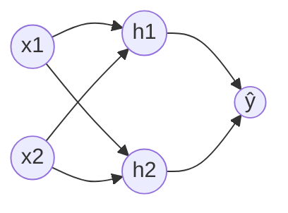
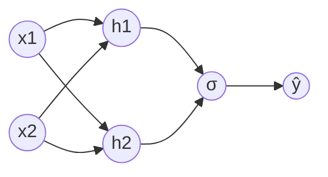

# Activation Functions

|                  Name                  |                        Output $f(x)$                         | Output Type |        Range        |
| :------------------------------------: | :----------------------------------------------------------: | ----------- | :-----------------: |
|                Identity                |                             $x$                              | Continuous  |      $[-1, 1]$      |
|            Binary Step            |    $\begin{cases} 0, &x < 0 \\ 1, & x \ge 0 \end{cases}$     | Binary      |      ${0, 1}$       |
|           Tariff/ Tanh            |                          $\tanh(x)$                          | Discrete    |      $[-1, 1]$      |
|                 ArcTan                 |                       $\tan^{-1} (x)$                        | Continuous  |  $(-\pi/2, \pi/2)$  |
|   ReLU (Rectified Linear Unit)    |    $\begin{cases} 0, &x < 0 \\ x, & x \ge 0 \end{cases}$     | Continuous  |    $[0, \infty]$    |
|   SoftPlus (smooth alt to ReLU)   |                        $\log(1+e^x)$                         | Continuous  |    $[0, \infty]$    |
|      Parametric/ Leaky ReLU       | $\begin{cases} \alpha x, &x < 0 \\ x, & x \ge 0 \end{cases}$ | Continuous  | $[-\infty, \infty]$ |
|      Exponential Linear Unit      | $\begin{cases} \alpha (e^x-1), &x < 0 \\ x,&  x \ge 0 \end{cases}$ | Continuous  | $[-\infty, \infty]$ |
| Sigmoid/ Logistic/ Soft Step |                    $\dfrac{1}{1+e^{-x}}$                     | Binary      |      $[0, -1]$      |
|                Softmax                 | $\dfrac{e^{x}}{\sum_{i=1}^k e^{x_i}}$ where $k=$ no of classes such that $\dfrac{\sum p_i}{k} = 1$ | Discrete    |      $[0, 1]$       |

## Why use activation function for hidden layers?

Else, it would just be regular linear regression/logistic regression, so no point of hidden layers

Not using activation function $\implies$ using identity activation function

The only place identity activation function is acceptable is for the final output activation function in regression.

### Linear Regression

$$
\begin{aligned}
\hat y
&= w_{h_1 \hat y} h_1 + w_{h_2 \hat y} h_2 \\
&= w_{h_1 \hat y} (w_{x_1 h_1} x_1 + w_{x_2 h_1} x_2) + w_{h_2 \hat y} (w_{x_1 h_2} x_1 + w_{x_2 h_2} x_2) \\
&= \cdots \\
&= w_1 x_1 + w_2 x_2
\end{aligned}
$$

### Logistic Regression

$$
\begin{aligned}
\hat y
&= \sigma(w_{h_1 \hat y} h_1 + w_{h_2 \hat y} h_2) \\
&= \sigma(w_{h_1 \hat y} (w_{x_1 h_1} x_1 + w_{x_2 h_1} x_2) + w_{h_2 \hat y} (w_{x_1 h_2} x_1 + w_{x_2 h_2} x_2)) \\
&= \cdots \\
&= \sigma(w_1 x_1 + w_2 x_2)
\end{aligned}
$$
