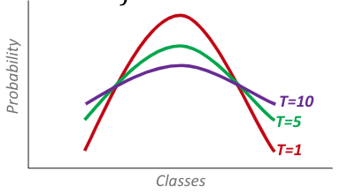
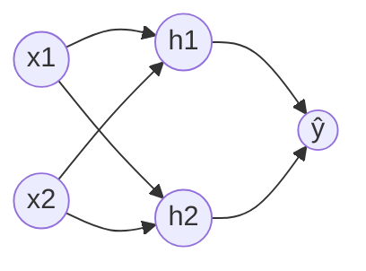
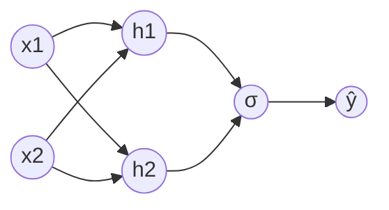

# Activation Functions

|                      Name                       |                                                Activation $f(x)$                                                | Inverse Activation $f^{-1} (y)$                                    | Output Type         |        Range        | Free from Vanishing Gradients | Zero-Centered | Comment                                                                                                                                                             |
| :---------------------------------------------: | :----------------------------------------------------------------------------------------------------------------: | --------------------------------------------------------------------- | ------------------- | :-----------------: | :------------------------------: | :-----------: | ------------------------------------------------------------------------------------------------------------------------------------------------------------------- |
|                    Identity                     |                                                        $x$                                                         | $y$                                                                   | Continuous          |      $[-1, 1]$      |                                  |       ✅       |                                                                                                                                                                     |
|                Binary Step                 |                               $\begin{cases} 0, &x < 0 \\ 1, & x \ge 0 \end{cases}$                                |                                                                       | Binary              |      ${0, 1}$       |                                  |       ❌       |                                                                                                                                                                     |
|                Tariff/ Tanh                |                                                     $\tanh(x)$                                                     | $\tanh^{-1}(y)$                                                       | Discrete            |      $[-1, 1]$      |                ❌                 |       ✅       |                                                                                                                                                                     |
|               Fast Softsign Tahn                |                                           $\dfrac{x}{1 + \vert x \vert}$                                           |                                                                       |                     |                     |                                  |               |                                                                                                                                                                     |
|                     ArcTan                      |                                                  $\tan^{-1} (x)$                                                   | $\tan(y)$                                                             | Continuous          |  $(-\pi/2, \pi/2)$  |                                  |               |                                                                                                                                                                     |
|                   Exponential                   |                                                       $e^x$                                                        | $\ln(y)$                                                              | Continuous          |    $[0, \infty]$    |                                  |               |                                                                                                                                                                     |
|        ReLU (Rectified Linear Unit)        |                               $\begin{cases} 0, &x < 0 \\ x, & x \ge 0 \end{cases}$                                |                                                                       | Continuous          |    $[0, \infty]$    |                ✅                 |       ❌       | ✅ Computationally-efficient ❌ Discontinuous at $x=0$ ❌ Dead neurons due to poor initialization, high learning rate; initialize with slight +ve bias           |
|       SoftPlus (smooth alt to ReLU)        |                       $\dfrac{1}{k} \ln \Bigg \vert 1 + \exp \{ {k (x-x_0)} \} \Bigg \vert$                        | $\ln(e^y-1)$  $k ?$                                             | Continuous          |    $[0, \infty]$    |                                  |       ❌       |                                                                                                                                                                     |
|           Parametric/ Leaky ReLU           |                            $\begin{cases} \alpha x, &x < 0 \\ x, & x \ge 0 \end{cases}$                            |                                                                       | Continuous          | $[-\infty, \infty]$ |                ✅                 |       ✅       | All positives of ReLU                                                                                                                                               |
|          Exponential Linear Unit           |                         $\begin{cases} \alpha (e^x-1), &x < 0 \\ x,&  x \ge 0 \end{cases}$                         |                                                                       | Continuous          | $[-\infty, \infty]$ |                                  |       ✅       | ❌ $\exp$ is computationally-expensive; though not significant in large networks                                                                                     |
|                     Maxout                      |                                          $\max(w_1 x + b_1, w_2 x + b_2)$                                          |                                                                       |                     |                     |                ✅                 |       ✅       | Generalization of ReLU and Leaky ReLU ❌ double the no of parameters                                                                                              |
|              Generalized Logistic               | $a + (b-a) \dfrac{1}{1+e^{-k(x-x_0)}}$  $a=$ minimum $b=$ maximum $k=$ steepness $x_0 =$ $x$ center | $\ln \left \vert \dfrac{x-a}{b-x} \right \vert$  what about $k$ | Continuous          |      $[a, b]$       |      Depends on $a$ and $b$      |       ❌       | ❌ $\exp$ is computationally-expensive; though not significant in large networks ✅ Easy to interpret - "probabilistic" - saturating "firing rate" of neuron |
| Sigmoid/ Standard Logistic/ Soft Step |                                               $\dfrac{1}{1+e^{-x}}$                                                | $\ln \left \vert \dfrac{x}{1-x} \right \vert$                         | Binary-Continuous   |      $[0, 1]$       |                                  |       ❌       | ❌ $\exp$ is computationally-expensive; though not significant in large networks ✅ Easy to interpret - "probabilistic" - saturating "firing rate" of neuron |
|              Fast Softsign Sigmoid              |                                 $0.5 \Bigg( 1+\dfrac{x}{1 + \vert x \vert} \Bigg)$                                 |                                                                       |                     |                     |                                  |               |                                                                                                                                                                     |
|                     Softmax                     |   $\dfrac{e^{x_i}}{\sum_{j=1}^k e^{x_j}}$ where $k=$ no of classes such that $\dfrac{\sum p_i}{k} = 1$   |                                                                       | Discrete-Continuous |      $[0, 1]$       |                                  |       ❌       |                                                                                                                                                                     |
|            Softmax with Temperature             |                           $\dfrac{e^{x_i/{\small T}}}{\sum_{j=1}^k e^{x_j/{\small T}}}$                            |                                                                       | Discrete-Continuous |                     |                                  |       ❌       | Exposes more “dark knowledge”                                                                                                                                       |

### Softmax with temperature

## Why use activation function for hidden layers?

Else, it would just be regular linear regression/logistic regression, so no point of hidden layers

Not using activation function $\implies$ using identity activation function

The only place identity activation function is acceptable is for the final output activation function in regression.

### Linear Regression

$$
\begin{aligned}
\hat y
&= w_{h_1 \hat y} h_1 + w_{h_2 \hat y} h_2 \\
&= w_{h_1 \hat y} (w_{x_1 h_1} x_1 + w_{x_2 h_1} x_2) + w_{h_2 \hat y} (w_{x_1 h_2} x_1 + w_{x_2 h_2} x_2) \\
&= \cdots \\
&= w_1 x_1 + w_2 x_2
\end{aligned}
$$

### Logistic Regression

$$
\begin{aligned}
\hat y
&= \sigma(w_{h_1 \hat y} h_1 + w_{h_2 \hat y} h_2) \\
&= \sigma(w_{h_1 \hat y} (w_{x_1 h_1} x_1 + w_{x_2 h_1} x_2) + w_{h_2 \hat y} (w_{x_1 h_2} x_1 + w_{x_2 h_2} x_2)) \\
&= \cdots \\
&= \sigma(w_1 x_1 + w_2 x_2)
\end{aligned}
$$
## Why is non-zero-centering bad?
Since Non-zero-centered activation function such as sigmoid always outputs +ve values, it constrains gradients of all parameters to be
- all +ve
  or
- all -ve

This leads to sub-optimal steps (zig-zag) in the update procedure, leading to slower convergence