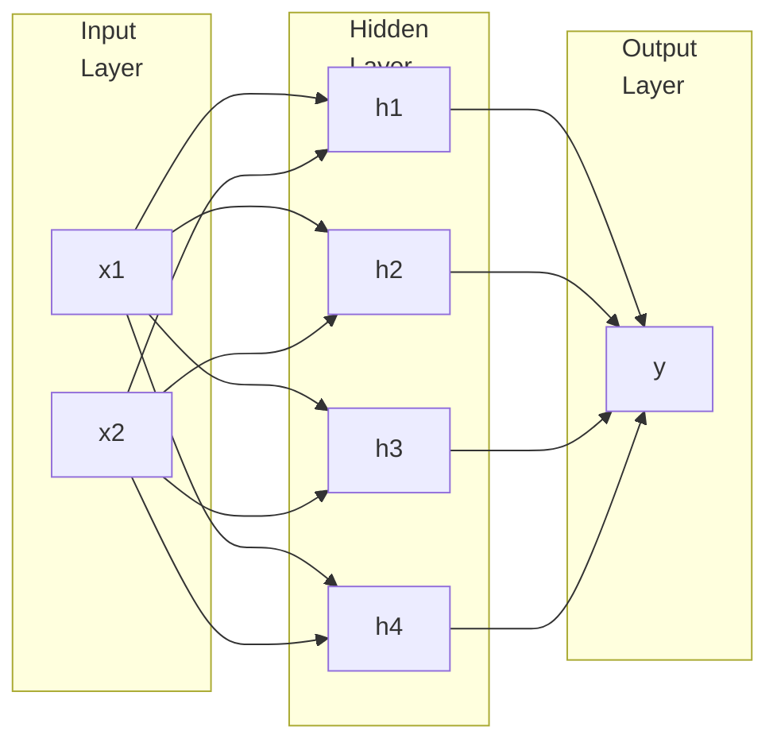

# Fully Connected Networks

## MLP

Multi-Layer Perceptron

Simple neural network with 3 Layers

For an input layer with $n$ nodes, we will have

- 1 output
- $2^n$ nodes in hidden layer

## Feed-Forward

NN (with $> 3$ layers) where every layer feeds forward to the next layer; backward/self-loop is not allowed

For an input layer with $n$ nodes, we will have

- $$
  hidden layers = 
  $$

- $W_i$ is the weights to layer $i$

$$
\begin{aligned}
\textcolor{hotpink}{\text{PreActivation}_{H_1}}
&= b_1 + w_1 x_1 + w_2 x_2 + \dots \\
\text{Activation}_{H_1}
&= \frac{1}{1 + e^{- \textcolor{hotpink}{\text{PreActivation}_{H_1}}}}
\end{aligned}
$$

### Decision Boundary

| Hidden Layers | Shape of Region |
| :-----------: | --------------- |
|       0       | Open            |
|       1       | Closed/Open     |
|    $\ge 2$    | Closed          |

As you increase the number of hidden layers, the possibility of open decision boundary decreases (which is good).

