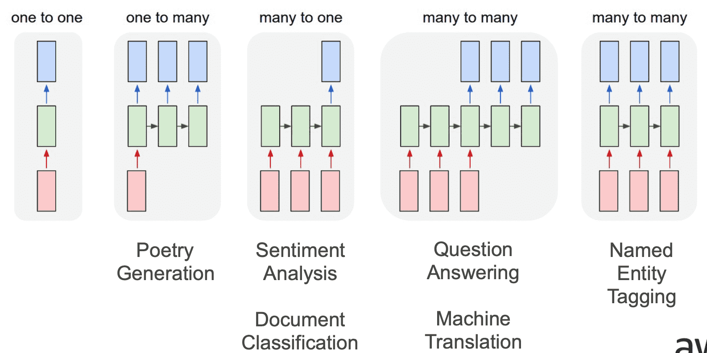

# Sequence Models

Consider a phenomenon where an observation is determined by its past values, eg: any time series variable, such as weather, precipitation, etc.
$$
p(x) = p(x_1) \cdot p(x_2 | x_1) \ldots p(x_t | x_1, \dots, x_{t−1})
$$

## Why not regular ANN?

1. ANN requires fixed number of input & output neurons. 
   - However, with sequential data, we do not know the length of the input
   - theoretically, we could convert all inputs to fixed size by padding shorter sentences, but this is infeasible
2. ANN does not care about order of input

## Memoryless Models

### Auto-Regressive Model

Predict next term in a sequence from a fixed number of previous terms using ‘delay taps’

$$
p(x_t | x_1, ..., x_{t−1}) = p\Big(x_t | f (x_1, ...x_{t−1}) \Big)
$$

### Markov Assumption-based Auto-Regressive Model

Assume that only a limited past upto time period $\tau$ affects the present value

$$
\begin{aligned}
p(x_t | x_1, ...x_{t−1}) &= p\Big(x_t | f (x_{t−τ}, \dots, x_{t−1}) \Big) \\
\implies \hat x &= f(x_{t-\tau}, \dots, x_{t-1} )
\end{aligned}
$$

We predict the next step and iterate.

### Feed-Forward Network

Generalized auto-regressive models with one/more layers of non-linear hidden units

## Memory Models

Generative models

### Linear Dynamic Systems (Stochastic)

Real-valued hidden state that cannot be observed directly

Hidden state has linear dynamics with Gaussian noise and produces the observations using a linear model with Gaussian noise. However, there may also be driving inputs.

A linearly transformed Gaussian is a Gaussian. So the distribution over the hidden state given the data so far is Gaussian. It can be computed using “Kalman filtering”.

### Hidden Markov Models (Stochastic)

have a discrete one-of-N hidden state

Transitions between states are stochastic and controlled by a transition matrix. The outputs produced by a state are stochastic. We cannot be sure which state produced a given output. So the state is “hidden”. It is easy to represent a probability distribution across N states with N numbers.

To predict the next output we need to infer the probability distribution over hidden states. HMMs have efficient algorithms for inference and learning.

#### Limitations

At each time step it must select one of its hidden states. So with N hidden states it can only remember $\log(N)$ bits about what it generated so far.

### Latent Variable Model/RNN (Deterministic)

layered, feed-forward net with shared weights

Next page

## Language Modelling

Inputs are tokens, not necessarily real numbers

$$
p(w_1, w_2, \dots, w_T) = \Pi_{t=1}^T \ p(w_t|w_1,...,w_{t−1})
$$

For eg: Consider the sentence `Statistics is fun.` We can model it as:

$$
\begin{aligned}
p(\text{Statistics, is, fun, . })
&= p(\text{Statistics}) \\
& \times p(\text{is | Statistics})\\
& \times p(\text{fun | Statistics, is}) \\
& \times p( . | \text{Statistics, is, fun})
\end{aligned}
$$

$$
\hat p(\text{is|Statistics}) = \frac{n \text{(Statistics is)}}{n \text{(Statistics)}}
$$

## Applications

Named Entity Tagging is when we identify the entities in a input sequence. For eg: Kelly worked at Google; Kelly is a person and Google is an organization.
