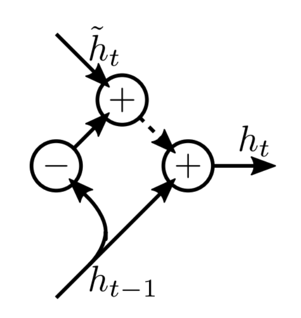

# IDK

## Optimization

Refer to [Optimization Algorithms](./../Optimization_Algorithms)

## Regularization

### Dropout

#### Regular Dropout

May lead to missing relevant information, since sequential part may involve variable-length inputs

#### Variational Dropout

IDK

### Zoneout

Skip hidden state update and keep the same as previously during training

$$
h_t = h_{t−1}
$$

- Robustness against skipping observations in sequence
- Robustness of state representation relative to hidden state updates

### DropConnect

### Parameter Averaging

Train RNN and average weights over run

### Stochastic Weight Averaging

Parameter averaging + Continuously varying learning rate

### Fraternal Dropout

Dropout while minimizing variation between outputs to increase robustness to parameterization
