# Convolutional Neural Networks

Convolutional Neural Networks is a type of architecture that exploits special properties of image data and are used in computer vision applications.

Convolution intuition: efficient "loop" that allows us to forward linear layers over space

Images are a 3-dimensional array of features: each pixel in the 2-D space contains three numbers from 0–255 (inclusive) corresponding to the Red, Green and Blue.

## Intuition
- Low-level/frequency features
- Medium-level/frequency features
- High-level/frequency features
- Logits

## Components
- Conv layer
- Activation function (usually ReLU)
- Pooling
- Fully-connected


The first important type of layer that a CNN has is called the Convolution (Conv) layer. It uses parameter sharing and applies the same smaller set of parameters spatially across the image.
- Number of filters is usually chosen as powers of 2, as many libraries handle these dimensions more efficiently.
- Size of filters is usually odd, as they have an integer center

Essentially the parameters (i.e. weights) associated to the input remain the same but the input itself is different as the layer computes the output of the neurons at different regions of the image.

Hyperparameters of conv layers are 
- Filter size - corresponds to how many input features in the width and height dimensions one neuron takes in
- Stride - how many pixels we want to move (towards the right/down direction) when we apply the neuron again

Then we have the pooling layer. The purpose of the pooling layer is to reduce the spatial size (width and height) of the layers. This reduces the number of parameters (and thus computation) required in future layers.

We use a fully connected layers at the end of our CNNs. When we reach this stage, we can flatten the neurons into a one-dimensional array of features.


We control output shape via padding, strides and channels

Very nice [Youtube explanations](https://www.youtube.com/playlist?list=PLuhqtP7jdD8CD6rOWy20INGM44kULvrHu). Watch this!

## Advantages

- Universal visual feature extractor
- Can be used as building blocks in conjunction with architectures such as RNN/FCNN for complex tasks

## Disadvantages

- High computational cost
- Large data requirements

## Variables in this page

| Variable | Meaning                                           |
| :------: | ------------------------------------------------- |
|   $I$    | Input matrix                                      |
|   $i$    | Size of input matrix                              |
|   $f$    | Size of filter matrix                             |
|   $p$    | Padding applied to input matrix (default=0)       |
|   $s$    | Stride length                                     |
|   $n$    | no of filters                                     |
|   $c$    | no of channels<br />- Grayscale: 1<br/>- Color: 3 |
|   $b$    | Bias                                              |

## Principles

- Translation invariance
- Locality

## Types of Layers

|                                             | Convolutional Layer                                                                                                                                                                                                                                                                                                                                                                                                                                                                                                                | Pooling Layer                                                                                                                                                                                                                                                                                                                              |
| ------------------------------------------- | :--------------------------------------------------------------------------------------------------------------------------------------------------------------------------------------------------------------------------------------------------------------------------------------------------------------------------------------------------------------------------------------------------------------------------------------------------------------------------------------------------------------------------------- | ------------------------------------------------------------------------------------------------------------------------------------------------------------------------------------------------------------------------------------------------------------------------------------------------------------------------------------------ |
| Purpose                                     | Extracting spatially-invariant features<br /><br />Control output shape via padding, strides and channels<br />Edge Detection<br />Image Sharpening                                                                                                                                                                                                                                                                                                                                                                                | Gradually reduce spatial resolution of hidden representations<br />Some degree of invariance to translation<br />Image size reduction, without much data loss<br />Image Sharpening                                                                                                                                                        |
| Operation                                   | Cross-Correlation                                                                                                                                                                                                                                                                                                                                                                                                                                                                                                                  | Pooling                                                                                                                                                                                                                                                                                                                                    |
| Representation<br />$O = $                  | $I \star F + b$<br />$\sum (I \star F + b)$ (multiple channels)                                                                                                                                                                                                                                                                                                                                                                                                                                                                    |                                                                                                                                                                                                                                                                                                                                            |
| $O_{i, j} =$                                | $\sum_{k=1}^f \sum_{l=1}^f F_{k, l} \odot  I_{i+k, j+l} + b$                                                                                                                                                                                                                                                                                                                                                                                                                                                                       | $\sum_{k=1}^f \sum_{l=1}^f \text{func}(F_{k, l} \odot  I_{i+k, j+l})$                                                                                                                                                                                                                                                                      |
| Steps to<br />calculate                     | 1. Perform padding<br/>2. Start from the left<br/>3. Place kernel filter over input matrix<br />(if there are multiple channels, place each filters over corr matrix)<br/>4. Output value of one element = sum of products + Bias<br />(if there are multiple channels, then sum of product of all the channels result in **one single value**)<br/>5. Perform stride rightward<br />6. Repeat steps 3-5, until there are no remaining columns on the right<br/>7. Repeat steps 2-6, until there are no remaining rows on the left | 1. Start from the left<br/>2. Place filter over input matrix<br/>3. Output value of one element = func(product of elements), where func = max, min, avg<br />4. Perform stride rightward<br/>5. Repeat steps 3-5, until there are no remaining columns on the right<br/>6. Repeat steps 2-5, until there are no remaining rows on the left |
| Default<br />stride length                  | 1                                                                                                                                                                                                                                                                                                                                                                                                                                                                                                                                  | $f$                                                                                                                                                                                                                                                                                                                                        |
| Size of<br />output                         | $\dfrac{i-f \textcolor{hotpink}{+2p}}{s} + 1$                                                                                                                                                                                                                                                                                                                                                                                                                                                                                      | $\dfrac{i-f}{s} + 1$                                                                                                                                                                                                                                                                                                                       |
| When Applied                                | First                                                                                                                                                                                                                                                                                                                                                                                                                                                                                                                              | Only after convolutional layer                                                                                                                                                                                                                                                                                                             |
| Common<br />Padding<br />Value              | $f-1$                                                                                                                                                                                                                                                                                                                                                                                                                                                                                                                              | 0                                                                                                                                                                                                                                                                                                                                          |
| Common<br />Stride<br />Value               | 1                                                                                                                                                                                                                                                                                                                                                                                                                                                                                                                                  | 1                                                                                                                                                                                                                                                                                                                                          |
| No of<br />input channels                   | $c$                                                                                                                                                                                                                                                                                                                                                                                                                                                                                                                                | 1                                                                                                                                                                                                                                                                                                                                          |
| No of output<br />images                    | $n$                                                                                                                                                                                                                                                                                                                                                                                                                                                                                                                                | 1                                                                                                                                                                                                                                                                                                                                          |
| No of<br />output channels per output image | 1                                                                                                                                                                                                                                                                                                                                                                                                                                                                                                                                  | 1                                                                                                                                                                                                                                                                                                                                          |

$$
\text{Total output dimension } o' = o \times n \times c
$$

### Depthwise Separable Convolution

Fewer multiplications

1. Perform convolution for each channel separately
2. Perform convolution of the outputs of step 1

$$
\begin{aligned}
\text{Improvement}
&= \dfrac{\text{No of operations in Depthwise Separable}}{\text{No of operations in Standard Conv}} \\
&= \dfrac{1}{\text{No of filters}} + \dfrac{1}{\text{Filter Dimensions}^2}
\end{aligned}
$$

### Notes

- Convolution and cross-correlation operations are slightly different, but it doesn’t matter if kernel is symmetric
- Since images are of different sizes, instead of using weight matrix of fixed size, convolution is applied various times depending on size of input
- 1 x 1 Convolutional Layer doesn’t recognize spatial patterns, but fuses channels
- $\times$ is not multiplication; it is depth/no of activation maps

### Example

The following shows convolution on with 0 padding and stride 1.


### Convolutional Layer

Each filter in the conversation layer produces an “activation map”

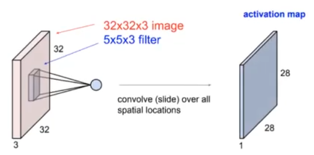

## Padding & Striding

|         | Padding                                                                                                                                                   | Striding                                                |
| ------- | --------------------------------------------------------------------------------------------------------------------------------------------------------- | ------------------------------------------------------- |
| Meaning | Number of extra row(s) and columns added around matrix<br />If $p =$ odd, then pad $\lceil p/2 \rceil$ on one side and $\lfloor p/2 \rfloor$ on the other | Step length in movement of kernel filter on input image |
| Purpose | Overcome loss of pixels, by increasing effective image size                                                                                               |                                                         |
|         | Zero padding means padding using 0s                                                                                                                       |                                                         |


## Operations

|                          |                                                              |                                                              |
| ------------------------ | ------------------------------------------------------------ | ------------------------------------------------------------ |
| Padding                  | 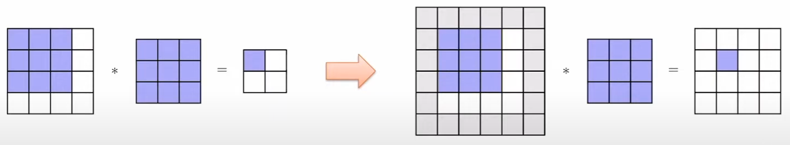 |                                                              |
| Pooling                  | 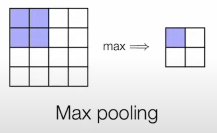 | Aggregate information                                        |
| Striding                 | 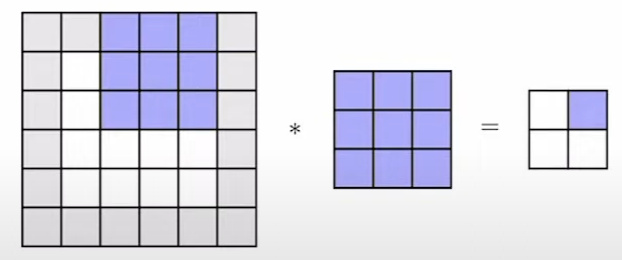 |                                                              |
| Depth-wise/<br />Grouped | 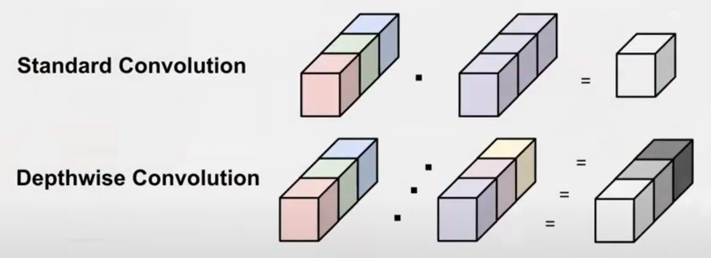<br />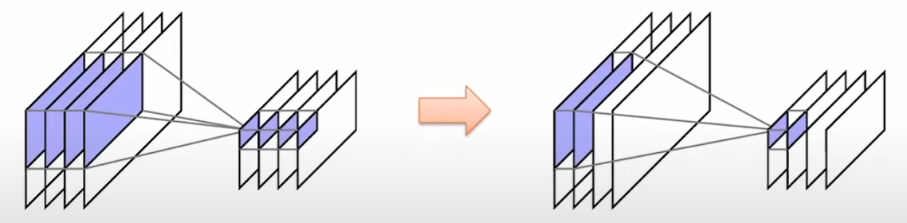 | Group together channels so that groups of channels in output only depend on corresponding groups of channels in input<br />Enforce filter weight matrices to be block-diagonal |
| Dilations                | 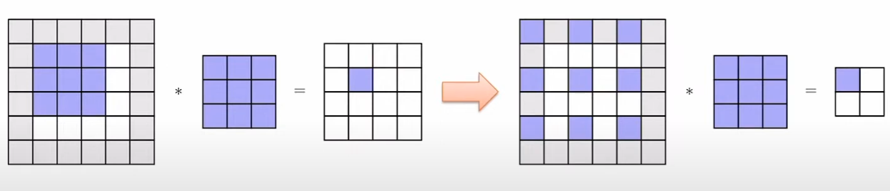 | Dilate convolution filter so that it covers more of the image<br />Requires padding to ensure same size as input |

## Derivative

Adjoint
$$
\begin{aligned}
\bar v \dfrac{\partial \text{conv}(x, W)}{\partial x}
&= \text{conv}(\bar v, \text{flip}(w)) \\
\bar v \dfrac{\partial \text{conv}(x, W)}{\partial W}
&= 
\end{aligned}
$$
## Common Filters

| Application               | Filter Used                                                  |
| ------------------------- | ------------------------------------------------------------ |
| Vertical edges detection  | $\begin{bmatrix}1 & 0 & -1 \\ 1 & 0 & -1 \\ 1 & 0 & -1\end{bmatrix}$ |
| Horizontal edge detection | $\begin{bmatrix}1 & 1 & 1 \\ 0 & 0 & 0 \\ -1 & -1 & -1\end{bmatrix}$ |
| Blur                      |                                                              |

Edge-Detection example


Smoothing


## Advanced CNN

|               | RCNN                                                                                                                                                                                                                                                                       | Fast-RCNN                                                                                                                                                                                                    | Faster RCNN                                                                                                                                                                                                                                  |
| ------------- | -------------------------------------------------------------------------------------------------------------------------------------------------------------------------------------------------------------------------------------------------------------------------- | ------------------------------------------------------------------------------------------------------------------------------------------------------------------------------------------------------------ | -------------------------------------------------------------------------------------------------------------------------------------------------------------------------------------------------------------------------------------------- |
| Major idea    | Region-Based                                                                                                                                                                                                                                                               | Do not recompute features for every box independently                                                                                                                                                        | Integrate bounding box proposals in CNN predictions                                                                                                                                                                                          |
| Steps         | 1. Generate category-independent region proposals (~2k)<br />2. Compute 4096-dimensional CNN feature vector from each region proposal<br />3. Classify regions w/ class-specific linear SVMs                                                                               | 1. Produce **single** convolutional feature map with several convolutional & max-pooling layers <br />2. Region of interest (RoI) pooling layer extracts fixed-length feature vector from region feature map | 1. Compute proposals with a deep convolutional Region Proposal Network (RPN)<br />2. Merge RPN and Fast-RCNN into a single network                                                                                                           |
| Advantages    | Simple<br />Improved mAP compared to RNN                                                                                                                                                                                                                                   | Higher mAP<br />Single end-to-end training stage<br />No disk storage required                                                                                                                               | Cost-free region proposals<br>One network optimizing four losses<br>- RPN classification (anchor good/bad)<br>- RPN regression (anchor -> proposal)<br>- Fast RCNN classification (over classes)<br>- Fast RCNN regression (proposal -> box) |
| Disadvantages | Slow inference: full forward pass of CNN for each region<br />Multistage pipeline<br />Disk storage required for feature caching<br />Training is expensive<br>Classifiers & regressors are post-hoc: CNN features are not updated in response to classifier and regressor | Proposals generation is computationally expensive                                                                                                                                                            |                                                                                                                                                                                                                                              |
| Flowchart     |                                                                                                                                                                                                                                               |                                                                                                                                                         |                                                                                                                                                                           |

## YOLO

You Only Look Once

Single CNN

No proposal for bounding box

==Treat this as a single regression (not classification)==, straight from images pixels to bounding box coordinates and class probabilities

### Steps

1. Residual block
   1. Input split into 7x7 grids
   2. Each cell trains a detector
      1. Detector needs to predict object’s class distributions
      2. detector has 2 bounding box predictor to predict bounding box and confidence scores
   3. Generate probability for each grid having an object
   4. Confidence Score = probability * IOU
2. Bounding box regression
3. IoU (Intersection over Union)
4. Non-max supression

### Non-Max Supression

```pseudocode
Algorithm Non-Max Supression
	Input: A list of proposal boxes B, corresponding confidence scores S and overlap threshold N
	Output:
		List of filtered proposals D
	
	select proposal with highest confidence score, remove it from B and add it to the fnal proposal list D
	Compare IOU of this proposal with all the proposal. If IOU > N, remove proposal from B
	
	more steps are there
```

## Popular Architectures

| Architecture Name | Description                                  |
| ----------------- | -------------------------------------------- |
| LeNet-5           | Recognizing handwritten digits               |
| AlexNet           |                                              |
| VGGNet            |                                              |
| DenseCap          | Image captioning                             |
| SqueezeNet        |                                              |
| GoogLeNet         | Inception Modules (Network inside a network) |
| DCNN              |                                              |
| ResNet            |                                              |
| CUImage           |                                              |
| SENet & SE-ResNet |                                              |

## Visualization of Conv layer

- Visualize patches (images) that maximally activate neurons
- Visualize raw weights of filters/kernels
	- only interpretable on the first conv layer
- Visualize representation space from last FC layer before classifier (t-SNE)
- Occlusion experiments
	- 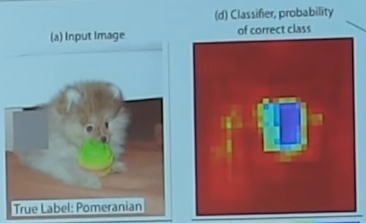
	- as a function of position of blank pixels
- Human experiment comparisons
- Visualize activations
	- Deconv approaches (single backward pass)
		1. Feed image into network
		2. Forward pass until interested neuron
		3. Set the gradient of the interested neuron to be 1.0, and all other neurons of the layer to be 0.0
		4. Backward pass to the image
			- Default backprop
				- 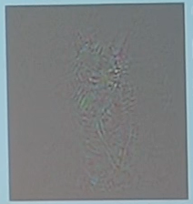
			- Guided backprop
				- 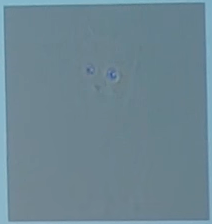
				- Only let the gradients of the neurons with +ve activations and +ve gradients to pass
			- Deconvnet
				- Change the backward pass of ReLU: Only let the gradients of the neurons with +ve gradients to pass
	- Optimization over image approaches (optimization): Find an image that maximizes the class score
		1. Feed in zeros to the network
		2. Set gradient of scores vector to all 0.0, except the interested class's gradient which is to be 1.0
			1. This can be extended to arbitrary neuron
		3. Backward pass to the image
		4. Do a small "image update"
		5. Forward the new image to the network
		6. Objective function
			- $\arg \max_{I} S_c(I) - \lambda \vert \vert I \vert \vert_2^2$
			- $\arg \max_{I} S_c(I)$
				- but blur image after every update
				- take any pixel with small norm to zero (to encourage sparsity)
		7. Go to step 2
		8. Once converged
			1. Visualize the final image
				- 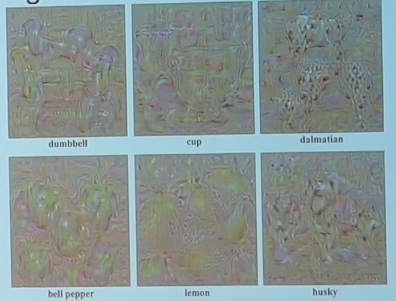
			2. Visualize the data gradient
				- 
				- $M_{ij} = \arg \max_c \vert w_{h(i, j, c)} \vert$
					- At each pixel take the absolute value
					- Max over all channels
				- This can be used in `grabcut` for segmentation
					- 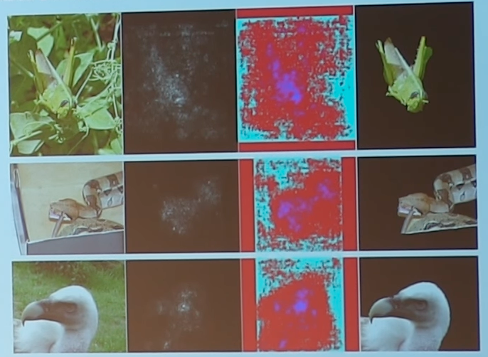
			3. Reconstruction of original image
				- 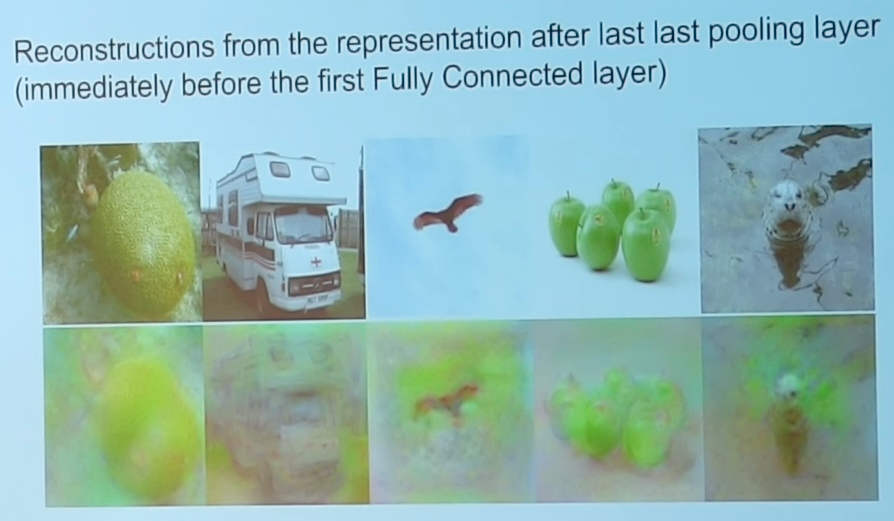

## Hallucination

### DeepDream

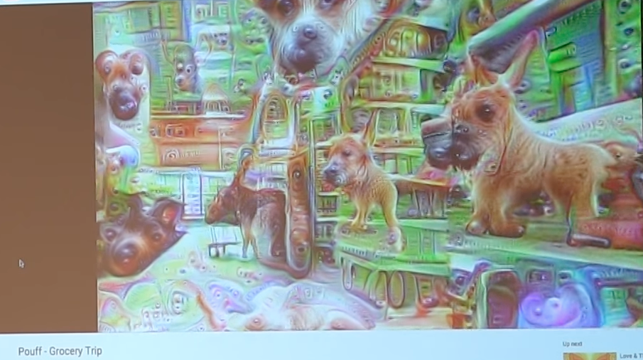

Set the gradients of the neurons in the layer you want to hallucinate at to be equal to the activations

Goal: Amplify the neurons which most activates the hallucination

### NeuralStyle

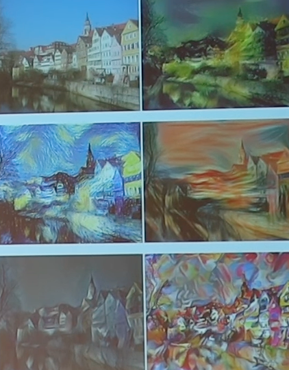

1. Take 2 images
	1. Content image
	2. Style image
2. Extract content targets (ConvNet activations of all layers for the given content image)
3. Extract style targets (Gram matrices of ConvNet activations of all layers for the given style image): $G = V^T T$
4. Optimize for generating a new image with
	1. Content of content image: activations match content
	2. Style of style image: Gram matrices of activations match style
5. Since it is a lightweight optimization problem with just 2 images, L-BFGS outperforms Adam

## More smaller filters are better

Three 3x3 conv vs one 7x7
- same receptive field
- fewer parameters
- more non-linearity
- more efficient compute

## Deconvolution

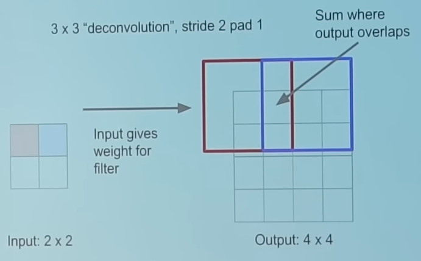

Same as backward pass for regular convolution

Misnomer; actual "deconvolution" means "inverse of convolution"; better terms
- backward convolution
- upconvolution
- convolution transpose
- fractionally-strided convolution