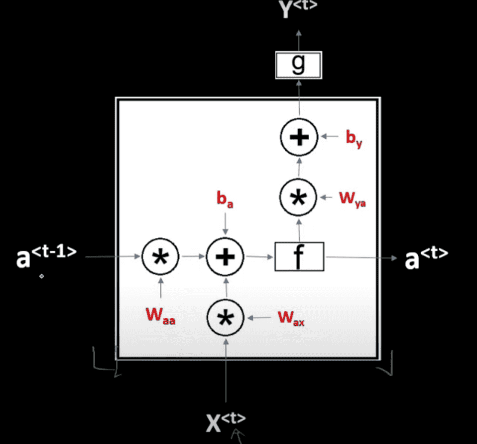
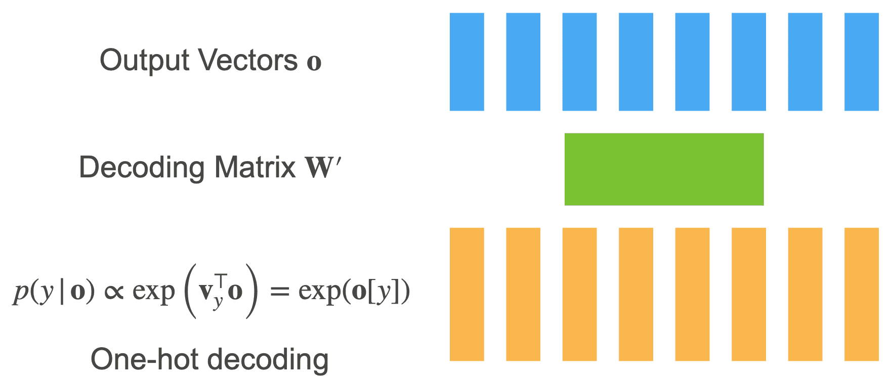

# Recurrent Neural Networks

A recurrent neural network (RNN) is a kind of artificial neural network mainly used in speech recognition and natural language processing (NLP).  

A recurrent neural network looks similar to a traditional neural network except that a memory-state is added to the neurons.

A RNN cell is a neural network that is used by the RNN.

As you can see, it’s the same cell repeats over time. The weights are updated as time progresses.

## IDK

We introduce a latent variable, that summarizes all the relevant information about the past

$$
h_t = f(x_1, \dots, x_{t−1}) = f(h_{t−1},x_{t−1})
$$

### Hidden State Update

$$
h_t = \phi \Big(W_{hh} h_{t−1} + W_{hx} x_{t−1} + b_h \Big)
$$

### Observation Update

$$
o_t = \phi(W_{ho} h_t + b_o)
$$

## Advantages

1. Require much less training data to reach the same level of performance as other models
2. Improve faster than other methods with larger datasets
3. Distributed hidden state allows storage of information about pass efficiently
4. Non-linear dynamics allows them to update their hidden state in complicated ways
5. With enough neurons & time, RNNs can compute anything that can be done by a computer
6. Good behaviors
   1. Can oscillate (good for motor control)
   2. Can settle to point attractors (good for retrieving memories)
   3. Can behave chaotically (bad for info processing)

## Disadvantages

1. High training cost
2. Difficulty dealing with long-range dependencies

## An Example RNN Computational Graph

## Implementing RNN Cell

### Tokenization/Input Encoding

Map text into sequence of IDs

#### Granularity

| Granularity | ID for each                           | Limitation                    |
| ----------- | ------------------------------------- | ----------------------------- |
| Character   | character                             | Spellings not incorporated    |
| Word        | word                                  | Costly for large vocabularies |
| Byte Pair   | Frequent subsequence (like syllables) |                               |

#### Minibatch Generation

| Partitioning |                                                              | Independent samples? |            No need to reset hidden state?             |
| ------------ | ------------------------------------------------------------ | :------------------: | :---------------------------------------------------: |
| Random       | Pick random offest Distribute sequences @ random over mini batches |          ✅           |                           ❌                           |
| Sequential   | Pick random offeset Distribute sequences in sequence over mini batches |          ❌           | ✅ (we can keep hidden state across mini batches) |

Sequential sampling is much more accurate than random, since state is carried through

### Hidden State Mechanics

- Input vector sequence $x_1, \dots, x_t$
- Hidden states $h_1, \dots, x_t$, where $h_t = f(h_{t-1}, x_t)$
- Output vector sequence $o_1, \dots, o_t$, where $o_t = g(h_t)$

Often outputs of current state are used as input for next hidden state (and thus output)

### Output Decoding

$$
P(y|o) \propto \exp(V_y^T \ o) = \exp(o[y])
$$

## Gradients

Long chain of dependencies for back-propagation

Need to keep a lot of intermediate values in memory

Gradients can have [problems](#gradient-problems)

### Accuracy

Accuracy is usually measured in terms of log-likelihood. However, this makes outputs of different length incomparable (bad model on short output has higher likelihood than excellent model on very long output).

Hence, we normalize log-likelihood to sequence length
$$
\begin{aligned}
\pi &= - \textcolor{hotpink}{\frac{1}{T}} \sum_{t=1}^T \log P(y_t|\text{model}) \\
\text{Perplexity} &= \exp(\pi)
\end{aligned}
$$
Perplexity is effectively number of possible choices on average

## Truncated BPTT

Back-Propagation Through Time

| Truncation Style |                                                              |
| ---------------- | ------------------------------------------------------------ |
| None             | Costly Divergent                                        |
| Fixed-Intervals  | Standard Approach Approximation Works well         |
| Variable Length  | Exit after reweighing Doesn’t work better in practice   |
| Random Variable  |  |

## Regularization

### Dropout

#### Regular Dropout

May lead to missing relevant information, since sequential part may involve variable-length inputs

#### Variational Dropout

IDK

### Zoneout

Skip hidden state update and keep the same as previously during training
$$
h_t = h_{t−1}
$$

- Robustness against skipping observations in sequence
- Robustness of state representation relative to hidden state updates

### Parameter Averaging

Train RNN and average weights over run

### Stochastic Weight Averaging

Parameter averaging + Continuously varying learning rate

### Fraternal Dropout

Dropout while minimizing variation between outputs to increase robustness to parameterization

## Gradient Problems

FFNN can cope with these problems because they only have a few hidden layers, but RNN struggles.

|                                                              | Vanishing (Converging) | Exploding (Diverging) |
| ------------------------------------------------------------ | ---------------------- | --------------------- |
| Cause Weights multiplied during BPTT are                | Too small              | Too large             |
| Gradients __ exponentially during back-propagation           | shrink                 | grow                  |
| Resultant problem Effect on current output due to past input | Too little             | Too high              |
| Solutions                                                    | Scaling                | Clipping              |

### Initial Weights

We can avoid this by initializing the weights very carefully

### Clipping

rescales gradient to size at most $\theta$.
$$
g \leftarrow \min \left( 1, \frac{\theta}{\vert g \vert}  \right) g
$$

If the weights are large, the gradients grow exponentially during back-propagation

