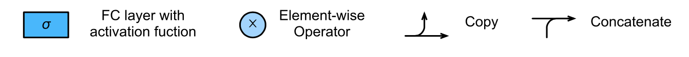
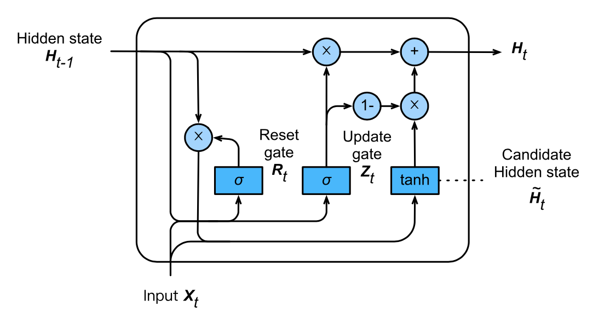

Gated Recurrent Unit

Not all observations are equally relevant, so we need a mechanism to 

|                 |               |
| --------------- | ------------- |
| Update gate $Z$ | Pay attention |
| Reset gate $R$  | Forget        |

## Operations

## Gating

$$
\begin{aligned}
R_t &= σ(X_t W_{xr} + H_{t−1} W_{hr} + b_r) \\
Z_t &= σ(X_t W_{xz} + H_{t−1} W_{hz} + b_z) \\
\tilde H_t &= \tanh \Big(
X_t W_{xh} + (R_t \odot H_{t−1}) W_{hh} + b_h
\Big) \\
H t &= \Big[
Z_t \odot H_{t−1}
\Big] + \Big[
(1−Z_t) \odot \tilde H_t
\Big]
\end{aligned}
$$