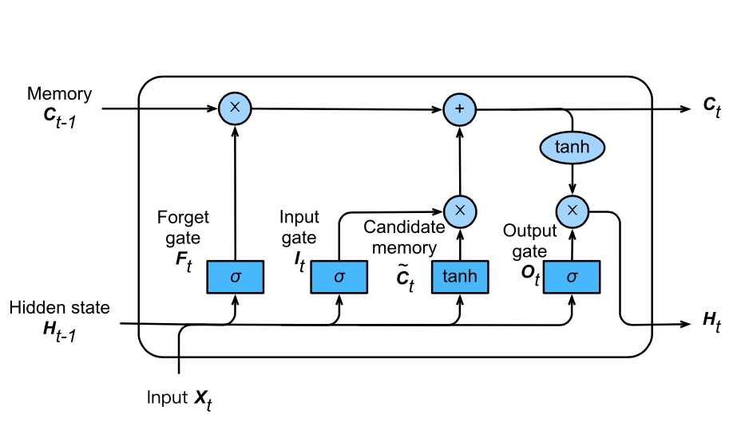

Long Short-Term Memory

RNN only has Short-Term memory, which does not work for well long sentences, and hence for use-cases such as Grammar Checking, we prefer LSTM

## Gates

| Gate   | Function                                              |
| ------ | ----------------------------------------------------- |
| Forget | Control forgetting/retaining info currently in memory |
| Input  | Control whether to add new info to memory             |
| Output | Control effect of hidden state on output              |

$$
\begin{aligned}
It &= \sigma(X_t W_{xi} + H_{t−1} W_{hi} + b_i) \\
Ft &= \sigma(X_t W_{xf} + H_{t−1} W_{hf} + b_f ) \\
O_t &= \sigma(X_t W_{xo} + H_{t−1} W_{ho} + b_o) \\
\tilde C_t &= \tanh(X_t W_{xc} + H_{t−1} W_{hc} + b_c) \\
C_t &= F_t \odot C_{t−1} + I_t \odot \tilde C_t \\
H_t &= O_t \odot \tanh(C_t)
\end{aligned}
$$

- $\tilde C_t$ is the candidate memory
- $C_t$ is the long-term memory
