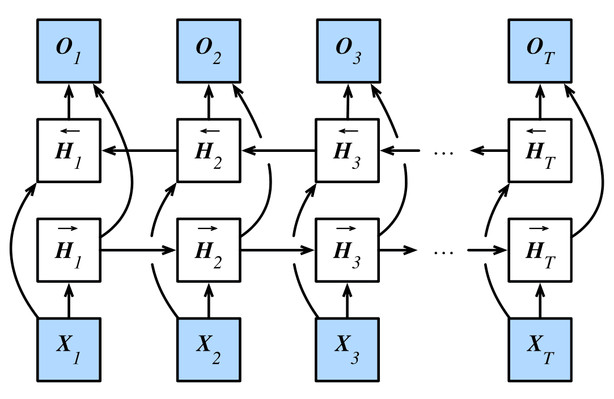

## Non-Linear Units

Replace $\phi$ of updates with MLP

✅ Keeps structure of latent space

❌ Costly (due to more complex gradients)

## Deep RNN

Rather than using just 1 hidden layer, we use more hidden layers, ie, each time stamp of RNN has multiple cells

$$
\begin{aligned}
H_t^j &= f_j(H_{t-1}^j, H_t^{j−1}) \\
O_t &= g(H_t^L)
\end{aligned}
$$

## Bidirectional RNN

### Context

- I am **<u>happy</u>**
- I am **<u>very</u>** hungry
- I am **<u>so</u>** hungry, I could eat 2 plates of rice

Very different words to fill in, depending on past and future context of a word

Traditional RNNs only look at the past. In interpolation (fill in) we also use the future.

### Implementation

- One RNN forward
- One RNN backward
- Combine both hidden states for output generation

### idk

Bi-RNN does not work for sequence generation

| Training                                                     | Testing                                                      |
| ------------------------------------------------------------ | ------------------------------------------------------------ |
|  |  |

However, we can still use it to encode the sequence

## Residual RNN

Input of every second layer is also added to its output (residual connection)

$$
\bar H_t^{(2i)} = H_t^{(2i)} + H_t^{(2i)−1}
$$

### Adding Layers

Adding a layer to a model changes function 
class.

We want to add to the function class, using Taylor expansion
 style parametrization
$$
f(x) = x + g(x)
$$

### Variants

- Simple addition
- Nonlinearity before addition
- Could also concatenate

## DenseNet RNN

Concatenate outputs of previous layers as input to next layer, with occasional transition layers to reduce dimensionality

$$
\bar H_t^{(t)} = [H_t^{(t)}, \bar H_t^{t−1}]
$$
