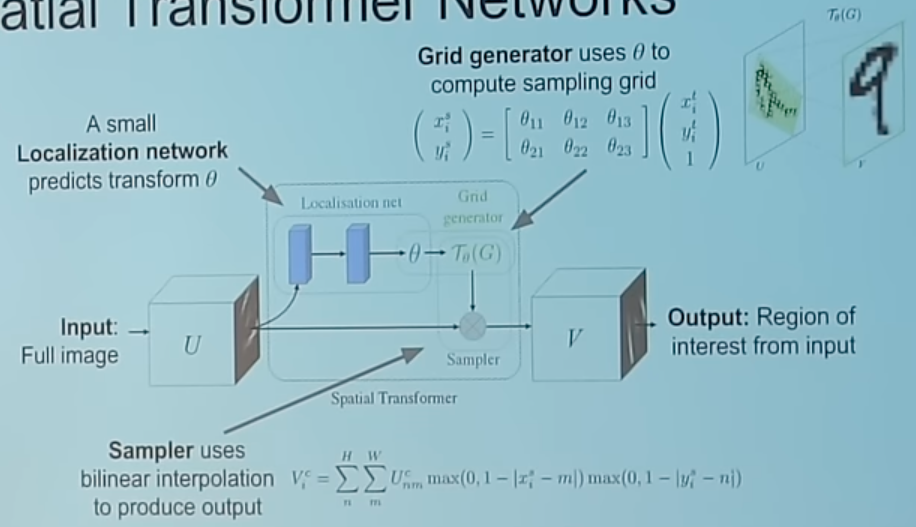
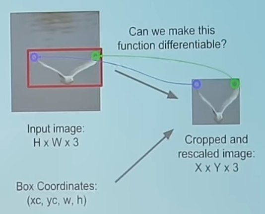
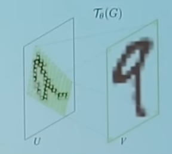
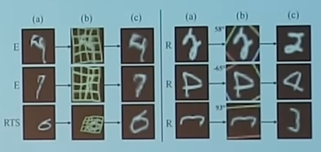
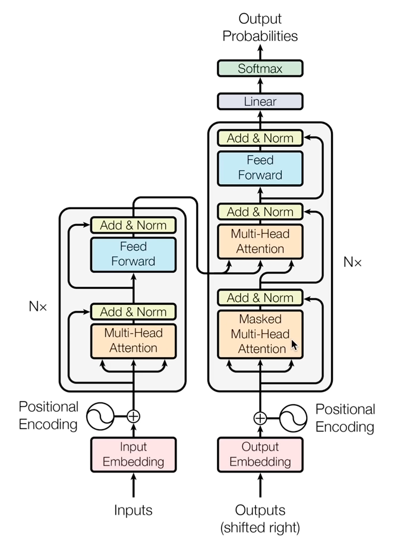

# Transformers

## Spatial Transformer

Differentiable (and hence, learnable) way of cropping images, allowing attention models to attend to arbitrary regions

1. Function mapping pixel coordinates $(x_t, y_t)$ of output to pixel coordinates $x_s, y_s$ of input
	1. 
2. Repeat for all pixels in output to get a sampling grid
3. Use bilinear interpolation to compute output

## LLM Transformer

