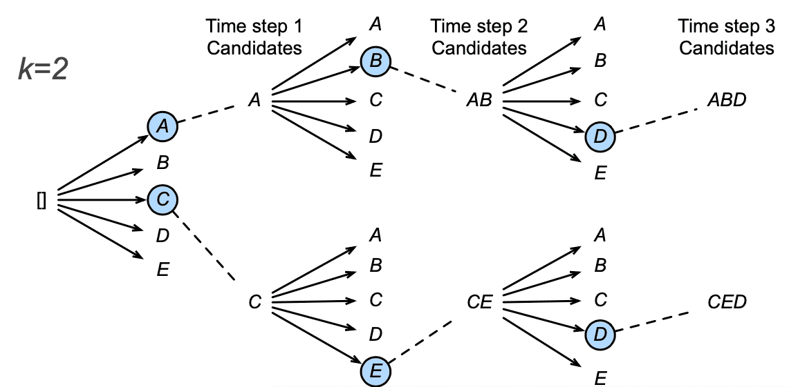

- Encoder processes inputs
- Decoder generates outputs

## Seq2Seq

Used for language translation

### Encoder

Reads input sequence

Standard RNN model without output layer

Encoder’s hidden state in last time step is used as the decoder’s initial hidden state

### Decoder

RNN that generates output

Fed with the targeted sentence during training

## Search Algorithms for Picking Weights

Let

- $n =$ output vocabulary size
- $T = L =$ max sequence length

| Search Algorithm |                                                              | Time Complexity                            |
| ---------------- | ------------------------------------------------------------ | ------------------------------------------ |
| Greedy           | Used in seq2seq model during prediction It could be suboptimal | $O(nT)$                                    |
| Exhaustive       | Compute probability for every possible sequence Pick the best sequence | $O(n^T)$ ❌ computationally infeasible |
| Beam             | We keep the best $k$ (beam size) candidates for each time Examine $kn$ sequences by adding new item to a candidate, and then keep the top-$k$ ones Final score of each candidate $= \frac{1}{L_\alpha} \log P(y_1, \dots, y_L)$ $= \frac{1}{L_\alpha} \sum_{t=1}^L \log P(y_t | y_1, \dots, y_{t-1}, c)$ Often, $\alpha = 0.7$ | $O(knT)$                                   |

## Disadvantage

Not suitable for large sentences, since the context vector might not be able to encapsulate the effect of very much previous words.
