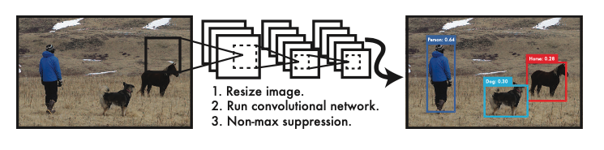
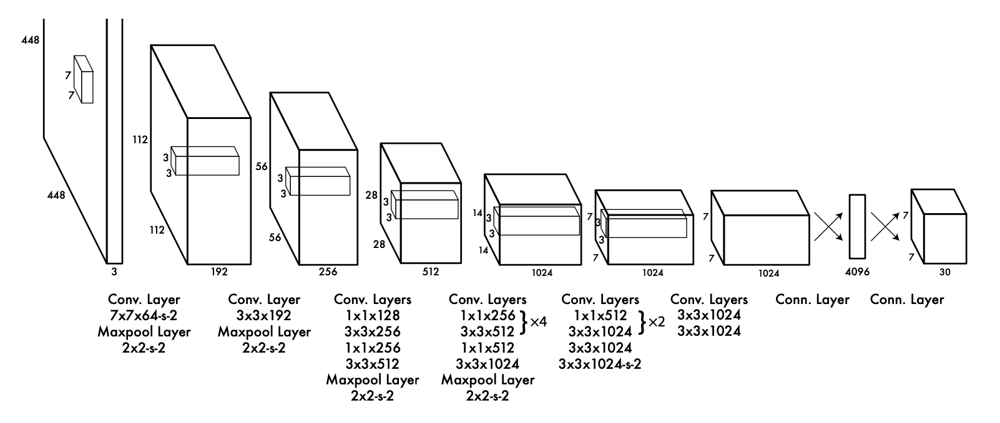

Reference: [YOLO](YOLO.pdf) 

You only look once (YOLO) at an image to predict what objects are present and where they are.

## Abstract

Traditional object detection repurposes classifiers to perform detection; YOLO frames object detection as a regression problem to spatially separated bounding boxes and associated class probabilities

A single neural network predicts bounding boxes and class probabilities directly from full images in one evaluation. Since the whole detection pipeline is a single network, it can be optimized end-to-end directly on detection performance

YOLO makes more localization errors but is less likely to predict false positives on background

## Working

A single convolutional network simultaneously predicts multiple bounding boxes and class probabilities for those boxes. YOLO trains on full images and directly optimizes detection performance.

## IDK

YOLO sees the entire image during training and test time, so it implicitly encodes contextual information about classes as well as their appearance. 

Meanwhile, Fast R-CNN mistakes background patches in an image for objects because it can’t see the larger context

## Advantages

1. Fast
2. Reasons globally
3. Better understanding of general representations of objects, compared to other models; ie, real-life, artwork, etc

## Disadvantages

- Lower accuracy than state-of-the-art systems; [however, higher accuracy (better mAP) than many models]
- Struggles with small objects that appear in groups, such as flocks of birds
  - Each grid cell only predicts two boxes and can only have one class
  - This spatial constraint limits no of nearby objects that the model can predict
- Struggles to generalize to objects in unseen aspect ratios/configurations
- Loss function treats errors the same in small and large bounding boxes
- Errors due to Incorrect localizations

## Detection

System divides the input image into an $S \times S$ grid. If the center of an object falls into a grid cell, that grid cell is responsible for detecting that object.

Each grid cell predicts B bounding boxes and confidence
scores for those boxes; each bounding box consists of 5 predictions: $x, y, w, h$, and confidence. These confidence scores reflect how
confident the model is that the box contains an object and
how accurate it thinks the box is that it predicts.
$$
\text{Confidence} = P(\text{Object}) \times \text{IOU}
$$
Each grid cell also predicts C conditional class probabilities $P(\text{Class}_i|\text{Object})$
$$
P(\text{Class}_i|\text{Object}) \times P(\text{Object}) \times \text{IOU} = Pr(\text{Class}_i) \times \text{IOU}
$$

## Network Design

Architecture is inspired by the GoogLeNet model for image classification. However, YOLO does not use inception modules used by GoogLeNet

Pretrain the convolutional layers on the ImageNet classification task at half the resolution (224 × 224 input image) and then double the resolution for detection

|                           |      Default YOLO      | Fast YOLO |
| ------------------------- | :--------------------: | :-------: |
| Convolutional Layers      |           24           |     9     |
| Convolutional Layers Size |      $3 \times 3$      |   Same    |
| Reduction Layers Size     |      $1 \times 1$      |   Same    |
| Fully-Connected Layers    |           2            |   Same    |
| Reduction                 |      $1 \times 1$      |   Same    |
| Final Output              | $7 \times 7 \times 30$ |   Same    |

## Activation Function

| Layer        | Function                                                     |
| ------------ | ------------------------------------------------------------ |
| Final Layer  | Linear                                                       |
| Other layers | $\phi(x) = \begin{cases} x, & x>0 \\ 0.1x, & \text{otherwise} \end{cases}$ |

## Error Function

Sum-Squared error

Easy to optimize, but not aligned with the goal of maximizing mAP
