# Unsupervised Deep Learning

## Traditional Autoencoder

Feature learning, dimensionality reduction, anomaly detection

```mermaid
flowchart LR
x1["x"] -->
|Encoder| z["z"] -->
|Decoder| x2["x̂"]
```

- Usually $\vert z \vert < \vert x \vert$, to find useful small subset of features
- Sometimes encoder and decoder share weights
- Use encoder to initialize a supervised model

Error function will be $u_i = x_i - \hat x_i$

## Variational Autoencoder

- Bayesian
- Useful to generate new data

## GAN

Generative Adversarial Networks

### Multiscale

### Vector Math

