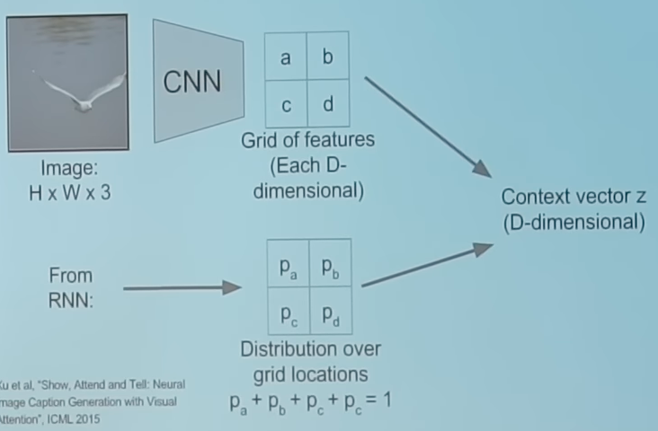
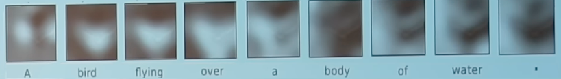
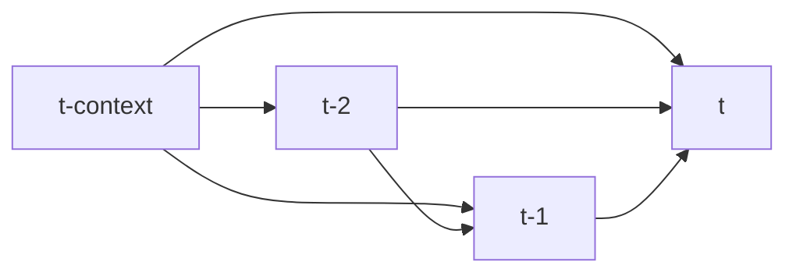
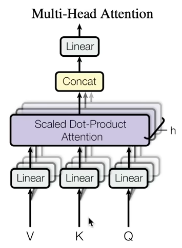

# Attention Models

- Attention is a communication mechanism
- Can be viewed as
	- nodes in directed graph looking at each other
	- aggregating with a weight sum from all nodes that point to them
	- with data-dependent weights

## Advantages
- Give interpretable outputs

## Disadvantages
- Can only attend to fixed grid positions

### Soft Attention for Translation

### Soft Attention for Captioning

Also generate a distribution of which pixels to look at next

## Soft vs Hard Attention

|                                        | Soft                                                               | Hard                                                                                                 |
| -------------------------------------- | ------------------------------------------------------------------ | ---------------------------------------------------------------------------------------------------- |
|                                        | Summarize all locations                                            | Sample one location according to $p$                                                                 |
| $z$                                    | $p_a a + p_b b + p_c c + p_d d$                                    | that vector                                                                                          |
| Advantage                              | Derivative is nice                                                 | Computationally-efficient as we focus on smaller chunks of input                                     |
| Disadvantage                           | No efficiency improvement as we still need to process entire input | Derivative is zero almost everywhere  Cannot use gradient descent; need reinforcement learning |
|  |                                      |                                                                        |

## Self-Attention

- No notion of space
	- Attention simply acts over a set of vectors
	- Hence, need to positionally encode tokens
-  Types of attention
	- "self-attention": source of key, query, and value is all $X$
	- "cross-attention": at least one source of key, query, and value is not $X$
- Every self-attention "head" has:

|         |                 | Dimension                  |
| ------- | --------------- | -------------------------- |
| key     | FC(X)           | $(B, T, \text{head size})$ |
| query   | FC(X)           | $(B, T, \text{head size})$ |
| weights | `query @ key.T` | $(B, T, T)$                |
| value   | FC(X)           | $(B, T, \text{head size})$ |
| output  | weights @ value |                            |

- Scale the weights by $1/\sqrt{\text{head size}}$ to get unit gaussian
- If you need to enforce that every $t$th token should only interact with tokens $< t$
	- Do an lower triangular mask on weights, with others being set to $- \infty$
- Do a softmax function to make all weights $\in [0, 1]$

### Multi-Head Attention

Multiple attention blocks in parallel and then concatenated