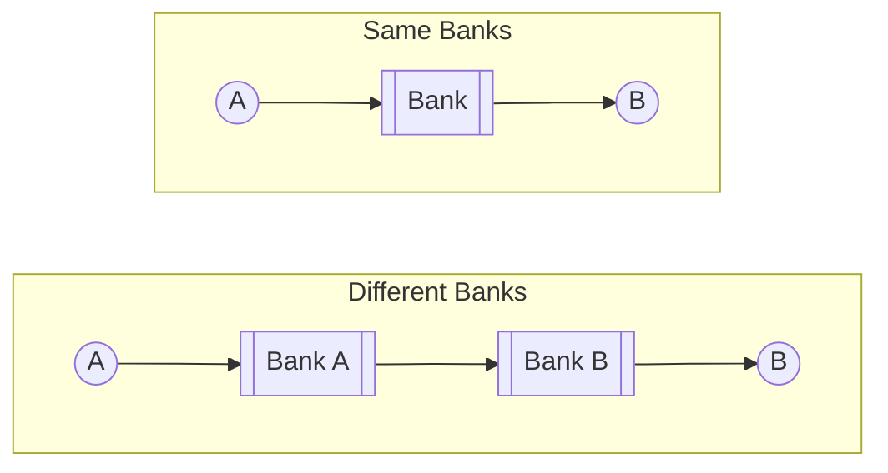
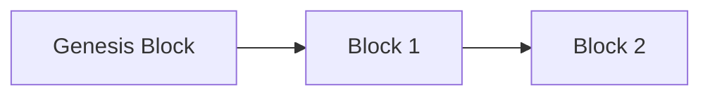

# Introduction

## Traditional Banks

Banks maintain ledger

Ledger is a record of the 

Bank ledgers are not auditable



### Bad Incidents

#### Cyprus

Take 30% of everyone’s funds, just like that

#### India demonetization


### Charge-backs

Reversed transaction within 24-48hrs

But counter-party can sue the payer

### 2008 Recession

The taxpayers’ money was used for bailing out banks

## Pre-Requisities

### Symmetric Keys


### Asymmetric Keys

- Public key helps
  - encrypt data
  - verify signature
- Private key helps
  - decrypt data
  - sign messages

#### Steps

1. A takes B’s public key
2. A encrypt the file
3. B receives file
4. B uses B’s private key to decrypt the file

## Blockchain

Continuous database split into blocks

Basically like a doubly-linked list

### Concensus

Permission

Centralized party cannot edit 

### Hash Function

Compression function that tranforms data into a simpler form

Helps with verification, by serving as signature to data



### Components

1. Hash of current block
2. Hash of previous block (except genesis block)
3. Transactions and signatures
   1. Sender’s signature, as they are the one initiating the transaction
4. Timestamp
5. Proof of Work

## Wallet

Front-end that keeps your details and interacts with the blockchain

## Bitcoin

Peer-to-peer network

Trillion-Dollar Market

### Advantages

- Resistant to inflation
  - Overall supply 
- Resistance to fraudulent
- Pseudo-anonymous
  - You can find out the 
  - But you can’t find out who it is
- ==Low transaction fees==

## Parts of Blockchain

1. **Users**
   The ones who send/receive transactions
2. **Nodes**
   Autonoumous computers which validate and timestamp transactions
3. **Miners**
   Subset of nodes, high computational, confirm transactions
   Monitor transations

### Mining

Every transcation has a transaction fee, which depends on 

The Bitcoin protocol rewards only the fastest miner solving a ‘hash puzzle’. The difficulty gets automatically adjusted by the network algorithm.

Winner gets a freshly-minted bitcoin and the commission fee by the payer.

There can only be 21M bitcoins total in the total. Every year, the reward gets divided into half. Currently, the reward is $6.25 \text{ BTC}$

**Protocol** is a set of rules

### Mempool

Memory pool

On every 2 weeks, the difficulty algorithm updates the difficulty level

## Limitations

- Time-Consuming
  - 10 min confirmation time

## Solutions

### Increase the block size

- So that more transactions fit into a block
- Introduce a second layer
- But not that great

### Lightning Network

- Without this, throughput is only 7
- Depends on the internet speed of the nodes
- ~ 3.9M transactions per second

You just need to record 2 transactions

- Opening channel
- Closing channel

Only disadvantage is that it depends on **liquidity** (of what?) ; hence, it is only recommend only for small transactions

Another features relayed transactions through shortest paths between payer and receiver

## Stages of Currency/Digital Currency


## Economic Majority


## Ring Signatures

(not relevant here)

## Softwares/Websites Used

### Electrum

```bash
open /Applications/Electrum.app --args --testnet
```

### Other

- [mempool.emzy.de](https://mempool.emzy.de)
- [Bitcoin Testnet Faucet](https://bitcoinfaucet.uo1.net/)
  - Parallel blockchain where developers use it for testing