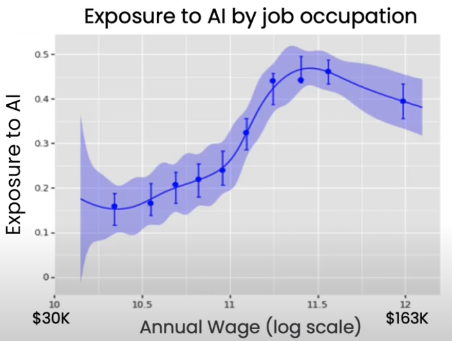
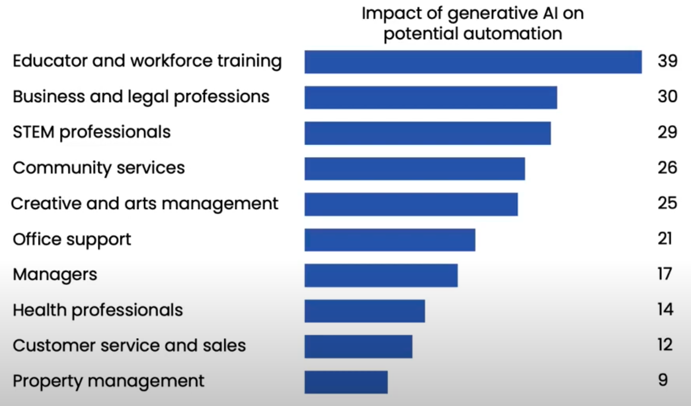

# Introduction

## Generative AI

AI systems that can produce high quality unstructured content: text, images, audio

## Impact on Jobs

More effect on

- higher-paid jobs 
- knowledge workers

## Lifecycle of GenAI Project

1. Scoping
2. Build prototype
3. Internal evaluation
4. Improve system
5. Deploy
6. Monitor

## LLMs

Large Language Models

Supervised learning to repeatedly predict the next word

### Applications

- Finding new information
- Writing
  - Assistant
  - Translation
- Reading
  - Proof reading
  - Summarization
- Chatting

Advice for chatbots: Start with internal-facing that works with staff

### What an LLM can do

Rule of thumb

Whatever a fresh undergraduate can do with the given prompt and

- No internet/other resources
- No training specific to your prompt
- No memory of previous tasks

### Prompting Tips

1. Be detailed: Give LLM sufficient context & information required to task at hand
2. Be specific
3. Guide the model to think through its answer: Suggest steps for performing task
4. Experiment and Iterate

### Objective

Helpful, Honest, Harmless

### How it works

- Instruction tuning
- RLHF: Reinforcement Learning from Human Feedback
  1. Train another Supervised Learning model for answer quality rewards
  2. Train LLM to generate responses with high response scores
  
  Can be used to reduce bias

### Tool-Use

#### Action

#### Reasoning

## Agents

- Use LLM to close and carry out complex sequence of actions
- Not ready at the time of typing this

## Image Generation

Diffusion Model

Noise + Prompt -> Generated Image

## Limitations

- Knowledge cut-off
- Hallucinations: LLM can produce confident responses which are completely false
- Prompt size is limited
- Does not work with structured data
- Does not do arithmetic well
- Bias & Toxicity

## Caveats

- Be careful with confidential information
- Double-check: LLMs do not necessarily give reliable information
- For user service, better to have confirmation dialog before performing transaction

## Cost of LLM

Relatively cheap to use

4 tokens ~ 3 words

## RAG

1. Given question, search relevant documents for answer
2. Incorporate retrieved text into updated prompt
3. Generate answer with new prompt with additional context

## Fine-Tuning

1. To carry out a task that isn’t easy to define in a prompt
2. To help LLM gain specific knowledge
3. To get a smaller model to perform a task

## Pre-Training

- Very costly
- Requires large amount of data

For building a specific application, pre-training is the last resort

## LLM Model Size

General guidelines

| Parameters | Capability                                                 | Example                     |
| ---------- | ---------------------------------------------------------- | --------------------------- |
| 1B         | Pattern-matching Basic knowledge of the word          | Restaurant review sentiment |
| 10B        | Greater world knowledge Can follow basic instructions | Food order chatbot          |
| > 100B     | Rich world knowledge Complex reasoning                | Brainstorming               |
