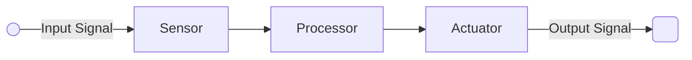

# Introduction

Network of physical objects embedded with electronics, software, sensors and network connectivity that enables these objects to collect and exchange data

## Parts

- Sensor and actuators are transducers
- Transducers convert signal from one form to another
	- Microphones: sound to electrical
	- Speaker: electrical to sound
	- Antenna: electromagnetic to electricity and vice-versa
	- Strain gauge: strain to electrical

## Applications

- Wearable tech
- Healthcare devices
- Smart appliances

## Signals

|         | Digital           | Analog                                                                                          |
| ------- | ----------------- | ----------------------------------------------------------------------------------------------- |
| Type    | Binary (0/1) | Continuous (Usually 0-5v or 0-3.3v)                                                        |
|         |                   | Usually mapped to digital 0-255 or 0-1023                                                       |
| Example | On/off LED        | Pulse-Width Modulation - Intensity of light - Brightness of LED - Speed of Motor |

## Standard Controllers for IoT

|                               | Arduino                             | Node MCU     | Raspberry Pi                    |
| ----------------------------- | ----------------------------------- | ------------ | ------------------------------- |
| Type                          | RISC                                | RISC         | CISC                            |
| Size of Projects              | Embedded Systems                    | Small-Size   | Large-Size                      |
| Cost                          |                                     |              |                                 |
| WiFi                          | ❌ Need external ESP8266 module | ✅            | ✅                               |
| Programming                   | C++                                 | C++ Lua | Python Java C++       |
| Flash Memory                  | 32 KB                               | 128 MB       | -                               |
| GPIO General Purpose I/O | 13                                  | 10           | 17                              |
| ADC Meaning              | 6                                   | 1            | 0                               |
| Operating Voltage             | 5 v                                 | 3.3 v        | 5 v                             |
| Clock Speed                   | 16 MHz                              | 26-52 MHz    | 1.2 GHz                         |
| Supported Wifi Bands          | 2.4 GHz                             | 2.4 GHz      | 2.4 GHz 5 GHz (RPi 4 only) |

## CPS
Cyber-Physical Systems

