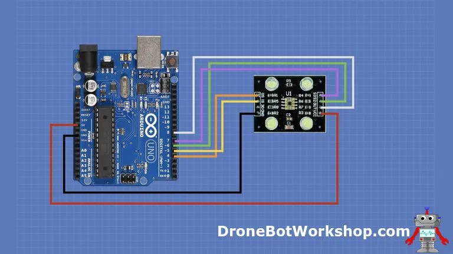

# Color Sensor

| Sensor   | IR Filter | Accuracy |
| -------- | --------- | -------- |
| ISL29125 | ✅         | Best     |
| TCS34725 | ✅         |          |
| TCS3414  | ✅         |          |
| TCS3200  | ❌         |          |
| TCS230   | ❌         |          |

## TS230




### Calibration

```cpp
/*
  Color Sensor Calibration
  color-sensor-calib.ino
  Calibrate RGB Color Sensor output Pulse Widths
  Uses values obtained for RGB Sensor Demo sketch 
 
  DroneBot Workshop 2020
  https://dronebotworkshop.com
*/
 
// Define color sensor pins
 
#define S0 4
#define S1 5
#define S2 6
#define S3 7
#define sensorOut 8
 
// Variables for Color Pulse Width Measurements
 
int redPW = 0;
int greenPW = 0;
int bluePW = 0;
 
void setup() {
 
  // Set S0 - S3 as outputs
  pinMode(S0, OUTPUT);
  pinMode(S1, OUTPUT);
  pinMode(S2, OUTPUT);
  pinMode(S3, OUTPUT);
  
  // Set Sensor output as input
  pinMode(sensorOut, INPUT);
  
  // Set Pulse Width scaling to 20%
  digitalWrite(S0,HIGH);
  digitalWrite(S1,LOW);
  
  // Setup Serial Monitor
  Serial.begin(9600);
}
 
void loop() {
  
  // Read Red Pulse Width
  redPW = getRedPW();
  // Delay to stabilize sensor
  delay(200);
  
  // Read Green Pulse Width
  greenPW = getGreenPW();
  // Delay to stabilize sensor
  delay(200);
  
  // Read Blue Pulse Width
  bluePW = getBluePW();
  // Delay to stabilize sensor
  delay(200);
  
  // Print output to Serial Monitor
  Serial.println(
    "RGB(" +
    String(redPW) + "," +
    String(greenPW) + "," +
    String(bluePW) +
    ")"
  );
}
 
 
// Function to read Red Pulse Widths
int getRedPW() {
 
  // Set sensor to read Red only
  digitalWrite(S2,LOW);
  digitalWrite(S3,LOW);
  // Define integer to represent Pulse Width
  int PW;
  // Read the output Pulse Width
  PW = pulseIn(sensorOut, LOW);
  // Return the value
  return PW;
 
}
 
// Function to read Green Pulse Widths
int getGreenPW() {
 
  // Set sensor to read Green only
  digitalWrite(S2,HIGH);
  digitalWrite(S3,HIGH);
  // Define integer to represent Pulse Width
  int PW;
  // Read the output Pulse Width
  PW = pulseIn(sensorOut, LOW);
  // Return the value
  return PW;
 
}
 
// Function to read Blue Pulse Widths
int getBluePW() {
 
  // Set sensor to read Blue only
  digitalWrite(S2,LOW);
  digitalWrite(S3,HIGH);
  // Define integer to represent Pulse Width
  int PW;
  // Read the output Pulse Width
  PW = pulseIn(sensorOut, LOW);
  // Return the value
  return PW;
 
}
```

### Get Values

```cpp
/*
  RGB Color Sensor Demonstration
  rgb-color-sensor-demo.ino
  Read RGB values from Color Sensor
  Must use calibration values from Color Sensor Calibration Sketch
 
  DroneBot Workshop 2020
  https://dronebotworkshop.com
*/
 
// Define color sensor pins
 
#define S0 4
#define S1 5
#define S2 6
#define S3 7
#define sensorOut 8
 
// Calibration Values
// Get these from Calibration Sketch
 
int redMin = 28; // Red minimum value pulse width from calibration
int redMax = 204; // Red maximum value pulse width from calibration
int greenMin = 30; // Green minimum value pulse width from calibration
int greenMax = 242; // Green maximum value pulse width from calibration
int blueMin = 26; // Blue minimum value pulse width from calibration
int blueMax = 220; // Blue maximum value pulse width from calibration
 
// Variables for Color Pulse Width Measurements
 
int redPW = 0;
int greenPW = 0;
int bluePW = 0;
 
// Variables for final Color values
 
int redValue;
int greenValue;
int blueValue;
 
void setup() {
 
  // Set S0 - S3 as outputs
  pinMode(S0, OUTPUT);
  pinMode(S1, OUTPUT);
  pinMode(S2, OUTPUT);
  pinMode(S3, OUTPUT);
  
  // Set Sensor output as input
  pinMode(sensorOut, INPUT);
  
  // Set Frequency scaling to 20%
  digitalWrite(S0,HIGH);
  digitalWrite(S1,LOW);
  
  // Setup Serial Monitor
  Serial.begin(9600);
}
 
void loop() {
  
  // Read Red value
  redPW = getRedPW();
  // Map to value from 0-255
  redValue = map(redPW, redMin,redMax,255,0);
  // Delay to stabilize sensor
  delay(200);
  
  // Read Green value
  greenPW = getGreenPW();
  // Map to value from 0-255
  greenValue = map(greenPW, greenMin,greenMax,255,0);
  // Delay to stabilize sensor
  delay(200);
  
  // Read Blue value
  bluePW = getBluePW();
  // Map to value from 0-255
  blueValue = map(bluePW, blueMin,blueMax,255,0);
  // Delay to stabilize sensor
  delay(200);
  
  // Print output to Serial Monitor
  Serial.println(
    "RGB(" +
    String(redValue) + "," +
    String(greenValue) + "," +
    String(blueValue) +
    ")"
  );
  
}
 
 
// Function to read Red Pulse Widths
int getRedPW() {
 
  // Set sensor to read Red only
  digitalWrite(S2,LOW);
  digitalWrite(S3,LOW);
  // Define integer to represent Pulse Width
  int PW;
  // Read the output Pulse Width
  PW = pulseIn(sensorOut, LOW);
  // Return the value
  return PW;
 
}
 
// Function to read Green Pulse Widths
int getGreenPW() {
 
  // Set sensor to read Green only
  digitalWrite(S2,HIGH);
  digitalWrite(S3,HIGH);
  // Define integer to represent Pulse Width
  int PW;
  // Read the output Pulse Width
  PW = pulseIn(sensorOut, LOW);
  // Return the value
  return PW;
 
}
 
// Function to read Blue Pulse Widths
int getBluePW() {
 
  // Set sensor to read Blue only
  digitalWrite(S2,LOW);
  digitalWrite(S3,HIGH);
  // Define integer to represent Pulse Width
  int PW;
  // Read the output Pulse Width
  PW = pulseIn(sensorOut, LOW);
  // Return the value
  return PW;
 
}
```

## ISL29125


### Calibration

```cpp
/******************************************************************************
ISL29125_basics.ino
Simple example for using the ISL29125 RGB sensor library.
Jordan McConnell @ SparkFun Electronics
11 Apr 2014
https://github.com/sparkfun/ISL29125_Breakout

This example declares an SFE_ISL29125 object called RGB_sensor. The 
object/sensor is initialized with a basic configuration so that it continuously
samples the light intensity of red, green and blue spectrums. These values are
read from the sensor every 2 seconds and printed to the Serial monitor.

Developed/Tested with:
Arduino Uno
Arduino IDE 1.0.5

Requires:
SFE_ISL29125_Library

This code is beerware.
Distributed as-is; no warranty is given. 
******************************************************************************/

#include <Wire.h>
#include "SFE_ISL29125.h"

// Declare sensor object
SFE_ISL29125 RGB_sensor;

void setup()
{
  // Initialize serial communication
  Serial.begin(115200);

  // Initialize the ISL29125 with simple configuration so it starts sampling
  if (RGB_sensor.init())
  {
    Serial.println("Sensor Initialization Successful\n\r");
  }
}

// Read sensor values for each color and print them to serial monitor
void loop()
{
  // Read sensor values (16 bit integers)
  unsigned int red = RGB_sensor.readRed();
  unsigned int green = RGB_sensor.readGreen();
  unsigned int blue = RGB_sensor.readBlue();
  
  // Print out readings, change HEX to DEC if you prefer decimal output
  Serial.print("Red: "); Serial.println(red,DEC);
  Serial.print("Green: "); Serial.println(green,DEC);
  Serial.print("Blue: "); Serial.println(blue,DEC);
  Serial.println();
  delay(2000);
}
```

### Get Values

```cpp
/*
  ISL29125 RGB sensor test
  isl29125-test.ino
  Displays RGB values for ISL29125 RGB sensor
  Uses values obtained with Sparkfun ISL29125 RGB sensor basic demo
  Uses Sparkfun ISL29125 Library

  DroneBot Workshop 2020
  https://dronebotworkshop.com
*/

// Include I2C Library
#include <Wire.h>

// Include Sparkfun ISL29125 Library
#include "SFE_ISL29125.h"

// Declare sensor object
SFE_ISL29125 RGB_sensor;

// Calibration values

unsigned int redlow = 0;
unsigned int redhigh = 0;
unsigned int greenlow = 0;
unsigned int greenhigh = 0;
unsigned int bluelow = 0;
unsigned int bluehigh = 0;

// Declare RGB Values
int redVal = 0;
int greenVal = 0;
int blueVal = 0;


void setup()
{
  // Initialize serial communication
  Serial.begin(115200);

  // Initialize the ISL29125 with simple configuration so it starts sampling
  if (RGB_sensor.init())
  {
    Serial.println("Sensor Initialization Successful\n\r");
  }
}


void loop()
{
  // Read sensor values (16 bit integers)
  unsigned int red = RGB_sensor.readRed();
  unsigned int green = RGB_sensor.readGreen();
  unsigned int blue = RGB_sensor.readBlue();
  
  // Convert to RGB values
  int redV = map(red, redlow, redhigh, 0, 255);
  int greenV = map(green, greenlow, greenhigh, 0, 255);
  int blueV = map(blue, bluelow, bluehigh, 0, 255);
  
  // Constrain to values of 0-255
  redVal = constrain(redV, 0, 255);
  greenVal = constrain(greenV, 0, 255);
  blueVal = constrain(blueV, 0, 255);
     
  Serial.print("Red: "); 
  Serial.print(redVal);
  Serial.print(" - Green: ");
  Serial.print(greenVal);
  Serial.print(" - Blue: "); 
  Serial.println(blueVal);
  
  // Delay for sensor to stabilize
  delay(2000);
}
```

## References

- [Arduino Color Sensing - TCS230 & ISL29125](https://dronebotworkshop.com/arduino-color-sense/)
- [#322 12 Light Sensors Tested: Measuring Light with Microcontrollers Arduino or ESP8266, ESP32 - YouTube](https://www.youtube.com/watch?v=r6mof_5w0rU)    
